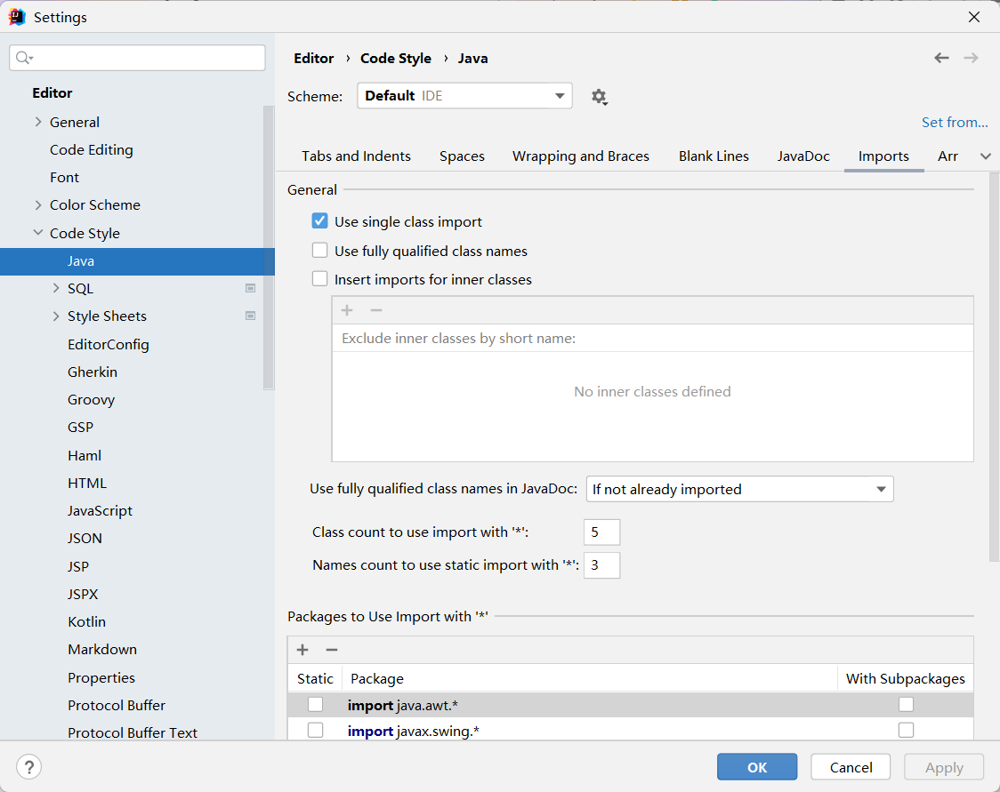

### 介绍

- `IDEA`，全称 `IntelliJ IDEA`，是 `Java` 语言的集成开发环境， `IDEA` 在业界被公认为是最好的 `java` 开发工具之一，尤其在智能代码助手、代码自动提示、重构、 J2EE支持、 Ant、 JUnit、 CVS 整合、代码审查、创新的 GUI 设计等方面的功能可以说是超常的  

#### 优势

- 强大的整合能力。比如： Git、 Maven、 Spring 等
- 提示功能的快速、 便捷
- 提示功能的范围广
- 好用的快捷键和代码模板 
- 精准搜索
- //值得注意的是，上述功能 `eclipse` 都支持，但是需要进行一系列设置  

### 安装

- IDEA 分为两个版本： 旗舰版(Ultimate)和社区版(Community)

  - 旗舰版有 30天免费试用，但是是收费的
  - 社区版是免费的

- 需求

  - 硬件
    - 硬件需要 4GB RAM， 2.5 GB 硬盘空间，然后屏幕 1024*768
    - 因为需要大量缓存，所以占用空间较大
  - 软件
    - Windows 所有版本
    - `JRE` 是安装时自带的，但是 `JDK` 必须自己安装配置

- 过程

  - 下载安装包后无脑下一步即可
  - 中间根据自己电脑的位数选择 `32-bit`或者 `64-bit`的桌面快捷方式；新版已经会自己自动选择了
  - 可以选择是否和 `.java`, `.groovy`文件进行关联，可以选择不关联

- 安装目录文件结构

  - 没有选择安装目录的话，默认安装在 `C:\Program Files\JetBrains\IntelliJ IDEA 2021.2` 目录下；建议保留文件夹后面的版本号，因为可以多个版本共存
  - 
  - `bin` 是 Executable Object Files 和启动参数的配置位置
  - `help` 快捷键文档和帮助文档
  - `jbr` 64 java 运行环境
  - `lib` 依赖的类库
  - `license` 存放大量纯文本文件，插件的使用许可
  - `plugins` 插件

- 调整配置文件

  - `C:\Program Files\JetBrains\IntelliJ IDEA 2021.2\bin\idea64.exe.vmoptions`
  - 修改建议
    - 32 位操作系统内存不会超过 4G，所以没有多大空间可以调整，建议不用调整了
    - 64 位操作系统中 8G 内存以下的机子或是静态页面开发者是无需修改的。
    - 64 位操作系统且内存大于 8G 的， 如果你是开发大型项目、 `Java` 项目或是 `Android` 项目，
      建议进行修改，常修改的就是下面 3 个参数
      - 
      - `-Xms` 初始内存数，增加该值可以提高 java 程序的启动速度， `16G` 内存可以修改为 `-Xms128m`
      - `-Xmx` 设置最大内存数，提高该值可以提升 `java` 程序的运行性能, `16G`内存可以修改为 `-Xmc1500`
      - `-XX:ReservedCodeCacheSize=`, 保留代码占用的内存容量，`16G`内存可以修改为`-XXLReservedCodeCacheSize=500m`

- 启动

  - 启动之后输入激活码或者试用
  - 然后选择主题，可以为深色或者浅色，根据个人喜好选择
  - 然后展示了默认的插件和可以在线安装的插件
    - 我们无需在这里设置，可以直接在菜单栏中选择然后下载插件
  - 启动页面
    - 
    - 
    - 我们可以导入工程（包括 `eclipse`的工程），创建工程，也可以使用版本管理工具进行创建工程
    - `Idea` 没有工作空间的概念，所以 `Idea`中最大单元就是一个 `project`

- 创建工程

  - 
  - 我们首先需要指定 SDK 的版本，这里只需要点击上面的文件夹图标，然后选择 `Add JDK `，选择 `JDK`的安装目录即可
  - 根据提示点选 `next`，一直到选择工作空间的路径；我们需要给工程命名和选择路径
    - 
  - 首次进入以后需要加载一段时间，这是因为他们需要生成缓存；耐心等待一段时间即可

- 配置

  - 

  - 首次使用建议使用 `View-Appearance-Toolbar` 将工具栏加上；工具栏中包含大部分快捷操作

  - 进入配置页面

    - `File` - `Settings`
    - 或者点击 `ToolBar` 上面的齿轮，在展开窗口中点击 `Settings`

  - 在 `Appearance ` 下可以选择多种不同的主题

  - 在 `Editor-General`下可以选择使用鼠标滚轮和 `Ctrl` 改变窗口字体大小

    - 

  - 在 `Editor-Code Editing`下可以让鼠标悬停时展示文档

    - 

  - `Editor-General-Auto Import`

    - 这样就可以自动导包；记得勾选 `Always`和 `Add unambiguous imports`以及 `Optimize`
    - 

  - `Editor-General-Appearance`

    - 使用这个下面的设置，方法之间会显示虚线并且会显示行号
    - 

  - `Editor-General-Code Completion`

    - 不要勾选大小写敏感匹配，去掉 `Match Case`的复选框；这样，无论大小写都能自动匹配
    - 

  - `Editor-General-Editor Tabs`

    - 去掉一行内显示，这样我们就可以同时打开大量的 `Class`
    - 

  - `Editor-Font`和 `Editor-Color Scheme-Console Font`

    - 通过上述两个选项可修改整个软件的字体，和控制台单独的字体

  - `Editor-Color Scheme-Langauge Defualts`

    - 这用于修改代码不同部分的显示字体和颜色
    - Doc Comment – Text： 修改文档注释的字体颜色
    - Block comment： 修改多行注释的字体颜色
    - Line comment： 修改单行注释的字体颜色  
    - 

  - `Editor-Code Style-Java-Import`

    - 
    - 这个可以修改对某个包下的导入超过一定数量，就用 `Import .*`

  - `Editor-File and Code Template`

    - 这个用来修改写代码时，文档注释的默认格式

    - ```java
      /**
          @author Yubo Cao
          @Create ${YEAR}-${MONTH}-${DAY} ${TIME}
      */
      ```

  - `Editor-File Encoding`

    - 我们把所有的编码集都改成 `UTF-8`
    - 
    - 建议不要选择 `Transparent native-to-ascii convertion`；不勾选的的话，配置文件就不会呈现出中文，而是以 `unicode`的方式展示
    - 对单独文件的编码修改还可以点击右下角的编码设置区。如果代码内容中包含中文，则会弹出如上的操作选择。 
      - `Reload` 表示使用新编码重新加载，新编码不会保存到文件中，重新打开此文件，旧编码是什么依旧还是什么。
      - `Convert` 表示使用新编码进行转换，新编码会保存到文件中，重新打开此文件，新编码是什么则是什么。
      - 含有中文的代码文件， `Convert` 之后可能会使中文变成乱码，所以在转换成请做好备份，不然可能出现转换过程变成乱码，无法还原。  
    
  - `Build, Execution, Deployment-Compiler`

    - 
    - 勾选 `Build Project automatically`
    - 构建就是以我们编写的 `java` 代码、框架配置文件、国际化等其他资源文件、JSP 页面和图片等资源作为“原材料”，去“生产”出一个可以运行的项目的过程。
      - 所以，如果不勾选自动构建，我们运行时还是跑的旧的代码
      - `Intellij Idea` 默认状态为不自动编译状态， `Eclipse` 默认为自动编译

  - `File-Power Save mode`

    - 
    - 不要错误的勾选这个，否则你就会发现代码的自动补全就没了

  - 分屏显示

    - 
    - `Windows-Editor Tabs - Split`
    - 通过这个，我们就可以同时预览两份源文件

- 使用

  - 创建包
    - 工程下的 src 类似于 Eclipse 下的 src 目录， 用于存放代码。
    - 工程下的.idea 和 project01.iml 文件都是 IDEA 工程特有的。类似于 Eclipse 工程下的.settings、 .classpath、 .project 等  
    - 
    - 
    - 不过值得注意的是， `Idea`的包如果前缀一样，那么他们不会显示成两个包 – 而是相同部分显示在一起，不同部分分叉
  - 创建类
    - 、
  - 快捷键
    - 输入 `main`或者 `psvm`就可直接生成 `main`方法
    - 输入 `"String".sout`就可以生成输出语句；或者 `sout`也可以
  - 运行
    - `Idea` 总是需要先 build才可以运行工程，所以比 `eclipse` 慢一些
    - 在 IDEA 里写完代码，不用点击保存。 IDEA 会自动保存代码  
  - 创建模块
    - 
    - 创建一个 `module`；这里的 `module`可以理解成 `eclipse`中的project
    - `Idea`中的 `project`则可以理解成eclipse中的workspace
      - `Idea`不支持同时管理多个项目，只能为每一个项目打开一个独立的窗口实例
      - `Idea`支持管理一个项目下的多个模块
  - 删除模块
    - 我们可以直接使用 `Remove Module`来删除模块
    - 
      - 也可以 `Open Module Setting`，然后点击减号来移除这个 `Module`
      - `Module`被删除以后只是图标改变，文件还在那里 – 保留文件目录；然后我们可以选择删除文件目录，这个模块就被整个删除了
        - 这作为对代码的一个保护操作

- 快捷键

  - ​	
  - 首先进入 `File-Settings-Keymap`，然后搜索自己想要完成的动作；但是你不能搜索快捷键
  - 想要修改快捷键，我们首先删除快捷键，然后添加快捷键，如图
  - 
  - 点击旁边的搜索框，然后在框中按快捷键，就可以根据快捷键对动作进行查找
  - 
  - 可以通过选不同的 `Keymap template`,这样就可以实现多个 `IDE`快捷键的无缝切换
  - 不过，通过这里进行切换的快捷键，还是有几个不一样的；可以自己去别的网站上下载一套完善替换

- 模板

  - `Editor-Live Templates`和 `Editor-General-Postfix Completion`
  - `Eclipse`中也有模板，但是没有 `idea`的效率高
  - 常用模板
    - `sout` = `System.out.println();`
    - `soutm` = 输出当前方法
    - `soutp` = 输出参数
    - `soutv` = 输出一个变量，可以在弹出的下拉窗口中选择想要的变量
  - 修改模板
    - `live Template`中模板是可以自定义的，可以修改，添加
    - `postfix`中的模板不能自定义

