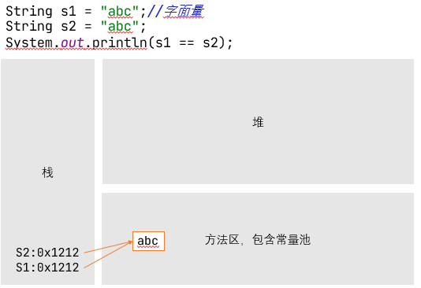
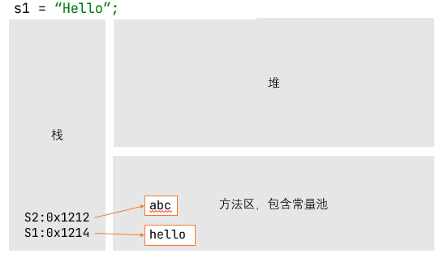
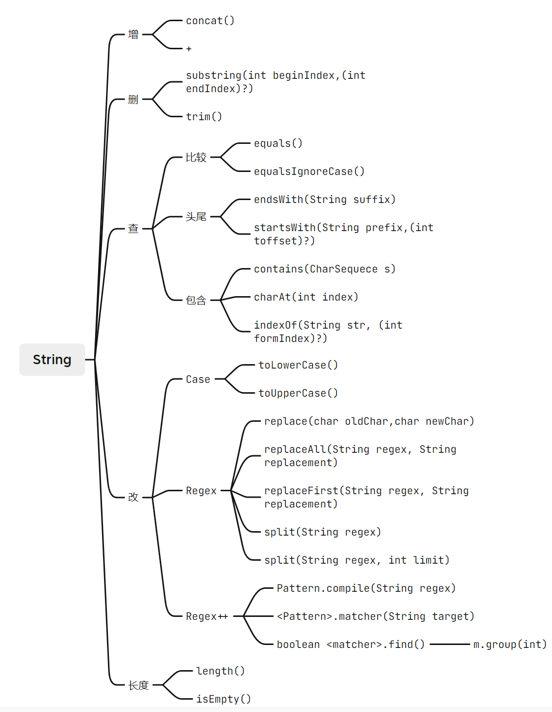
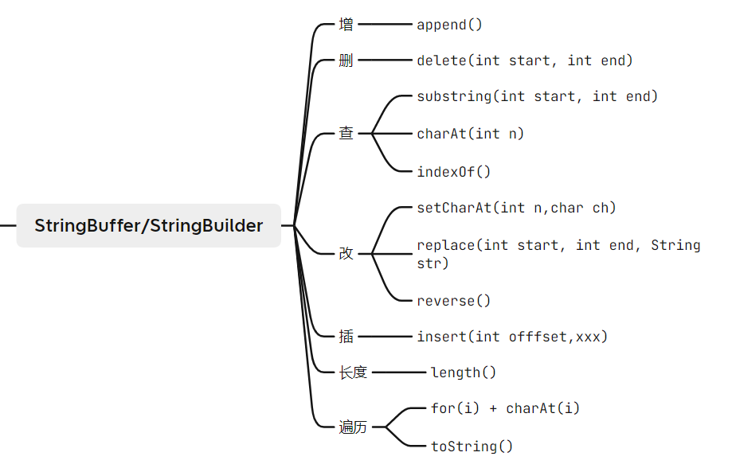
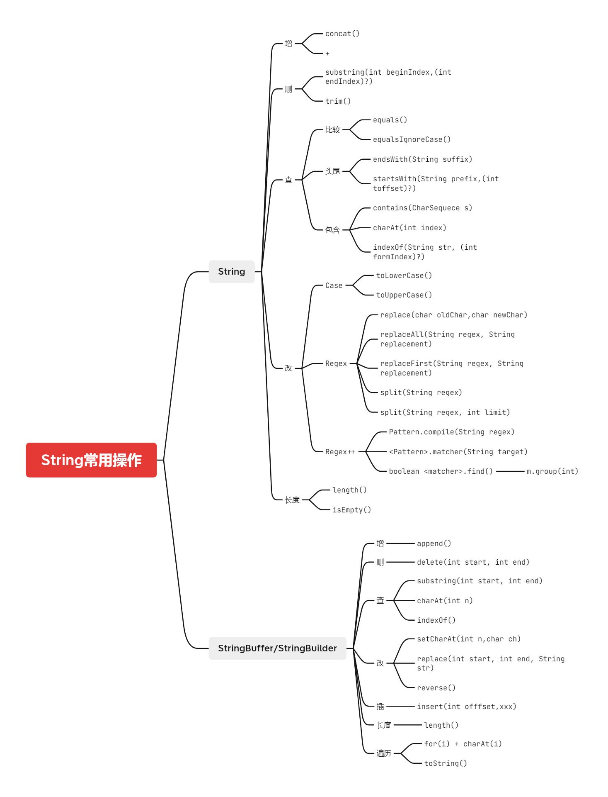

### 字符串相关类

#### `String`

- 类

  - `String`是一个`final`类，代表内部的功能完善，不需要修改（也不让你修改）

    - ```java
      public final class String
      implements java.io.Serializable, Comparable<String>, CharSequence {
      ```

- 内部结构

  - 字符串是的值**不可变**， `String`对象的字符内容是存储在一个`private final byte value[]`中的（这个数组是一个常量，则指向的地址值不变）

    - ```java
      @Stable
      private final byte[] value;
      ```

  - 数组是一个链式存储（`Sequential Memory`）

- 接口

  - 实现了`Serializable`接口，表示字符串支持序列化，也就是可以进行传输
  - 实现了`Comparable`接口，表示字符串可以比较大小

- 不可变性

  - 不可变的字符序列，简称不可变性

  - 字面量给字符串赋值

    - 字面量，是表达源代码中一个固定值的表示方式；如 `String str = "XIAOKEAI";`，这里面 `"XIAOKEAI"`就是字面量，`str`是变量

    - `String`用字面量的方式创建时，`String <name> = <Literal>;`，如果这两个字面量相同，则这两个数组共用同样的地址值

    - ```java
      String s1 = "abc";//字面量
      String s2 = "abc";
      System.out.println(s1 == s2);//true
      ```

      - 
      - 通过字面量的方式给字符串赋值，字符串值声明在常量池中
      - 常量池中不会存储相同内容的字符串的（也就是，内容完全相同的字符串）

  - 字面量给字符串重新赋值

    - 
    - 通过字面量方式给字符串重新复制后，不改变字符串中内容的值（内容不变）；相反，让字符串中的 `byte[] value`指向一个新的地址值，而不是修改

  - 通过 `+=`修改字符串

    - `String s3 += "def"`
    - 对现有的字符串进行连接操作时，也需要重新指定内存区域进行赋值，不能对原有的区域进行操作

  - 通过 `replace`修改字符串

    - ```java
      String s4 = "abc";
      String s5 = s4.replace("a","m");
      System.out.println(s5);//mbc
      System.out.println(s4);//abc
      ```

  - 综上，我们对字符串的不可变性做出总结

    - 不论长度是否修改 `replace()/+=/+`， `String`中的字符串一旦出现任何修改，那么就必须重新制定新的内存区域，创建一个新的字符串

- `String`的实例化 `new or literal`

  - ```java
    String str = "Hello";
    String s1 = new String();//创建一个长度为0的字符串数组
    String s2 = new String(Strig original);//复制一份传入参数的 String
    String s3 = new String(Char[] a);//复制一个字符串数组
    String s4 = new String(Char[] a,int startIndex, int count);//从某个角标开始，到某个角标结束，读取一个字符串数组
    ```

  - 上述方法中，在常量池中直接创建数组的方式是通过字面量

  - 使用`new`关键字创建的数组，内容存储在堆空间中；堆空间中的数组，将内容存储在常量池中

    - 因此，如果使用`String s = new String("abc");`创建数组，那么我们实际上创建了两个对象；一个对象存放在常量池当中，一个存放在堆空间中 

- `String`字面量实例化和变量

  - ```java
    String s1 = "javaEE";
    String s2 = "hadoop";
    
    String s3 = "javaEEhadoop";
    String s4 = "javaEE" + "hadoop";
    String s5 = s1 + "hadoop";
    String s6 = "javaEE" + s2;
    String s7 = s1 + s2;
    System.out.println(s3 == s4);//true
    System.out.println(s3 == s5);//false
    System.out.println(s3 == s6);//false
    System.out.println(s5 == s6);//false
    System.out.println(s3 == s7);//false
    System.out.println(s5 == s7);//false
    System.out.println(s6 == s7);//false
    ```

  - **常量与常量**的拼接结果在常量池。且常量池中不会存在相同内容的常量。（因此，如果声明一个 `final String s = "xx";`，它是一个常量，拼接的结果也在常量池）

  - 只要其中有一个是变量，结果就在堆中 – 也就是相当于 `new` 了一个字符串

  - 如果拼接的结果调用`intern()`方法，返回值就在常量池中

    - ```java
      /**
      Returns a canonical representation for the string object.
      A pool of strings, initially empty, is maintained privately by the class String.
      When the intern method is invoked, if the pool already contains a string equal to this String object as determined by the equals(Object) method, then the string from the pool is returned. Otherwise, this String object is added to the pool and a reference to this String object is returned.
      */
      ```

    - `intern()`是声明在字符串中的一个方法；调用这个方法，会返回

      - 一个在常量池已经存在的需求的字符串
      - 一个在常量池新创建的需要的字符串

    - ```java
      String s1 = "hello";
      String s2 = "world";
      String s3 = s1 + s2;
      String s4 = s3.intern();
      System.out.println(s4 == "helloworld");//true
      ```

- 代码分析

  - ```java
    String s9 = s7;
    System.out.println(System.identityHashCode(s9));//258931371
    System.out.println(System.identityHashCode(s7));//258931371
    
    s9 += "KEAI";
    System.out.println(System.identityHashCode(s9));//1008315045
    System.out.println(System.identityHashCode(s7));//258931371
    ```

    - 我们发现这个时候，两个引用指向同一个对象；通过引用来处理对象时，两个引用竟然指向了不同的对象
    - 这就是字符串不可变性的一个体现；任何变化都会开辟一个新的内存空间，然后让引用指向这个新的内存空间；旧的引用岿然不动，仍然指向原有的地方；于是，就出现上述情况

  - ```java
    public class StringTest {
    
        String str = new String("good");
        char[] ch = {'t', 'e', 's', 't'};
    
        public static void main(String[] args) {
            StringTest ex = new StringTest();
            ex.change(ex.str, ex.ch);
            System.out.print(ex.str + " and ");
            //"good and "
            System.out.println(ex.ch);
            //"best"
        }
    
        public void change(String str, char ch[]) {
            str = "test ok";//传入数组，修改不了本体内容；将形参 str 指向一个新开辟的，修改过的内存空间；实例变量中的 str 岿然不动
            ch[0] = 'b';//传入的数组也是地址值，根据地址值修改 ch 本体的内容；因此 ch = {'b','e','s','t'}
        }
    }
    ```

    - `good and best`
    - 这其实就是值传递：基本数据类型传入内容，引用数据类型传入地址值；说引用数据类型改内容，基本数据类型不改是不行的

- `JVM` 中 `String`的内存结构

  - `JVM` 的类型
    - `Sun HotSpot`, `Bea JRockit`, `IBM J9 VM`
    - `JVM`虚拟机的规范随着 `JDK` 版本的变化，`JVM`也会有所变化；我们默认使用的虚拟机就是 `HotSpot` – 这也是最常用的
  - `Heap`堆
    - 一个 `JVM` 实例中只存在一个堆内存，堆内存的大小是可以调节的。类加载器读取了类文件以后，需要把类，方法，成员变量放到堆内存中，保存所有引用类型的真实性信息，以方便执行器执行；堆内存分成三部分
      - `Young Generation Space`新生区， `Young`
        - 新生去是类诞生，成长，消亡的区域；一个类在这里产生，应用，最后被垃圾回收器手机，结束生命。新生区分为
          - 伊甸区 `Eden Space`
            - 负责 `new` 新的 `clsss`
          - 幸存者区 `Survivorspace`
            - `Survivor 0 space` & `Survivor 1 space`
            - 如果伊甸园的空间用完，程序有需要创建对象，那么伊甸园中不被其他对象应用的对象就会被回收，然后剩余对象丢到 `Survivor 0 Space`；如果0区满了，那么垃圾回收，到1区；1区满了，到养老区；养老区也爆了，那么就出现 `OOM` 异常
      - `Tenure Generation Space` 养老区， `Old`
      - `Permanent Space` 永久存储区， `Perm` – 这一部分在实施的时候，是作为方法去的一部分；别名叫 `Non-Heap`
        - 常驻内存区域，用于存放`JDK`自身所携带的 `Class`，`Interface`的元数据，也就是他存储的是运行环境所必需的类信息；在这里的数据不会被垃圾回收器回收，只有关闭 `JVM`才会释放此区域的占用的内存
        - 如果这里面太多，那么就可能报错
  - 常量池
    - `JDK 1.6`
      - 常量池放到方法区中
    - `JDK 1.7`
      - 常量池放到堆里面去了
    - `JDK 1.8`
      - 常量池又返回到方法区里面去了，具体体现为 `Metaspace`

- `String`的常用方法

  - `int length()`返回字符串的长度
  - `char charAt(int index)` 返回某个索引处的字符；`0<=index<value.length`；如果索引位置错误，则 `StringIndexOutOfBoundsException`
  - `boolean isEmpty()`，返回值为 `boolean`，判断是否为空字符串
  - `String toLowerCase()`，返回值为 `String`，将会把所有的字符小写
  - `String toUpperCase()`，所有的字符转化为大写
  - `String trim()`，去掉开头和结尾所有的空格，但是不会去掉中间的空格
  - `boolean equals(Object obj)`，比较字符串的内容是否相同
  - `boolean equalsIgnoreCase(String anotherString)`，比较字符串的内容是否相同，忽略大小写
  - `String concat(String str)`，将指定字符串连接到此字符串的结尾，等价于使用 +
  - `int compareTo(String anotherString)`，比较两个字符串的大小
  
    - 比较方式其实就是两个字符串各个位转化为编码值，相减
    - 如果两个字符串有在多个位置的索引处不同，则选择最小的不同索引，然后返回 `this.charAt(k)-anotherString.charAt(k)`
    - 如果两个字符串恰好在所有位置都相同，但是长度不同，则返回 `this.length()-anotherString.length()`
    - 如果返回值是 0，那么两个字符串相等；返回值是负数，那么调用者小；返回是正数，调用者大
  - `String substring(int beginIndex)`
  
    - 返回一个新的字符串， 它是此字符串的从`beginIndex`开始截取到最后的一个子字符串
  - `String sustring(int beginIndex, int endIndex)`
    - 返回一个新的字符串，它是此字符串从 `beginIndex``到endIndex`截取的最后一个字符串
    - `begin`是返回 `chatAt(beginIndex)`
    - `endIndex`是不返回 `charAt(endIndex)`
    - 总结为**左闭右开**
  - `boolean endsWith(String suffix)` 测试此字符串是否已指定的后缀结束
  - `boolean startsWith(String prefix)`测试此字符串是否已指定的前缀开始
  - `boolean startsWith(String prefix, int toffset)`测试此字符串从指定索引开始的子字符串是否已指定前缀开始
    - 包括指定索引处的字符
    - `int toffset`，寻找字符串时包含 `charAt(fromindex)`
  - `boolean contains(CharSequence s)`返回指定子字符串在此字符串中第一次出现处的索引
  - `int indexOf(String str)`返回指定字符串在此字符串中第一次出现处的索引
    - 如果找不到这个内容，那么返回 `-1`
    - 返回的索引是找到字符串的开头位置的索引
  - `int indexOf(string str,int formIndex)`，返回指定字符串在此字符串中第一次出现处的索引，从指定的索引开始
    - `formIndex`，寻找字符串时包含 `charAt(formIndex)`
  - 如果整个字符串只有一个匹配/不存在匹配，那么 `indexOf(str)`和 `lastIndexOf(str)`返回值相同
  - `String replace(char oldChar, char newChar)`， 返回一个新的字符串，它是通过用 `newChar`替换此字符串中出现的**所有** `oldChar`得到的
  - `String replace(CharSequence target, CharSequence replacement)`，使用指定的字面值替换序列替换此字符串所有匹配字面值目标序列的子字符串
  - `String replaceAll(String regex, String replacement)`，使用给定的 `replacement`替换此字符串所有匹配给定的正则表达式的子字符串
  - `String replaceFrist(String regex, String replacement)`，使用给定的 `replacement`替换此字符串匹配给定的正则表达式的第一个子字符串
  - 注意
    - 上述所有的方法都是返回一个新的字符串，而不会修改调用者（字符串）；这是因为字符串的不可变性
    - 左闭右开，这是 `subString`方法的特性； `indexOf`，`lastIndexOf`，这些方法的 `from`作为左，因此都是包含的
  - `boolean matches(String regex)`，告知此字符串是否匹配给定的正则表达式
  - `String[] split(String regex)`，根据给定的正则表达式匹配拆分此字符串
  - `String[] split(String regex, int limit)`，根据匹配 的正则表达式拆分此字符串，最多不超过 `Limit`个；超过了，剩下的部分全部放到最后一个元素中
  - 
  
- 正则表达式

  - 斜线 `\`在 `Java`中，如果只有一个，那么表示为转义字符；因此，想要输入一个斜线，必须输入两个\\\\–也就是字符串字面值

  - 不仅如此，为了表示一个正则表达式中使用的转义字符，也需要输入两个斜线 – 如 `\\d`

  - 常用内容

    - | \             | 将下一字符标记为特殊字符、文本、反向引用或八进制转义符。例如， **n**匹配字符 **n**。**\n** 匹配换行符。序列 **\\\\** 匹配 **\\** ，**\\(** 匹配 **(**。 |
      | ------------- | ------------------------------------------------------------ |
      | ^             | 匹配输入字符串开始的位置。如果设置了 **RegExp** 对象的 **Multiline** 属性，^ 还会与"\n"或"\r"之后的位置匹配。 |
      | $             | 匹配输入字符串结尾的位置。如果设置了 **RegExp** 对象的 **Multiline** 属性，$ 还会与"\n"或"\r"之前的位置匹配。 |
      | *             | 零次或多次匹配前面的字符或子表达式。例如，zo* 匹配"z"和"zoo"。* 等效于 {0,}。 |
      | +             | 一次或多次匹配前面的字符或子表达式。例如，"zo+"与"zo"和"zoo"匹配，但与"z"不匹配。+ 等效于 {1,}。 |
      | ?             | 零次或一次匹配前面的字符或子表达式。例如，"do(es)?"匹配"do"或"does"中的"do"。? 等效于 {0,1}。 |
      | {*n*}         | *n* 是非负整数。正好匹配 *n* 次。例如，"o{2}"与"Bob"中的"o"不匹配，但与"food"中的两个"o"匹配。 |
      | {*n*,}        | *n* 是非负整数。至少匹配 *n* 次。例如，"o{2,}"不匹配"Bob"中的"o"，而匹配"foooood"中的所有 o。"o{1,}"等效于"o+"。"o{0,}"等效于"o*"。 |
      | {*n*,*m*}     | *m* 和 *n* 是非负整数，其中 *n* <= *m*。匹配至少 *n* 次，至多 *m* 次。例如，"o{1,3}"匹配"fooooood"中的头三个 o。'o{0,1}' 等效于 'o?'。注意：您不能将空格插入逗号和数字之间。 |
      | ?             | 当此字符紧随任何其他限定符（*、+、?、{*n*}、{*n*,}、{*n*,*m*}）之后时，匹配模式是"非贪心的"。"非贪心的"模式匹配搜索到的、尽可能短的字符串，而默认的"贪心的"模式匹配搜索到的、尽可能长的字符串。例如，在字符串"oooo"中，"o+?"只匹配单个"o"，而"o+"匹配所有"o"。 |
      | .             | 匹配除"\r\n"之外的任何单个字符。若要匹配包括"\r\n"在内的任意字符，请使用诸如"[\s\S]"之类的模式。 |
      | (*pattern*)   | 匹配 *pattern* 并捕获该匹配的子表达式。可以使用 **$0…$9** 属性从结果"匹配"集合中检索捕获的匹配。若要匹配括号字符 ( )，请使用`"\("`或者`"\)"`。 |
      | (?:*pattern*) | 匹配 *pattern* 但不捕获该匹配的子表达式，即它是一个非捕获匹配，不存储供以后使用的匹配。这对于用"or"字符 (\|) 组合模式部件的情况很有用。例如，'industr(?:y\|ies) 是比 'industry\|industries' 更经济的表达式。 |
      | (?=*pattern*) | 执行正向预测先行搜索的子表达式，该表达式匹配处于匹配 *pattern* 的字符串的起始点的字符串。它是一个非捕获匹配，即不能捕获供以后使用的匹配。例如，'Windows (?=95\|98\|NT\|2000)' 匹配"Windows 2000"中的"Windows"，但不匹配"Windows 3.1"中的"Windows"。预测先行不占用字符，即发生匹配后，下一匹配的搜索紧随上一匹配之后，而不是在组成预测先行的字符后。 |
      | (?!*pattern*) | 执行反向预测先行搜索的子表达式，该表达式匹配不处于匹配 *pattern* 的字符串的起始点的搜索字符串。它是一个非捕获匹配，即不能捕获供以后使用的匹配。例如，'Windows (?!95\|98\|NT\|2000)' 匹配"Windows 3.1"中的 "Windows"，但不匹配"Windows 2000"中的"Windows"。预测先行不占用字符，即发生匹配后，下一匹配的搜索紧随上一匹配之后，而不是在组成预测先行的字符后。 |
      | *x*\|*y*      | 匹配 *x* 或 *y*。例如，'z\|food' 匹配"z"或"food"。'(z\|f)ood' 匹配"zood"或"food"。 |
      | [*xyz*]       | 字符集。匹配包含的任一字符。例如，"[abc]"匹配"plain"中的"a"。 |
      | [^*xyz*]      | 反向字符集。匹配未包含的任何字符。例如，`"[^abc]"`匹配"plain"中"p"，"l"，"i"，"n"。 |
      | [*a-z*]       | 字符范围。匹配指定范围内的任何字符。例如，"[a-z]"匹配"a"到"z"范围内的任何小写字母。 |
      | [^*a-z*]      | 反向范围字符。匹配不在指定的范围内的任何字符。例如，`"[^a-z]"`匹配任何不在"a"到"z"范围内的任何字符。 |
      | \b            | 匹配一个字边界，即字与空格间的位置。例如，"er\b"匹配"never"中的"er"，但不匹配"verb"中的"er"。 |
      | \B            | 非字边界匹配。"er\B"匹配"verb"中的"er"，但不匹配"never"中的"er"。 |
      | \c*x*         | 匹配 *x* 指示的控制字符。例如，\cM 匹配 Control-M 或回车符。*x* 的值必须在 A-Z 或 a-z 之间。如果不是这样，则假定 c 就是"c"字符本身。 |
      | \d            | 数字字符匹配。等效于 [0-9]。                                 |
      | \D            | 非数字字符匹配。等效于 `[^0-9]`。                            |
      | \f            | 换页符匹配。等效于 \x0c 和 \cL。                             |
      | \n            | 换行符匹配。等效于 \x0a 和 \cJ。                             |
      | \r            | 匹配一个回车符。等效于 \x0d 和 \cM。                         |
      | \s            | 匹配任何空白字符，包括空格、制表符、换页符等。与 [ \f\n\r\t\v] 等效。 |
      | \S            | 匹配任何非空白字符。与 `[^ \f\n\r\t\v`] 等效。               |
      | \t            | 制表符匹配。与 \x09 和 \cI 等效。                            |
      | \v            | 垂直制表符匹配。与 \x0b 和 \cK 等效。                        |
      | \w            | 匹配任何字类字符，包括下划线。与"[A-Za-z0-9_]"等效。         |
      | \W            | 与任何非单词字符匹配。与`"[^A-Za-z0-9_]"`等效。              |
      | \x*n*         | 匹配 *n*，此处的 *n* 是一个十六进制转义码。十六进制转义码必须正好是两位数长。例如，"\x41"匹配"A"。"\x041"与"\x04"&"1"等效。允许在正则表达式中使用 ASCII 代码。 |
      | \num          | 匹配 *num*，此处的 *num* 是一个正整数。到捕获匹配的反向引用。例如，"(.)\1"匹配两个连续的相同字符。 |
      | \n            | 标识一个八进制转义码或反向引用。如果 \*n* 前面至少有 *n* 个捕获子表达式，那么 *n* 是反向引用。否则，如果 *n* 是八进制数 (0-7)，那么 *n* 是八进制转义码。 |
      | \nm           | 标识一个八进制转义码或反向引用。如果 \*nm* 前面至少有 *nm* 个捕获子表达式，那么 *nm* 是反向引用。如果 \*nm* 前面至少有 *n* 个捕获，则 *n* 是反向引用，后面跟有字符 *m*。如果两种前面的情况都不存在，则 \*nm* 匹配八进制值 *nm*，其中 *n* 和 *m* 是八进制数字 (0-7)。 |
      | \nml          | 当 *n* 是八进制数 (0-3)，*m* 和 *l* 是八进制数 (0-7) 时，匹配八进制转义码 *nml*。 |
      | \u*n*         | 匹配 *n*，其中 *n* 是以四位十六进制数表示的 Unicode 字符。例如，\u00A9 匹配版权符号 (©)。 |


- 调用方法实现相互转换

  - `String` 和 包装类，基本数据类型 互转
    - `int i = Integer.parseInt(String)`
    - `Integer i = Integer.valueOf(String)`
    - `String s = i + "";`
    - `String s = i.toString;`
    - `String s = String.valueOf(i); `
  - `String` 和 `Char[]`
    - `char[] cs = String.toCharArray();`，调用这个方法将会返回一个 `char[]`
    - `String s = new String(cs);`，调用这个方法，将会得到一个由 `char[]`造出来的字符串
      - 值得注意的是，我们还可以在里面写上角标和长度，表示 `char[i] - char[i+j]`之间的元素
      -  `String s2 = new String(cs,0,2);`表示截取从 `cs[0]`开始，长度为2的元素（两个元素），作为数组
  - `String` 和 `byte[]`
    - 方法
      - 调用 `<stringInstance>.getBytes()`方法来获得字符串的 `byte`
      - 在默认情况下，调用的 `Charsets`都是 `UTF-8`；如果想要更改，可以使用 `str.getBytes(String charsetName)`的方法
        - 例子： `str1.getBytes("gbk");`
      - 调用 `new String(byte[])`就可把一个 `byte[]`转化成 `String`
      - 调用 `new String(byte[],int offset,int length);`就可以转化指定长度部分的 `byte[]`到 `String`
        - 例子： `new String(b1);`
        - 但是需要注意的是，如果 `byte[]`使用的字符集和我们解析时使用的字符集（`utf-8`），不一样，那么就会出现问题 – 乱码；通过调用 `new String(byte[],String charsetName);`指定编码集，这样就可以了
    - 编码
      - 从字符串转化为字节，因为计算机的底层是二进制，所有的东西都是数；但是 `String-->char`不是编码
      - 对于数字，字母在大多数标准下，每个只占用一个 `byte`（因为基本上所有的编码集都会考虑到堆 `ASCII-American Standard Code for Information Interchange` ；因此，我们发现产生的数组的长度，和字符串的长度是一样的
      - 对于中文，在 `UTF-8`标准下，每个汉字占用三个字节；因此，我们会得到一个更长的数组；对于`gbk`，每个汉字占用两个字节
        - 如 `String str1 = "中国";byte[] b1 = str1.getBytes();System.out.println(Arrays.toStirng(b1));`的输出结果为 `[-28, -72, -83, -27, -101, -67]`
    - 解码
      - 解码是从字节转化为字符串
      - 根据不同的编码方式，转化出来的字符串有所变化（乱码）

- `CompactString`

  - 因为 `JVM`内部使用 `UTF-16`来表示字符串，英文字符的一个 `byte`都将被浪费；许多字符需要 `2 Byte`；所以为了优化内存占用和性能， `JDK9.0`引入了 `CompactString`，为了优化字符串的内存占用

    - **无论何时我们创建一个所有字符都能用一个字节的 LATIN-1 编码来描述的字符串，都将在内部使用字节数组的形式存储**

  - ```java
    static final byte LATIN1 = 0;
    static final byte UTF16 = 1;
    ```

  - 大多数字符串操作都将检查 `coder`变量，采取特定的实现

- `String`常见的算法题目

  - 模拟一个`trim`方法，去除字符串两端的空格

    - ```java
      public String trim2(String input) {
          char[] i = input.toCharArray();
          int length = i.length;
          int start = 0;
          while (i[start] == ' ') {
              start++;
          }
          while (i[length - 1] == ' '){
              length--;
          }
          return new String(i,start, length - start);
      }
      ```

  - 将指定部分的 `String`进行反转

    - ```java
      public String reverse(String input,int offSet,int endIndex){
          char[] in = input.toCharArray();
          char temp = 0;
          for (int i = 0; i < (endIndex - offSet)/2; i++) {
              temp = in[endIndex - i];
              in[endIndex - i] = in[offSet + i];
              in[offSet + i] = temp;
          }
          return new String(in);
      }
      ```

  - 获取一个字符串在另一个字符串中出现的次数

    - ```java
      public int numberOfRepetition(String input, String target){
          int index = 0;
          int count = 0;
          if(input.indexOf(target) == -1){
              return -1;
          }else{
              index = input.indexOf(target) + target.length();
              count++;
          }
          while(true){
              if(input.indexOf(target,index) == -1){
                  return count;
              }else{
                  index = input.indexOf(target,index) + target.length();
                  count ++;
              }
          }
      }
      ```

  - 获取两个字符串中最大相同子串。

    提示：将短的那个串进行长度依次递减的子串与较长的串比较。

    - ```java
      public String maxSubString(String input1,String input2){
          char[] in2 = input2.toCharArray();
          String max = (input1.length()>input2.length())?input1:input2;
          String min = (max == input1)?input2:input1;
          for(int i = 0;i<min.length();i++){
              for(int j = 0,z = min.length()-i;z!=min.length()+1;j++,z++){
                  String temp = min.substring(j,z);
                  if(max.contains(temp)){
                      return temp;
                  }
              }
          }
          return "";
      }
      ```

- 对字符串中字符进行自然顺序排序

  - ```java
    public String sortString(String s) {
        char[] i = s.toCharArray();
        char temp = 0;
        int counter = 0;
        while(true) {
            counter++;
            boolean finished = true;
            for (int j = 0; j < s.length() - 1; j++) {
                if (i[j] > i[j + 1]) {
                    finished = false;
                    temp = i[j];
                    i[j] = i[j + 1];
                    i[j + 1] = temp;
                }
            }
            for (int j = s.length() - 1; j > 0; j--) {
                if (i[j] < i[j - 1]) {
                    finished = false;
                    temp = i[j];
                    i[j] = i[j - 1];
                    i[j - 1] = temp;
                }
            }
            if (finished) {
                return new String(i);
            } else if(counter == s.length()){
                return new String(i);
            } else{
                continue;
            }
        }
    }
    ```

#### `StringBuffer`, `StringBuilder`

- `StringBuffer`

  - `java.lang.StringBuffer`代表**可变的字符序列**，`JDK1.0`中声明，可以对字符串内容进行增删，此时不会产生新的对象。
    - 很多方法与`String`相同。
    - 作为参数传递时，方法内部可以改变值。
    - 线程安全，效率低

- `StringBuilder`

  - `java.lang.StringBuilder`代表**可变的字符序列**， `JDK1.5`新增，线程不安全，提供更快的速度
    - 方法和`StringBuffer`基本一样，就是去掉了 `synchronized`

- 底层实现

  - `StringBuffer sb1 = new StringBuffer();`

    - ```java
      //java.lang.StringBuffer
      public StringBuffer() {
          super(16);
      }
      //java.lang.AbstractStringBuilder, extends by StringBuffer
      AbstractStringBuilder(int capacity) {
          if (COMPACT_STRINGS) {
              value = new byte[capacity];//返回一个长度为 capacity的 byte[]
              coder = LATIN1;
          } else {
              value = StringUTF16.newBytesFor(capacity);//
              coder = UTF16;
          }
      }
      //java.lang.StringUTF16
      public static byte[] newBytesFor(int len) {
          if (len < 0) {
              throw new NegativeArraySizeException();
          }
          if (len > MAX_LENGTH) {//MAX_LENGTH = Integer.MAX_VALUE >> 1 = （2^31 - 1）/2 
              throw new OutOfMemoryError("UTF16 String size is " + len +
                                         ", should be less than " + MAX_LENGTH);
          }
          return new byte[len << 1];//位运算操作，len * 2 = len << 1
      }
      ```

    - 在不传递参数的情况下，创建一个默认长度为 16/32 的 `byte[]`数组

  - `StringBuffer sb2 = new StringBuffer("abc");`

    - ```java
      //java.lang.StringBuffer
      public StringBuffer(String str) {
          super(str.length() + 16);
          append(str);
      }
      ```

    - 如果我们传入参数，那么就是调用一下父类的 `append`，然后创建一个 `new char("abc".length() + 16);`

  - 相当于总是会把数组的长度增加 16

  - `<StringBuffer>.length()`

    - 因为它里面还增加了一个新的东西

    - ```java
      //The count is the number of characters used.
      int count;
      public synchronized int length() {
          return count;
      }
      ```

    - 也就是每增加一个字符，那么就 `count++`；不返回 `value.length` – 所以我们就不会出现一个什么都没有的 `StringBuffer`有长度 `16`

  - `<StringBuffer>.append()`

    - 如果我们添加的数组，底层数组盛不下了，那就需要扩容底层的数组

    - ```java
      //java.lang.AbtractStringBuilder
      public AbstractStringBuilder append(String str) {
          if (str == null) {
              return appendNull();//appendNull = append("null")
          }
          int len = str.length();//例子 "abcdefghijklmnop" append "rs"
          ensureCapacityInternal(count + len);//count = 16, length = 2
          putStringAt(count, str);//
          count += len;
          return this;
      }
      //java.lang.AbtractStringBuilder
      private void ensureCapacityInternal(int minimumCapacity) {
          // overflow-conscious code
          int oldCapacity = value.length >> coder;//coder = 0 = LATIN-1;coder = 1 = UTF-16;
          if (minimumCapacity - oldCapacity > 0) {//minimumCapacity是需要的长度，如果大于 0 ，则 oldCapacity < minimumCapacity
              value = Arrays.copyOf(value,
                                    newCapacity(minimumCapacity) << coder);//不够，
          }
      }
      //java.util.Arrays
      public static byte[] copyOf(byte[] original, int newLength) {
          byte[] copy = new byte[newLength];
          System.arraycopy(original, 0, copy, 0,
                           Math.min(original.length, newLength));//复制一份新长度的数组
          return copy;
      }
      //java.lang.System
      public static native void arraycopy(Object src,  int  srcPos,
                                          Object dest, int destPos,
                                          int length);//把dest, 从 destPos 长度为 length的数组复制到从 srcPos开始的 src数组中
      //java.lang.AbstractStringBuilder, newCapacity的确认
      private int newCapacity(int minCapacity) {
          // overflow-conscious code
          int oldCapacity = value.length >> coder;//长度除2或者1，获得byte[]数组的真实包含字符数量的长度
          int newCapacity = (oldCapacity << 1) + 2;//新的需要的长度为乘2+2
          if (newCapacity - minCapacity < 0) {
              newCapacity = minCapacity;//如果新的长度不如 minCapacity，那么直接返回 manCapacity
          }
          int SAFE_BOUND = MAX_ARRAY_SIZE >> coder;//MAX_ARRAY_SIZE = Integer.MAX_VALUE - 8
          return (newCapacity <= 0 || SAFE_BOUND - newCapacity < 0)//如果长度太大，加一次还是不行；或者长度太大， <<1之后符号位干掉了 -- 那么返回 hugeCapacity，也就是 JVM 虚拟机中允许的最大长度
              ? hugeCapacity(minCapacity)
              : newCapacity;
      }
      ```

    - 综上，`append`

      - 长度
        - 默认情况下，扩容为原来容量的两倍
        - 如果原来容量的两倍不大于最小长度需求，那么，直接扩容为最小需要长度，即 `count + len`
        - 如果需求极端巨大，那么返回 `Integer.MAX_VALUE` = $2^{31}-1$，根据字符串数组的编码（UTF-8/2，LATIN-1不除2），返回 `SAFE_BOUND`作为数组的扩容容量；如果数组的扩容容量大于 `SAFE_BOUND`或者 `UNSAFE_BOUND`，返回 `OOM`异常
      - 复制
        - 然后会把原来的字符串复制，并且在 `append`方法中把新的字符串复制进去

    - 

- 开发

  - 综上，如果底层数组的容量是可估计的，我们应当开始使用时使用 `StringBuffer(int capacity)`，尽可能避免不断地创建新的数组，增加性能

-  常用方法

  -  `void append(<whatEver>)`，在末尾处拼接字符串；因为这个方法重载过，所以我们可以输入8种基本数据类型和 `CharSequence`，比较类似于 `+`
  - `void delete(int start,int end)`，左闭右开，删除这部分的字符串
  - `void replace(int start,int end, String str)`，左闭右开，替换索引位置为 `str`
  - `void insert(int offset, xxx)`，在指定位置插入某些结构，插入从 `charAt(offSet+1)`开始替换东西
  - `void reverse()`反转当前字符序列
    - 上述几个方法允许方法链，也就是 `s1.append(String str).delete(int start, int end).replace(int start, int end, String str)....`
  - `int indexOf(String str)`，返回 `str`在当前字符串中首次出现的位置
  - `String substring(int start,int end)`，返回从某处开始，到某处结束的字符串，左闭右开
  - `int length()`，返回字符串的长度
  - `charAt(int n)`，返回某处的字符串
  - `setCharAt(int n ,char ch)`，把某处的字符替换为 `ch`

- 开发中的选择

  - 如果是多线程，使用 `StringBuffer`
  - 如果不需要多线程，或者不存在线程安全问题，使用 `StringBuilder`

- 总结

  - 	

- 效率对比

  - ```java
    //本代码让 StringBuffer, StringBuilder, String append；然后测算时间
    public void test3() {
        long startTime = 0L;
        long endTime = 0L;
        String text = "";
        StringBuffer buffer = new StringBuffer("");
        StringBuilder builder = new StringBuilder("");
        //开始对比
        startTime = System.currentTimeMillis();
        for (int i = 0; i < 20000; i++) {
            buffer.append(String.valueOf(i));
        }
        endTime = System.currentTimeMillis();
        System.out.println("StringBuffer的执行时间：" + (endTime - startTime));
        startTime = System.currentTimeMillis();
        for (int i = 0; i < 20000; i++) {
            builder.append(String.valueOf(i));
        }
        endTime = System.currentTimeMillis();
        System.out.println("StringBuilder的执行时间：" + (endTime - startTime));
        startTime = System.currentTimeMillis();
        for (int i = 0; i < 20000; i++) {
            text = text + i;
        }
        endTime = System.currentTimeMillis();
        System.out.println("String的执行时间：" + (endTime - startTime));
    }
    ```

  - `StringBuilder>StringBuffer>String(远远大于)`

### `JDK 8.0<`日期时间 `api`

#### `System`

- System类提供的`public static long currentTimeMillis()`用来返回当前时间与1970年1月1日0时0分0秒之间以毫秒为单位的时间差。
  - 这个方法用于计算时间差（代码运行时间）
  - 这个返回值，我们称为时间戳 – 用来制作唯一标识符

#### `Date Class`

- 

#### `Calendar`

#### `SimpleDateFormat`

### `JDK 8.0` 日期时间 `api`

#### `LocalDate, LocalTime, LocalDateTime`

#### `Instant`

#### `DateTimeFormatter`

#### `Other`

### `Java`比较器

#### `Comparable`接口

#### `Comparator`接口

### `System`类

### `Math`类

### `BigInteger`和`BigDecimal`

