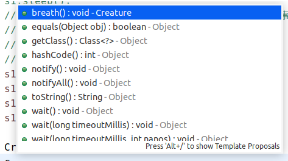

[[面向对象-OOP]]
#### Object 类

-   我们发现我们创建的对象自带方法 -- 这来自于其父类 -- java定义的object类
    
-   如果我们没有显式的声明一个类的父类，则此类继承与java.lang.Object类
    
-   所有的java类，（除java.lang.object类之外），都直接或间接的继承与java.lang.Object类。
    
-   意味着，所有的java类都具有java.lang.Object类中声明的功能