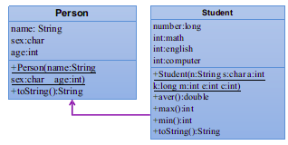

[[面向对象-OOP]]
#### UML图

- 箭头从子类指向父类，可表示继承关系
- 从上至下三部分 
  - 上面是类的类名
  - 中间的部分是字段，`+`表示字段是`public`， `-` 表示字段是 `private`
  - 下面是方法
    - `+`表示方法是`public`， `-` 表示方法是 `private`
    - 从左到右依次为 `权限修饰符` `方法名` `方法参数列表--形参名：形参类型` `返回值类型`

