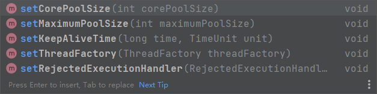

[[Idea.md]]

### 基本概念：程序、进程、线程  

- 程序(`program`)是为完成特定任务、用某种语言编写的一组指令的集合。即指一段**静态的代码，静态对象**。

- 进程(`process`)是**程序的一次执行过程**，或是正在运行的一个程序。是一个动态的过程：有它自身的产生、存在和消亡的过程。 ——生命周期

  - 运行中的QQ，运行中的MP3播放器
  - 程序是静态的，进程是动态的
  - 进程作为资源分配的单位， 系统在运行时会为每个进程分配不同的内存区域

- 线程(`thread`)，进程可进一步细化为线程，是**一个程序内部的一条执行路径**。

  - 若一个进程同一时间并行执行多个线程，就是支持多线程的
    - `main()`，就可以视为一个 `thread`
  - 线程作为调度和执行的单位，每个线程拥有独立的运行栈和程序计数器(pc)，线程切换的开销小
    - 线程各自享有独立的 `Program Counter Register`  和 `VM Stack`
  - 一个进程中的多个线程共享相同的内存单元/内存地址空间它们从同一堆中分配对象，可以访问相同的变量和对象。这就使得线程间通信更简便、高效。
    - 线程共享 `Heap`和 `Method Area`
    - 因此，实现多个线程的通信比较方便
    - 但多个线程操作共享的系统资源可能就会带来安全的隐患 – 如果多个线程抢着操作，那就崩了

- 单核和多核 `CPU`

  - 单核`CPU`，其实是一种假的多线程，因为在一个时间单元内，也只能执行一个线程的任务  
    - 但是单核 `CPU` 看起来实现多线程，其实是因为 `CPU` 分配每个线程一个时间单元进行运行，而且每个时间单元都很短 – 也就是挂起一个进程，然后运行别的
    - 所以实现了假的多线程
  - 如果是多核的话，才能更好的发挥多线程的效率。（现在的服务器都是多核的）  
  - 一个`Java`应用程序`java.exe`，其实至少有三个线程： `main`()主线程， `gc`()垃圾回收线程，异常处理线程。当然如果发生异常，会影响主线程。  

- 并行和并发

  - 多个 `CPU`同时执行多个任务，称为并行 parallel；十个人，各自有一球
  - 一个 `CPU` 采用时间片，同时执行多个任务，称为并发 concurrence; 十个人抢一个球

- 多线程的优点

  - 以单核CPU为例， 只使用单个线程先后完成多个任务（调用多个方法），肯定比用多个线程来完成用的时间更短，为何仍需多线程呢？  
    - 因为单核 `CPU`的切换的过程中，也需要时间；单线程反而更快
    - 但是多核 `CPU`，多个线程来完成比较好
  - 提高应用程序的响应。对图形化界面更有意义，可增强用户体验。
  - 提高计算机系统`CPU`的利用率
  - 改善程序结构。将既长又复杂的进程分为多个线程，独立运行，利于理解和修改  

- 何时需要多线程

  - 程序需要同时执行两个或多个任务
  - 程序需要实现一些需要等待的任务时，如用户输入，文件读写操作，网络操作，搜索等
  - 需要一些后台运行的程序时 – 垃圾回收器

- 辨析

  - ```java
    public class Sample {
        public static void main(String[] args) {
            Sample s = new Sample();
            s.method2("Hello");
        }
        public void method2(String str){
            method1(str);
        }
        public void method1(String str){
            System.out.println(str);
        }
    }
    ```

  - 上述代码并不实现多线程，他只是两个方法的来回顺次调用

  - 我们只要发现一条路径可以画出程序的执行过程，那么就是单线程

### 线程的创建和使用

- 线程的调度 – 优先级
  - 调度策略
    - 时间片
      - `CPU`没有偏好，轮流执行
      - 
    - 抢占式
      - 抢占式： 高优先级的线程抢占 `CPU`
  - `Java`调度方法
    - 同优先级线程组成先进先出队列（先到先服务），使用时间片策略
    - 对高优先级，使用优先调度的抢占式策略  
  - 线程的优先级等级
    - `MAX_PRIORITY`： 10
    - `MIN _PRIORITY`： 1
    - `NORM_PRIORITY`： 5
  - 涉及的方法
    - `getPriority()` ： 返回线程优先值
    - `setPriority(int newPriority)` ： 改变线程的优先级
  - 说明
    - 线程创建时继承父线程的优先级
    - 低优先级只是获得调度的概率低，并**非一定**是在高优先级线程之后才被调用  

- `Thread` 类中常用方法

  - `void start()`启动当前线程，调用当前线程的 `run()`

  - `void run()` 线程在被调度时执行的操作  

  - `currentThread()` 静态方法，返回执行当前代码的线程

  - `String getName() ` 返回线程的名字 

  - `String setName()` 设置当前线程的名字

    - 改名改的是对象的名字，所以线程名是一个实例变量；而且，改名应在线程运行之前 – 线程运行中可以改名，不会报错
    - `Thread.currentThread().setName("可爱");`//这个可以改当前线程的名，如 `main`

    - 我们也可以通过重写线程的构造器来初始化实例变量

      - `Thread(name)`提供了父类方法；子类可创建自己的构造器，并使用 `super`调用父类的有参构造器来创建自己的有参构造器

      - ```java
        public MyThread(String str){
        	super(str);
        }
        ```

  - `static void yield()`

    - 暂停当前正在执行的线程，把执行机会让给优先级相同或更高的线程 – 其实就是放弃这个线程在 `CPU`中的执行权
    - 若队列中没有同优先级的线程，忽略此方法 

  - `join()`

    - 当某个程序执行流中调用其他线程的 `join()` 方法时， 调用线程其他线程的线程将被阻塞，直到 `join()` 方法加入的 `join` 线程执行完为止
      - 低优先级的线程也可以获得执行 
      - 这个方法不是静态，所以 `main` 方法中不能直接调用；需要 `t1.join()`
      - 这个方法可能抛出异常，需要处理

  - `static void sleep(long millis)`(指定时间毫秒)

    - 让当前的进程暂停一段时间
    - 这个方法会抛出 `InterruptedException`异常，所以需要用 `try-catch`处理异常；而且你不能通过抛出异常的方式来解决问题，因为 `run()`方法在父类中没有抛出异常
    - 我们可以使用 `sleep`方法来实现一个简单的计时器

  - `stop()` - `Deprecated` 强制结束当前线程

  - `boolean isAlive()`

    - 这个用于判断当前线程是否仍然存活

- `JDK5.0<`

  - 创建方法一

    - 继承`java.lang.Thread`，并重写 `public void run()`方法

      - `run()`方法中重写我们希望其执行的代码 – 也就是线程的功能
      - 经常把`run()`方法的主体称为线程体  - `ThreadBody`

    - 然后创建子类对象，调用对象继承自父类的 `start()`方法

      - 启动这个线程以及调用线程的`run()`
      -  都是通过主线程 `main()`调用方法的 `start()`完成的
        - 但是**不能调用 `run()`方法**，这样相当于就是普通的调用方法，不是多线程了
        - 我们可以通过 `Thread.currentThread().getName()`的方法来得到运行线程的名字；在调用 `run()`方法时，得到的名字就是 `main`

    - 例子

      - ```java
        class EvenNumber extends Thread {
            @Override
            public void run() {
                for (int i = 0; i <= 100; i++) {
                    if (i % 2 == 0) {
                        System.out.print(i + ",");
                    }
                }
            }
        }
        
        public class ThreadTest {
            public static void main(String[] args) {
                EvenNumber t1 = new EvenNumber();
                t1.start();
                System.out.println("Main");//因为多线程，这个main输出的位置可能不一样
            }
        }
        ```

    - 创建两个线程

      - `java.lang.IllegalThreadStateException`
      - 如果当前线程运行过一次，那么 `threadStatus`就变成了1；因此，如果调用两次 `start()`试图得到两个线程，那么就会抛出异常
      - 所以，我们必须创建第二个`Thread`对象，并调用其 `start()`方法

  - 创建方法二
  
    - 过程
      - 定义子类，实现`Runnable`接口。
      - 子类中实现`Runnable`接口中的`run`方法 – 抽象方法
      - 创建实现类的对象
      - 将`Runnable`接口的子类对象作为实际参数传递给`Thread`类的构造器
        - `Thread t = new Thread();` – 这里面接受的参数为 `Runnable`，是多态的体现
      - 调用`Thread`类的`start`方法：开启线程， 调用`Runnable`子类接口的`run`方法
      
    - 原理
    
      - ```java
        public void run() {
            if (target != null) {
                target.run();
            }
        }
        ```
    
      - 如上，在调用 `new Thread(Runnable Object)`构造器时，我们实际上是给 `thread`中的 `private Runnable Target`赋值；因此，就可以运行 `implements Runnable interface`的类中的`run`方法
    
    - 创建两个线程
    
      - ```java
        Window w = Window.getInstance();
        Thread t1 = new Thread(w);
        Thread t2 = new Thread(w);
        ```
  
  - 比较
    - 实现接口的方式更好
      - 接口可以实现多继承 – 也就是我们使用接口的方式，可以让其继承别的父类，而非必须 `Thread`
      - 接口实现可以默认实现共享数据 – 多个线程之间共享数据，而不需要加入 `static`
    - 共性
      - 其实 `Thread`类就是一个实现了 `Runnable`接口的类
  
- 线程的分类

  - Java中的线程分为两类：一种是守护线程，一种是用户线程。
    - 它们在几乎每个方面都是相同的，唯一的区别是判断JVM何时离开
      - 若`JVM`中都是守护线程，当前`JVM`将退出
    - 守护线程是用来服务用户线程的，通过在`start()`方法前调用
  - `thread.setDaemon(true)`可以把一个用户线程变成一个守护线程。
  - `Java`垃圾回收就是一个典型的守护线程。

### 线程的生命周期

- 定义

  - 生命周期，指的是线程从创建到死亡的几种状态

- 线程的状态 – `这些信息定义在 java.lang.Thread.State`中

  - ```java
    public enum State {
        /**
         * Thread state for a thread which has not yet started.
         */ 
        NEW,
    ```
    - 当一个 `Thread`类或其子类对象被声明并创建时，新生的线程对象处于新建状态 `Thread t = new Thread()`
    
  - ```java
        /**
         * Thread state for a runnable thread.  A thread in the runnable
         * state is executing in the Java virtual machine but it may
         * be waiting for other resources from the operating system
         * such as processor. 没分配资源
         */
        RUNNABLE,
    ```
    - 当一个新建的线程被启动，`t.start()`，但是可能还没有被分配到 `CPU`时间片，他就是就绪 `Runnable`状态
    - 这个状态下包括线程的 `就绪` 和 `运行` 两个阶段
      - `CPU`主动分配资源，
      - 就绪： 处于新建状态的线程被`start()`后，将进入线程队列等待`CPU`时间片，此时它已具备了运行的条件，只是没分配到`CPU`资源
      - 运行： 当就绪的线程被调度并获得`CPU`资源时,便进入运行状态， `run()`方法定义了线程的操作和功能 ；`yield()`可能让他回到就绪状态

  - ```java
        /**
         * Thread state for a thread blocked waiting for a monitor lock.
         * A thread in the blocked state is waiting for a monitor lock
         * to enter a synchronized block/method or
         * reenter a synchronized block/method after calling
         * {@link Object#wait() Object.wait}. 没进入同步结构
         */
        BLOCKED,
    ```
    - `synchronized`会阻塞线程，这时线程处于 `Blocked`在状态，让出 CPU 并临时中
      止自己的执行，进入阻塞状态  

  - ```java
        /**
         * Thread state for a waiting thread.
         * A thread is in the waiting state due to calling one of the
         * following methods:
         * <ul>
         *   <li>{@link Object#wait() Object.wait} with no timeout</li>
         *   <li>{@link #join() Thread.join} with no timeout</li>
         *   <li>{@link LockSupport#park() LockSupport.park}</li>
         * </ul>
         *
         * <p>A thread in the waiting state is waiting for another thread to
         * perform a particular action.
         *
         * For example, a thread that has called {@code Object.wait()}
         * on an object is waiting for another thread to call
         * {@code Object.notify()} or {@code Object.notifyAll()} on
         * that object. A thread that has called {@code Thread.join()}
         * is waiting for a specified thread to terminate. 线程等待其他线程干活 -- 被阻塞。因为自己调用了 join()
         */
        WAITING,
    ```

    - 线程没有时间限制，长时间等待，包括但不仅限于 `wait()`,`join()`，让出 CPU 并临时中
      止自己的执行，进入阻塞状态  

  - ```java
        /**
         * Thread state for a waiting thread with a specified waiting time.
         * A thread is in the timed waiting state due to calling one of
         * the following methods with a specified positive waiting time:
         * <ul>
         *   <li>{@link #sleep Thread.sleep}</li>
         *   <li>{@link Object#wait(long) Object.wait} with timeout</li>
         *   <li>{@link #join(long) Thread.join} with timeout</li>
         *   <li>{@link LockSupport#parkNanos LockSupport.parkNanos}</li>
         *   <li>{@link LockSupport#parkUntil LockSupport.parkUntil}</li>
         * </ul> 线程等待一段时间后执行
         */
        TIMED_WAITING,
    ```

    - 线程等待一段时间后，继续运行，如 `sleep()`

  - ```java
        /**
         * Thread state for a terminated thread.
         * The thread has completed execution. 线程结束了
         */
        TERMINATED;
    ```

    - 线程死亡，线程完成了它的全部工作或线程被提前强制性地中止或出现异常导致结束  
    - 执行完 `run()`，或者被`stop()`，或者异常没有处理
    - 线程一定在 `Terminated`状态结束，阻塞是不行的

  - ```mermaid
    sequenceDiagram
    	participant 新建
    	participant 就绪
    	participant 运行
    	participant 阻塞
    	participant 死亡
    	新建->>就绪:New Thread().start()，调用 start()
    	就绪->>运行:获得CPU执行权
    	运行->>就绪:失去CPU执行权或yield()
    	rect rgb(191, 223, 255)
    	loop 线程可能被阻塞多次
    	运行->>+阻塞:sleep(),join(),synchronized,suspend(),wait()
    	阻塞->>-就绪:sleep()时间到了,join()线程结束，获取同步锁，notify()/notifyAll() -- wait被唤醒，挂起被 resume()
    	end
    	end
    	运行->>死亡:执行完run(),调用现成的stop(),出现error
    ```

### 线程的同步

- 问题

  - 多个线程执行的**不确定性**引起执行结果的不稳定

  - 多个线程对**账本的共享**，会造成操作的不完整性，会破坏数据

  - 例子

    - 两人同时取钱，取同一个账户的钱

    - 三线程卖票

      - ```java
        public class WindowTest {
            public static void main(String[] args) {
                Window w = new Window();
                Thread t1 = new Thread(w);
                Thread t2 = new Thread(w);
                Thread t3 = new Thread(w);
                t1.start();
                t2.start();
                t3.start();
            }
        }
        
        class Window implements Runnable{
            private int ticket = 100;
            private static int UUID = 0;
        
            @Override
            public void run() {
                for(;;){
                    if(ticket > 0){
                        try {
                            Thread.sleep(100);//加不加都可能出现0,-1；我们sleep以后CPU同时在ticket=1时CPU把三个线程同时运行了一下的概率增加
                        } catch (InterruptedException e) {
                            e.printStackTrace();
                        }
                        System.out.println(Thread.currentThread().getName()+":卖票" + ticket--);
                    }else{
                        break;
                    }
                }
            }
        }
        ```

      - 有的时候会出现 0，-1，1票
      - 这种情况是因为三个线程同时在 ticket=1时得到了 CPU 运行权，并且刚好在其他线程没有 `--` 之前进入

- 线程的安全问题

  - 原因

    - 当多条语句在操作同一个线程共享数据时，一个线程对多条语句只执行了一部分，还没有执行完`if(ticket>0)到sysout`，另一个线程参与进来执行。导致共享数据的错误，E.g., `ticket`
      - 如果线程之间没有共享数据，是不会有线程安全问题的

  - 解决方法

    - 当一个线程在操作共享数据的时候，其他线程不能参与进来；直到线程操作完共享数据，其他线程才可以操纵共享数据，即使线程被阻塞（`TIMED_WAITING`)

  - 在`java`中，我们通过同步机制，来解决线程的安全问题

  - 同步代码块

    - 使用

      - ```java
        synchronized(同步监视器){
        	//需要被同步的代码 -- 也就是操作共享数据的代码
        }
        ```

      - 操作共享数据的代码就是需要被同步的代码，共享数据就是多个线程同时处理的变量，比如 `ticket` 就是共享数据

      - 不能将过多代码或者过少代码放在同步代码块中

        - 过少 – 有可能还是多个进程操作共享数据
        - 过多 – 就会变成单线程，因为一个线程直接操作完了，其他几个线程就不用运行直接终止了

      - 同步监视器 - `Monitor Lock`

        - 监视器可以是任意对象，比如 `private Object obj = new Object()`

        - 要求

          - 多个线程**必须共用同一把锁**；如果存在多个锁，那么仍然不安全

          - ```java
            class Window implements Runnable{
                private int ticket = 100;
                private Object obj = new Object();
                @Override
                public void run() {
                	//Object obj = new Object();错误，不保证唯一性
                    for(;;){
                    	//synchronized(new object()),错误，不保证唯一性
                        synchronized(obj) {
                            if (ticket > 0) {
                                try {
                                    sleep(100);
                                }catch(InterruptedException e){
                                    e.printStackTrace();
                                }
                                System.out.println(Thread.currentThread().getName() + ":卖票" + ticket--);
                            } else {
                                break;
                            }
                        }
                    }
                }
            }
            ```

      - 常用的同步监视器

        - | 对象                         | Runnable                        | Thread                              |
          | ---------------------------- | ------------------------------- | ----------------------------------- |
          | `private obj = new Object()` | 可以                            | 不可以，用 `private static obj`     |
          | `this`                       | 可以，一个 `runnable`对象到处放 | 不可以，每个创建对象是有独立 `this` |
          | `<ClassName>.class`          | 可以                            | 可以                                |

        - 我们还可以直接写 `<ClassName>.class`作为同步监视器，因为类也是一个对象，并且类是唯一的 – 类只会加载一次

        - //上述常用对象只是参考，具体问题具体分析，保证唯一即可

      - 优缺点

        - 好处：解决了线程的安全问题
        - 缺点：操作同步代码块时，只能由一个线程参与，其他线程等待，相当于是一个单线程的过程，效率较低 – 不过单线程的部分一般较小，可以忽略不记

      - 原理

        - 只有持有同步监视器对象的线程才可以执行同步代码块；执行完成以后释放同步监视器对象
        - 但是有可能同步监视器被同一个线程抢到多次

      - 继承方法的同步锁

        - ```java
          public class WindowTest2 {
              public static void main(String[] args) {
                  Windows t1 = new Windows();
                  Windows t2 = new Windows();
                  Windows t3 = new Windows();
          
                  t1.start();
                  t2.start();
                  t3.start();
                  //输出不是递减，因为有可能一个程序先 --，然后 System.out.println
              }
          }
          
          class Windows extends Thread{
              private static int Number = 1;
              private static int ticket = 100;//有可能三个线程一起干活，然后出来三个100
              private static Object obj = new Object();//不加static那么就有三个这样的变量
              public Windows(){
                  super("窗口"+ Number);
                  Number++;
              }
              @Override
              public void run() {
                  while(true){
                      synchronized (obj) {
                          if (ticket > 0) {
                              try {
                                  sleep(100);
                              } catch (InterruptedException e) {
                                  e.printStackTrace();
                              }
                              System.out.println(getName() + ":卖票，票号为:" + ticket--);
                          } else {
                              break;
                          }
                      }
                  }
              }
          }
          
          ```

        - 因为使用继承实现的多线程并不是默认共享数据，我们必须把同步锁声明为 `static` 才可以

  - 同步方法

    - 如果操作共享数据的代码正好完整的声明在一个方法中，我们不妨把这个方法声明为同步的

    - ```java
      <PermissionModifier> synchronized <ReturnDataType> <MethodName>(){
      
      } 
      ```

    - 这个就是声明的同步方法，同步方法同样有同步监视器

      - 非静态同步方法使用 `this` 作为同步监视器
      - 静态同步方法使用 `<ThisClass>.class`作为同步监视器

    - 使用

      - 和接口实现类

        - 没有问题，直接使用默认的同步监视器即可

        - ```java
          class Window3 implements Runnable{
              private int ticket = 100;
              @Override
              public void run() {
                  for (;;){
                     soldTicket();
                     if(ticket <= 0){
                         break;
                     }
                  }
              }
              public synchronized void soldTicket(){
                  if(ticket > 0) {
                      try {
                          sleep(100);
                      } catch (Exception e) {
                          e.printStackTrace();
                      }
                      System.out.println(Thread.currentThread().getName() + ": 卖票 " + ticket--);
                  }
              }
          }
          ```

      - 和 `Thread`的子类

        - 有问题，因为每一个 `new` 都有一个自己的 `this` – 每线程都有一个同步监视器

        - 问了解决，我们必须把方法同步方法改成静态的，直接使用同步方法是不正确的

          - 这里的同步监视器默认变成了 `<ThisClass>.class`，因为静态方法中也不能调用对象

        - ```java
          class Windows4 extends Thread {
              private static int ticket = 100;
              @Override
              public void run() {
                  while (true) {
                      show();
                      if(ticket <=0){break;}
                  }
              }
              private static synchronized void show() {
                  if (ticket > 0) {
                      try {sleep(100);
                      } catch (InterruptedException e) {e.printStackTrace();}
                      System.out.println(Thread.currentThread().getName() + ":卖票，票号为:" + ticket--);
                  }
              }
          }
          ```

  - 线程安全的懒汉式

    - 效率稍差

      - ```java
        class Bank {
            private static Bank instance = null;
        
            private Bank() {
            }
        
            public static synchronized Bank getInstance() {//锁是当前类本身
                synchronized (Bank.class) {//这个方法也是可以的
                    if (instance == null) {//instance是共享数据，然后两个线程同时对 instance赋值两次
                        instance = new Bank();
                        return instance;
                    } else {
                        return instance;
                    }
                }
            }
        }
        ```

      - 可以使用 `synchronized` 方法或者代码块，上述代码将两个方法都写在一起了
      - 效率差的原因是因为，我们可以把 `return`不看做对共享对象的操作；因此，我们只需要把 `instance = new Bank()`包起来就可以的
        - 第一个 `null` 创建完对象以后，之后的就不需要 `synchronized`

    - 效率优化

      - ```java
        class Bank {
            private static Bank instance = null;
        
            private Bank() {
            }
        
            public static Bank getInstance() {
                if (instance == null) {//上述判断可以保证，一旦刚开始的线程创建了单例，之后的线程就可以一起进入，无需一个一个等待才能拿到单例
                    synchronized (Bank.class) { 
                        if (instance == null) {//这里的 if是必须，不然不是线程安全的
                            instance = new Bank();
                        }
                    }
                }
                return instance;
            }
        
        }
        ```

- 线程的死锁

  - 问题
    - 不同的线程分别占用对方需要的同步资源不放弃，都在等待对方放弃自己需要的同步资源，就形成了线程的死锁  
    - 出现死锁后，不会出现异常，不会出现提示，只是所有的线程都处于阻塞状态，无法继续 
  - 说明
    - 写 `sychronized` 需要避免出现死锁
    - 出现死锁不会抛出异常，两个线程将会永远僵持下去，空耗系统资源
    - 执行时没有出现死锁不一定不是没有死锁
  - 解决
    - 我们一定要分析同步监视器
    - 避免嵌套同步
    - 专门的算法，定义

- `Lock` 实现同步锁

  - 介绍
    - 从`JDK 5.0`开始， `Java`提供了更强大的线程同步机制——通过显式定义同步锁对象来实现同步。同步锁使用`Lock`对象 – `Lock`只是一个接口
  - 使用
    - 实例化 `ReentrantLock`
      - `private ReentrantLock lock = new ReentrantLock(true);`
      - 这里可以无参，或者传入一个 `boolean` 类型的变量；无参时情况和 `false`相同
      - `true` 表示让各个线程，根据先后顺序轮流获得锁
      - `false`表示允许单个线程反复多次获得锁
    - 使用 `try-finally` 保住代码
      - 在`try`中调用 `lock.lock()`
      - 在`finally`中调用 `lock.unlock()`
  - 说明
    - `lock`对象必须是唯一的，否则不能实现同步
    
    - ```java
      public class lockTest {
          public static void main(String[] args) {
              XiaoKeAi t1 = new XiaoKeAi();
              XiaoKeAi t2 = new XiaoKeAi();
              XiaoKeAi t3 = new XiaoKeAi();
              t1.start();
              t2.start();
              t3.start();
          }
      }
      
      class XiaoKeAi extends Thread {
          private static int ticket = 100;
          private ReentrantLock lock = new ReentrantLock();
      
          @Override
          public void run() {
              while (true) {
                  if (ticket >= 1) {
                      lock.lock();
                      System.out.println(Thread.currentThread().getName() + " Sold ticket that have number " + ticket--);
                      try{
                          sleep(100);
                      }catch(InterruptedException e){
                          e.printStackTrace();
                      }
                      lock.unlock();
                  } else {
                      break;
                  }
              }
          }
      }
      ```
    
      

- 比较

  - `lock`更为灵活，相较于 `synchronized`更建议使用；如果必须使用 `synchronized`，使用同步代码块更好，同步方法最次

### 线程的通信

- 用法
  - `notify()`
    - 一旦执行此方法，就会唤醒一个`wait`的线程；如果有多个线程 `wait`，那么JVM将随机唤醒一个线程
  - `notifyAll()`
    - 一旦执行此方法，就会唤醒所有被 `wait`的线程
  - `wait()`
    - 一旦执行此方法，当前线程就进入阻塞状态，并释放同步监视器
      - 释放了同步监视器；这一点和 `sleep()`不一样，`sleep()`并不会释放同步监视器

- 注意

  - 上述三个方法必须声明在 `synchronized`的代码块中
  - 上述三个方法都是非静态的；前面省却的是 `this`
  - `java.lang.IllegalMonitorStateException`，这三个方法块必须是由同步监视器发起的调用，否则就会出现上述异常
    - 又因为同步监视器可以是任意对象，故上述三个方法定义在 `java.lang.Object`类中，而非 `Thread`

- `sleep()`方法和 `wait()`方法的异同

  - | sleep()                                                      | wait()                                                       |
    | ------------------------------------------------------------ | ------------------------------------------------------------ |
    | 执行到这个语句，都可以是使得当前的进程进入阻塞状态           |                                                              |
    | `sleep()`声明在 `Thread`类中                                 | `wait()`声明在 `object`类中                                  |
    | `sleep()`可以在任何需要场景下调用                            | `wait()`必须使用在同步代码块/同步方法中，调用者必须是同步监视器 |
    | `sleep()`调用时，不会释放同步监视器（如果使用在同步代码块或同步方法中） | `wait()`调用时，会释放同步监视器                             |

- 经典例题 – 生产者和消费者

  - 生产者(`Productor`)将产品交给店员(`Clerk`)，而消费者(`Customer`)从店员处取走产品，店员一次只能持有固定数量的产品(比如:20），如果生产者试图生产更多的产品，店员会叫生产者停一下，如果店中有空位放产品了再通知生产者继续生产；如果店中没有产品了，店员会告诉消费者等一下，如果店中有产品了再通知消费者来取走产品。  

  - ```java
    public class ProductTest {
        public static void main(String[] args) {
            Clerk clerk = new Clerk();
    
            Productor p1 = new Productor(clerk);
            Customer c1 = new Customer(clerk);
    
            p1.setName("生产者");
            c1.setName("消费者");
    
            p1.start();
            c1.start();
        }
    }
    
    class Clerk{
        public static final int PRODUCT_MAX = 20;
        private int productCount = 0;
        public synchronized void addProduct() {
            if(productCount < PRODUCT_MAX){
                productCount++;
                System.out.println(Thread.currentThread().getName()+"生产第"+productCount+"产品");
                //如果在productCount++到sout之间消耗了产品，那么就会出现既不生产也不消耗，但是打印生产xx产品
                notify();//一旦生产一些产品，就可以消费
            }else{
                try {
                    wait();
                } catch (InterruptedException e) {
                    e.printStackTrace();
                }
            }
        }
    
    
        public synchronized void consumeProduct() {
            if(productCount > 0){
                System.out.println(Thread.currentThread().getName()+"消耗第"+productCount+"产品");
                productCount--;//后--,例如最后一个产品不是 0
                notify();
            }else{
                try {
                    wait();
                } catch (InterruptedException e) {
                    e.printStackTrace();
                }
            }
        }
    }
    
    class Productor extends Thread{
        private Clerk clerk;
    
        public Productor(Clerk clerk) {
            this.clerk = clerk;
        }
    
        @Override
        public void run() {
            System.out.println(getName() + ":开始生产");
            while(true){
    
                try {
                    sleep(100);
                } catch (InterruptedException e) {
                    e.printStackTrace();
                }
                clerk.addProduct();
            }
        }
    }
    
    class Customer extends Thread{
        private Clerk clerk;
    
        public Customer(Clerk clerk) {
            this.clerk = clerk;
        }
    
        @Override
        public void run() {
            System.out.println(getName() + ":消费产品");
            while(true){
    
                try {
                    sleep(300);
                } catch (InterruptedException e) {
                    e.printStackTrace();
                }
                clerk.consumeProduct();
            }
        }
    }
    ```

### `JDK5.0`新增线程创建方式  

- 实现 `Callable`接口

  - 优点

    - 相比`run()`方法，可以有**返回值**
    - 方法可以**抛出异常**
    - 支持泛型的返回值
    - 需要借助`FutureTask`类，比如获取返回结果  

  - 代码实现

    - 创建一个 `Callable` 接口的实现类
    - 实现 `call()`方法，并且这个方法可以有返回值，返回值为对象
    - 实例化 `Callable`接口的实现类对象
    - 实例化 `FutureTask`类对象，并将 `Callable`接口的实现类对象作为实参传入
    - 将 `FutureTask`类的对象作为参数传递到 `Thread()`类的构造器中，启动线程
    - 调用 `FutureTask.get()`方法获得返回值

  - 例子

    - ```java
      package com.atguigu.java3;
      
      import java.util.concurrent.Callable;
      import java.util.concurrent.ExecutionException;
      import java.util.concurrent.FutureTask;
      
      class NumberThread implements Callable {
          @Override
          public Object call() throws Exception {
              int sum = 0;
              for (int i = 0; i < 100; i++) {
                  if (i % 2 == 0) {
                      System.out.println(i);
                      sum += i;
                  }
              }
              return sum;
          }
      }
      
      public class CallableTest {
          public static void main(String[] args) {
              NumberThread n = new NumberThread();
              FutureTask futureTask = new FutureTask(n);
              Thread t = new Thread(futureTask);
              t.start();
              try {
                  System.out.println("总和为" + futureTask.get());
                  futureTask.get();
                  System.out.println(futureTask.get());
              } catch (InterruptedException e) {
                  e.printStackTrace();
              } catch (ExecutionException e) {
                  e.printStackTrace();
              }
          }
      }
      ```

- 线程池 – 常用

  - 背景

    - 创建线程需要操作系统资源（线程资源，栈空间等），频繁创建和销毁大量线程需要消耗大量时间

  - 思路

    - 提前创建好多个线程，放入线程池中，使用时直接获取，使用完放回池中 – 也就是实现线程的复用。可以避免频繁创建销毁、实现重复利用。类似生活中的公共交通工具。

  - 好处

    - 提高响应速度（减少了创建新线程的时间）
    - 降低资源消耗（重复利用线程池中线程，不需要每次都创建）
    - 便于线程管理
      - `corePoolSize`：核心池的大小
      - `maximumPoolSize`：最大线程数
      - `keepAliveTime`：线程没有任务时最多保持多长时间后会终止

  - 代码实现

    - 创建线程池

      - ```java
        ExecutorService fixedThread = Executors.newFixedThreadPool(10);//创建一个固定线程数的线程池，返回 ThreadPoolExecutor对象
        ExecutorService cachedThread = Executors.newCachedThreadPool();//创建一个可根据需要创建新线程的线程池，返回 ThreadPoolExecutor对象
        ExecutorService singleThread = Executors.newSingleThreadExecutor();//创建一个只有一个线程的线程池，返回 ThreadPoolExecutor对象
        ExecutorService scheduleThread = Executors.newScheduledThreadPool(10);//创建一个在指定延迟后运行的线程池，返回 ScheduledThreadPoolExecutor对象，数量控制  corePoolSize
        ```

      - `ExecutorService`是线程池的接口，不可以被创建；`Executors`是线程池的工厂类，工具类，可以创建并返回不同类型的线程池

    - 运行线程

      - ```java
        fixedThread.submit(new NumbreC());
        fixedThread.submit(new Numbre());
        fixedThread.execute(new Numbre());
        ```

      - `ExecutorService.submit(Callable<T> task)`用于创建一个线程，该线程执行一个实现了 `Callable`接口的实现类的对象中重写的 `call()`；有返回值
      
      - `ExecutorService.submit(RUnnable Task)`用于创建一个线程，该线程执行一个实现了 `Runnable`接口的对象；该方法有返回值
      
      - `ExecutorService.execute(Runnable command)`，执行任务或命令，没有返回值，一般用来执行实现`Runnable`接口的对象
      
    - 线程池的配置

      - `corePoolSize`

        - Core pool size is the minimum number of workers to keep alive (and not allow to time out etc) unless allowCoreThreadTimeOut is set, in which case the minimum is zero. 
        - 核心线程数大小 – 不论线程是否空闲，线程池中都有这样数量的线程；如果设置了 `allowCoreThreadTimeOut`，就无需

      - `maximumPoolSize`

        - 线程池中最多允许创建 maximumPoolSize 个线程

      - `KeepAliveTime`

        - Timeout in nanoseconds for idle threads waiting for work. Threads use this timeout when there are more than corePoolSize present or if allowCoreThreadTimeOut. 
        - 等待工作的空闲线程的超时(以纳秒计)。线程存在超过corePoolSize或allowCoreThreadTimeOut时，使用此超时来干掉线程

      - ```java
        ThreadPoolExecutor t = (ThreadPoolExecutor)fixedThread;
        t.setCorePoolSize(1);
        ```

      - 将线程池工厂返回的对象强制转型，就可以调用下面的方法来对线程池进行设置

      - 
      
    - 使用完线程池之后使用 `e.shutdown()`来关闭线程池
