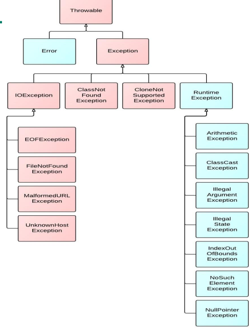

### 异常概述

- 在使用计算机语言进行项目开发的过程中，即使程序员把代码写得尽善尽美，在系统的运行过程中仍然会遇到一些问题，很多问题不是靠代码能够避免的

  - 客户输入数据的格式
  - 读取文件是否存在
  - 网络是否始终保持通畅等等
  - **我们必须处理这些问题，不能不管而直接让程序终止**

- 异常

  - 在Java语言中， 将程序执行中发生的不正常情况称为“异常” (开发过程中的语法错误和逻辑错误不是异常)    
  - `Java`语言中的异常有两种
    - `Error`
      - `Java`虚拟机无法解决的严重问题，如 `JVM`系统内部错误，资源耗尽等。 `StackOverflowError`-栈溢出,`OOP`-堆溢出
      - 这些问题只能通过修改程序解决，不编写针对性代码进行解决
    - `Exception`
      - 其它因编程错误或偶然的外在因素导致的一般性问题， 可以使用**针对性的代码**进行处理。 
        - 空指针访问
        - 试图读取不存在的文件
        - 网络连接中断
        - 数组角标越界  
      - 处理方法
        - 遇到错误终止程序运行
        - 编写程序时考虑到错误的检测，错误消息的提示，以及错误的处理
          - 捕获错误最好是在编译期间，但有的错误只有在运行时才会发生，比如 除数为零， 数组下标越界 – 编译时异常和运行时异常
      - 
        - 上图中的异常，红色时可以检测出来，编译器即可以发现的异常 `Checked`
          - 是指编译器要求必须处置的异常。即程序在运行时由于外界因素造成的一般性异常。 编译器要求`Java`程序必须捕获或声明所有编译时异常。  
        - 蓝色时无法检测出来，运行时才会发现的异常；`Unchecked`
          - 编译器不要求强制处置的异常。一般是指编程时的逻辑错误，是程序员应该积极避免其出现的异常  
          - `java.lang.RuntimeException`类及它的子类都是运行时异常，这些异常一般不做处理

- 常见异常

  - `Unchecked`

    - `NullPointerException`

      - ```java
        public void test(){
        	String s = "abc";
        	s = null;
        	System.out.println(s.charAt(0));
        }
        ```

    - `ArrayIndexOutOfBoundsException`

      - ```java
        public void test(){
        	int[] arr = new int[4];
        	System.out.println(arr[4]);
        }
        ```

    - `InputMismatchException`

      - ```java
        public void test(){
        	Scanner scan = new Scanner(System.in);
        	System.out.println(scan.nextInt());//输入"abc"
        }
        ```

    - `NumberFormatException`

      - ```java
        public void test(){
            String str = "1234a";
            int num = Integer.parseInt(str);
        }
        ```

    - `ArithmeticException`

      - ```java
        public void test(){
        	int a = 0;
        	int b = 1;
        	System.out.println(b/a)
        }
        ```

    - `ClassCastException`

      - ```java
        public void test(){
            Object o = new Date();
            String s = (String)o;
        }
        ```

  - `Checked`

    - `IOException`

      - ```java
        public void test() {
            File file = new File("Hello.txt");
            FileInputStream fls = new FileInputStream(file);//FileNotFoundException
        
            int data = fls.read();//IOException
            while(data != -1) {
                System.out.println((char)data);
                data = fls.read();
            }
        
            fls.close();
        }
        ```

      - 编译时报错

    - `ClassNotFoundException`

- 异常处理 :star:  

  - 把可能出现异常的代码集中在一起，使程序简洁优雅，便于维护

  - `Java`提供的是异常处理的抓抛模型

    - 抛 `throws`
      - `Java`程序的执行过程中如出现异常， 就会在异常代码处生成一个异常类对象，该异常对象将抛出给调用者（如：`Java`运行时系统）
      - 抛出异常以后，其后的代码就不再执行 
    - 抓 `try-catch-finally`

  - 常用两个方法

    - `String getMessage()`
      - 打印获取异常的信息
    - `void printStackTrace()`
      - 打印整个栈中的信息
  
  - `try-catch-finally` 真正处理异常
  
    - ```java
      try{
      	//可能出现异常的代码（并未一定出现）
      }catch(异常类型1 变量名1){
          //处理方式1
      }catch(异常类型2 变量名2){
          //处理方式2
      }
      finally{
          //一定会执行的代码，不论异常类型
      }
      ```
  
      
      
    - `finally`
    
      - 这个是可选的
      - `finally`中声明的是一定会被执行的代码，即使 `catch`中出现异常， `catch`或 `try` 中有 `return`语句
        - `finally` 在`return`语句和`throws`语句之前执行；如果其内部有 `return` 语句，则方法返回值以 `finally`中的为准 – 也就是原本的那个 `return`就不执行了
      - 数据库链接，输入输出流，网络编程 `socket` 等资源， `JVM`不能自动回收，需要我们手动回收资源
        - 这些东西就是必须执行的部分，声明在 `finally`中
    
    - 如果 `catch` 后面声明的异常类型不是出现异常的类型，则不会解决异常（没有匹配到）；声明的变量名只在当前 `catch`中有效
    
    - 一旦处理完成，则跳出当前的 `try-catch`结构（如果没写 `finally`）；继续执行后面的代码
    
    - 匹配是从上到下匹配的
    
      - 如果异常没有子父类关系，则异常声明的顺序无所谓
      - 如果我们把写父类异常写在上面，则会报错
        - `Unreachable catch block for NumberFormatException. It is already handled by the catch block for Exception`
    
    - 在 `try`中声明的变量，作用域只在 `try`的大括号中
    
      - 把变量声明在外边
      - 赋值语句放在里面，这样就可以保证外部可以调用了
    
    - 使用这个只能处理编译时异常，使得程序编译时不再报错；但是运行时仍可能报错；相当于我们把编译时可能出现的异常延迟到运行时出现
    
    - 这个结构可以相互嵌套，一层套一层
    
    - **开发时无需手写，只需要自动补全即可 – 选中代码，右键 surround try catch**
    
    - 开放中，对于运行时异常，通常不会用 `try-catch` 处理异常 – 因为处理不处理，区别不大；但是编译时异常，需要进行异常处理 – 延迟可能出现的异常到运行时
    
  -  `throws` 把异常抛给调用者
  
    - `<PermissionIdentifier> <Returntype> <MethodIdentifier> throws <TypeofException1>,...{}`
    - 把 `throws + 异常类型` 写在方法的声明处，指明方法运行时可能出现的异常；代码产生成一个异常类的对象，满足 `throws` 后的异常类型，则将异常对象交给调用者
      - 异常对象后的代码不再执行
      - 调用者解决异常或者丢个调用者的调用者；`main`方法使用 `throws`丢给虚拟机 – 异常不会解决，程序终止
  
  - 子类
  
    - 子类重写的方法抛出的异常小于等于父类被重写的方法抛出的异常类型，原因在于
  
    - 
  
      ```java
      public class OverrideTest {
      	public void display(SuperClass s) {
      		try {
      			s.method();
      		} catch (IOException e) {//如果子类抛出的异常>IOException，则异常处理语句挂掉了 -- 那就是语言设计的失败
      			e.printStackTrace();
      		}
      	}
      }
      ```
      
      
  
  - 两个处理方法的选择
  
    - 如果父类中被重写的方法没有异常
      - 子类必须使用 `try-catch-finally` 的方式处理异常
    - 如果多个方法都有可能出异常，且这些方法是递进关系（一个方法算出参数，参数丢给下一个方法，etc）
      - 这些方法都用 `throws`
      - 在调用这些方法的部分中，使用 `try-catch`，这样保证不会让错误的信息一直向下传递
    - 我们无需同时使用 `try-catch` 和 `throws` – 选择一种即可
  
  - 思考
  
    - 处理异常不能解决问题 – 只是修改了异常展示的方式
    - 异常最后还是需要程序员修复的
  
  - 异常对象的产生
  
    - 由虚拟机自动生成：程序运行过程中，虚拟机检测到程序发生了问题，如果在当前代码中没有找到相应的处理程序，就会在后台自动创建一个对应异常类的实例对象并抛出——自动抛出
    - 由开发人员手动创建： `Exception exception = new ClassCastException();`——创建好的异常对象不抛出对程序没有任何影响，和创建一个普通对象一样  – `throw not throws`
    
  - 自己抛出异常
  
    - `throw new RuntimeException("NumberOutOfBound");`这将会产生一个无需解决的异常；如果出现程序结束运行
    - `throw new Exception("NumberOutOfBound");`这个将会产生一个需要用 `try-catch`或 `throws`的异常
  
  - 用户自定义异常类
  
    - ```java
      public class MyException extends RuntimeException{
      	static final long serialVersionUID = -7034897190645766939L;
      	public MyException() {
      		
      	}
      	public MyException(String msg) {
      		super(msg);
      	}
      }
      ```
  
    - 自定义异常类需要继承任意一个异常类，并有 `serialVersionUID`，两个重载的构造器
  
  - 
  
  

