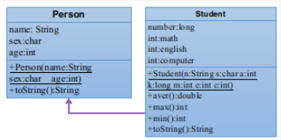

[[面向对象-OOP]]
### Inheritance

通过继承（extends关键字），我们可以让一个新类直接拥有其继承类的所有方法和属性

#### 作用

-   继承的出现减少了代码冗余，提高了代码的复用性。
    
-   继承的出现，更有利于功能的扩展。
    
-   继承的出现让类与类之间产生了关系，提供了多态的前提
    

#### 实现

Class A extends class B{}

-   A是子类（subclass），B是父类（Superclass）
    
-   子类继承父类所有的属性和方法
    
-   子类的功能往往比父类更加丰富，extends
    

#### 注意

-   子类不可以直接调用父类的private属性和方法
    
-   Private字段，子类不可以直接使用；但是可以使用父类提供的getter和setter来更改自身继承的private字段
    
-   Private方法，子类不可以直接使用；但是可以使用父类提供的，包含private方法的public方法
    
-   Java中类的**单继承性**和多层继承，不允许多重继承
    
-   **一个子类只能有一个父类**
    
-   一个父类可以派生出多个子类
    

-   子父类是相对概念，我们可以多重继承。为便于区分，我们把父类区分为间接父类/直接父类。多层继承后，子类获取了直接父类以及所有间接父类中声明的属性和方法。