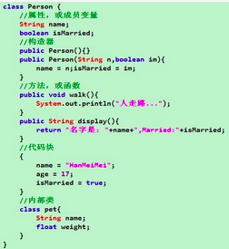
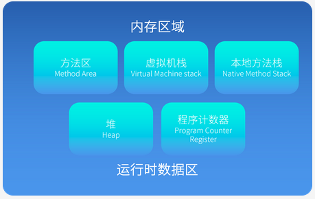
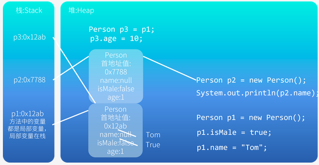
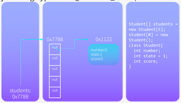
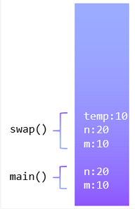
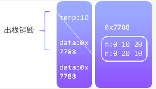
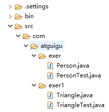

### 引入

#### **三大主线** 

- Java类以及类的成员-属性，方法，构造器；代码块，内部类 
- 面向对象的三大特征-封装，继承，多态，抽象 
- 其他关键字-this, super, static, final, abstract, interface, package, import等 

#### 面向对象的定义

- 编程的原则就是编程思想；我们更多关注思想的体现，而不是思想本身

- 面向过程(POP) 与 面向对象(OOP) 
  - 二者都是一种思想，面向对象是相对于面向过程而言的。 
- 面向过程：Procedure Oriented Programming 
  - **面向过程**，强调的是功能行为，以函数为最小单位，考虑怎么做。 
- 面向对象：Object Oriented Programming 
  - **面向对象**，将功能封装进对象，强调具备了功能的对象，以类/对象为最小单位，考虑谁来做。 
  - 面向对象更加强调运用人类在日常的思维逻辑中采用的思想方法与原则，如 抽象、分类、继承、聚合、多态等 
- **三大特点** 
  - 封装 (Encapsulation) 
  - 继承 (Inheritance) 
  - 多态 (Polymorphism) 

#### **优点** 

- ​	重复利用，拓展性强，可读性佳 

#### **概述** 

- 程序员从面向过程的执行者转化成了面向对象的指挥者 
- `OOP`分析问题的思路和步骤： 
  - 根据问题需要，选择问题所针对的现实世界中的实体。 
  - 从实体中寻找解决问题相关的属性和功能，这些属性和功能就形成了概念世界中的类。 
  - 把抽象的实体用计算机语言进行描述，形成计算机世界中类的定义。即借助某种程序语言，把类构造成计算机能够识别和处理的数据结构。 
  - 将类实例化成计算机世界中的对象。对象是计算机世界中解决问题的最终工具。 
- 相较于面向过程，面向对象关注主体的功能，把功能封装到对象中：`人{打开(冰箱){冰箱.开;}}大象{进入(冰箱)}冰箱{开()}`

#### 类和对象是`Java` 语言的基本元素

- 类(Class)和对象(Object)是面向对象的核心概念。 
  - 类是对一类事物的描述，是抽象的、概念上的定义 
  - 对象是实际存在的该类事物的每个个体，因而也称为实例(instance)。

- 面向对象程序设计的重点是类的设计 
- 成员的功能，是由类决定的；对象的功能，完全取决于类的设计 
- 类的设计，其实就是类的成员（对象）的设计 

### **类的设计** 

Java代码世界是由诸多个不同功能的类构成的。 

类里面包括 

- 属性：对应类中的成员变量 -- Field 
- 行为：对应类中的成员方法 -- Method 



### **类的实例化** 

- 类造好了，要造出对象才可以使用。这个过程我们叫实例化 

- 如果创建一个类的多个对象，则每个对象都独立的拥有一个类的属性（非Static)。意味着，修改一个对象的属性a，不会影响另外一个对象属性a的值 

- #### **语法** 

  - 类名 对象名 = new 类名(参数列表); -- 声明 
  - 通过 对象名.方法/对象名.字段名，来调用对象的结构 -- 调用 

### **Java的内存结构** 

#### 概述



- 堆`（Heap）`
  - 存放**对象实例**
  - 所有的对象实例以及数组都要在堆上分配内存和资源
- 通常所说的栈`（Stack）`，是指虚拟机栈。
  - 虚拟机栈中存放局部变量
    - 各种基本数据类型（`boolean`、`byte`、 `char` 、 `short` 、 `int` 、 `float` 、  `long` 、 `double`）、
    - 对象引用（`reference`类型， 它不等同于对象本身，是对象在堆内存的首地址）。 
    - 方法执行完，自动出栈 ，这是自动垃圾回收器的依赖机制
- 方法区（`Method Area`）
  - 用于存储已被虚拟机加载的类信息、常量、静态 变量、即时编译器编译后的代码等数据。 
- 本地方法区，调用`java`自带的C函数是使用本地方法区完成的

#### **分析代码的内存结构** 



### 成员变量与局部变量 

#### 不同点 

##### 位置不同

- 根据在类中**声明**的位置不同进行区分 
- 在方法体外，类体内声明的变量称为成员变量--直接定义在{}内 
- 在方法内，方法形参，代码块，构造器形参，构造器局部变量 

```java
public void talk(String language) { 
	System.out.println("我们使用" + language + 进行交流); 
} 
```

本例中，`String language`是形参，是局部变量 

```java
public void eat() { 
    String food = "老兵"; 
    System.out.println("北方人喜欢吃：" + food); 
}
```

本例中，`food`定义在方法内，是局部变量 

##### 权限修饰符不同 

- 声明属性时，指明其权限，使用权限修饰符。`private, public, protected, default(`留空不写) -->封装性 
- 声明局部变量不可以使用权限修饰符 -- 其权限大小由方法决定 

##### 默认初始化值的不同 

- 局部变量-没有默认初始化值 
- 这意味着我们在调用局部变量之前必须显式赋值 
  - 特别的，形参在调用时赋值即可，不会报错（传入参数时，自动赋值）
  - 其他局部变量不能调用时赋值（你也没法赋），必须显示赋值 
- 成员变量-类的`field`根据其类型都有默认初始化值。初始化值和一维数组的初始化值完全一样 
  - 整形 (`byte/short/int/long)` = 0 
  - 浮点型 (`float`/`double`) = 0.0 
  - 字符串(`char`) = ‘\u0000’=0 
  - `boolean` = false 
  - 引用数据类型（类，数组，接口，etc）：`null` 

##### 内存中加载位置不同 

- 属性加载到heap中，对象内（非static） 
- 局部变量加载到栈空间中 

|              | **成员变量**                     | **局部变量**                             |
| ------------ | -------------------------------- | ---------------------------------------- |
| 声明的位置   | 直接声明在类中                   | 方法形参或内部、代码块内、构造器内等     |
| 修饰符       | private、public、static、final等 | 不能用权限修饰符修饰，可以用final修饰    |
| 初始化值     | 有默认初始化值                   | 没有默认初始化值，必须显式赋值，方可使用 |
| 内存加载位置 | 堆空间 或 静态域内               | 栈空间                                   |

#### 相同点 

- 定义这两种变量的方法都一样 `Type Name = value;` 
- 两种变量都是先声明后使用 
- 这两种变量都有其对应的作用域 

### 类中方法的声明和使用 

#### **介绍** 

- 方法是类或对象行为特征的抽象，用来完成某个功能操作。在某些语言中 也称为函数或过程。 
- 将功能封装为方法的目的是，可以实现代码重用，简化代码 
- Java里的方法不能独立存在，所有的方法必须定义在类里。 

#### **例子** 

- Math类， sqrt， random都是类中的方法 
- Scanner，有nextxx()的方法 
- Arrays类，可以sort/binarySearch/toString/equals 

#### **声明格式** 

```java
权限修饰符 返回值类型 方法名(形参列表 0个到无数个){ 
	方法体-一堆代码;
} 
```

#### **权限修饰符** 

- `private`, `public`,`default`, `protected` 
- 权限修饰符表明方法权限大小；默认权限仅能在同包下访问

#### **返回值类型** 

- 方法有返回值
  - 必须在方法声明时指定返回值类型
  - 方法中需要使用`return`关键字来返回指定类型的变量或常量；如果没有返回值，则方法报错
  - 且要求在任何情况下都有一个返回值；下面的代码如果没有`else`就会报错

```java
public String getName() { 
    if(age > 18) { 
    	return name;
    }else { 
    	return "TOM"; 
    } 
} 
```

- 方法没有返回值
  - 使用`void`指定返回值类型
  - 没有返回值的方法中就不需要使用return。如果使用，只能return;（也就是返回啥都没有），用来表示结束方法 
  
    - `return`后不可以写代码，编译报错：`Unreachable code` 

#### **方法名** 

- 一个标识符，需要遵循标识符的规则和规范和见名知意。规范为所有的单词写在一起，第一个单词首字母小写，其他大写 


#### **形参列表** 

- 方法可以声明0个，1个，或多个形参。 

- 格式：`数据类型1 形参1，数据类型2 形参2`， … 用逗号来区分多个形参，不能写参数值 

- 定义方法时要不要形参，该不该定义形参 
  - 题目要求 - 比如UML图已经给你的情况 
  - 凡是不确定的，都是传进来的 

#### **方法体** 

- 方法功能的主要体现 

- 方法中不能定义方法 

- 方法在使用中可以调用当前类的属性或方法 -- 而且调用时不需要加实例名 
  - 递归方法：方法调用自己。需要注意的是，递归方法必须有return语句在其中使其可以终止，否则会因为栈溢出`java`报错 -- 死循环 

#### `return`关键字的使用 

- 适用范围：在方法体中 

- 作用： 
  - 如同break，可以用来结束方法 
  - 针对于有返回值类型的方法，使用 "`return 数据`"来结束方法并返回指定数据 
- 注意 
  - return,break,continue，这些关键字后面都不能有执行语句；编译时报错 

#### 万事万物皆对象 

- 在Java语言范畴中,我们都将功能、结构等封装到类中,通过类的实例化,来调用具体的功能结构 
  - Scanner, String 等 
  - 文件，File 
  - 网络资源，URL 
  - `Java`语言与前端`Html`、后端的数据库交互时,前后端的结构在`Java` 交互时,都体现为类、对象。 

#### 内存空间解析 

- 引用类型变量只可能存在两类值，null或地址值（地址值中包含变量的类型）（例如java.lang.Typename@Address_Value) 




#### 匿名对象的使用 

- 如果创建的对象没有显式命名，则该对象称为匿名对象
- 每次使用的匿名对象都是不同对象，除非我们将其赋给一个引用类型变量（也就是不匿名了）
- 代码 


```java
new Phone().sendEmail(); 
new Phone().playGame(); 
f.show(new Phone()); 
class PhoneFactory{ 
	public void show(Phone phone) {//这个时候，匿名对象被丢给phone，因此就可以用两次了；被形参指向以后，就可以调用多次 
	phone.sendEmail(); 
	phone.playGame(); 
	} 
} 
```

### 方法

#### 方法重载 

- 定义 
  - 在同一个类中，允许存在一个以上的同名方法，只要它们的**参数个数或者参数类型**不同即可。 
- 特点 
  - 与返回值类型无关，只看参数列表，且参数列表必须不同。(参数个数或参数类型)。调用时，根据方法参数列表的不同来区别。 
- 注意 
  - 参数的方法体/权限修饰符/返回值类型/形参的名字 和是否能重载无关；只看**参数列表和方法名** 
  - 自动类型转换：如果有方法无需自动类型提升即可使用，则优先使用此重载方法；不存在，提升后使用对应重载方法。如 

```java
test.getSum(1,2); 

public void getSum(int i, int j) { 
	System.out.println("1"); 
} 
public void getSum(double d1, double d2) { 
	System.out.println("2"); 
} 
```

- 例子 
  - `Println`方法中大量使用重载，应对多种数据类型；因此我们可以往里面输入多种数据类型而不会出现编译错误 

#### 可变个数的形参 

- 定义 
  - `JavaSE` 5.0 中提供了`Varargs`(variable number of arguments)机制，允许直接定 义能和多个实参相匹配的形参。从而，可以用一种更简单的方式，来传递个数可变的实参。（0到无数个，包括0） 
- 格式 
  - 数据类型…名 

```java
public void show(String... strs) { 
} 
test.show("AA","BB","CC");//新版方法 
public void show(String[] strs) { 
} 
test.show(new String[] {"AA","BB","CC"});//旧版方法调用，该方法同可将参数传入新版方法
```

- 方法体 
  - 调用该形参的所有语法和数组一样 
- 注意 
  - 如果有固定形参个数的方法定义了，则编译器有先调用固定个数的方法。 
  - 可变个数形参方法中可以传入0个参数；如果和其他方法同名，同样可以构成重载。 
  - `Java`将可变个数形参和形参数组的视为相同参数列表，因为`java8`之前可变形参都是这么实现的。因此，可变个数形参不能和形参数组方法共存。 
  - 可变个数形参在方法的形参中，必须声明在末尾。因此一个方法的形参列表中只能有一个可变个数形参 。这是因为如果声明在开头，因为数量可变，编译器无法确定传入形参到底是什么。

```java
public void show2(int i,String...strs) { 
} 
```

#### 方法参数的值传递机制 

- 方法，必须由其所在类或对象调用才有意义。若方法含有参数： 
  - 形参：方法声明时的参数 
  - 实参：方法调用时实际传给形参的参数值 

##### **形参是基本数据类型：将实参基本数据类型变量的“数据值”传递给形参** 

```java
public static void main(String[] args) { 
    int m = 10; 
    int n = 20; 
    v.swap(m,n); 
} 

public void swap(int m,int n) { 
    int temp = m; 
    m = n; 
    n = temp; 
} 
```

上述代码并不能交换两个基本数据类型变量的值；因为它只是交换了传入的实参，我们没有交换main方法中的参数 



例子 

```java
private void wrongSwap(int i,int j) { 
    i ^= j; 
    j ^= i; 
    i ^= j; 
} 
```

调用这个方法也不能交换数组值；同理

##### **形参是引用数据类型：将实参引用数据类型变量的“地址值”传递给形参(包含变量的数据类型)** 

正确方法 

```java
class Data { 
    int m; 
    int n; 
} 

public void swap(Data data) { 
    int temp = data.m; 
    data.m = data.n; 
    data.n = temp; 
} 
```



- 上例中，我们改变了`data`这个类中的字段（通过传入地址值）；因此通过方法改变以后，再次打印出来的就是正确的值 


- 上述两条规律，叫做`java`的值传递机制 


##### 地址值中包含数据类型；因此不同数据类型的引用类型变量不可以相互赋值       

```java
Person p1 = new Person(); 
User u1 = p1; 
```

上述代码编译报错。 

试想上述写法正确，则java不是强类型语言 -- 这便是原因所在。 

##### char型数组的特点 

```java
char[] arr1 = new char[] {'a'}; 
System.out.println(arr1); 
```

遍历char型数组打印出来字符串 

##### 递归方法-recursion 

- 递归方法：一个方法体内调用它自身。 

- 方法递归包含了一种隐式的循环，它会重复执行某段代码，但这种重复执 行无须循环控制。 

- 递归一定要向已知方向递归，否则这种递归就变成了无穷递归，类似于死循环。 


- 例子 


```java
public int getSum(int n) { 
    if(n == 1) { 
    	return 1; 
    }else { 
    	return n + getSum(n-1);//计算n+n-1+n-2+....+1 
    } 
} 
```

- 已知方向: n = 1 时，和是1 

- 所有未知方向：sum = n - 1+ n -2 + … 


### 封装与隐藏 

- 封装的含义 
  - 用户并不关心（包括开发人员）`api`的实现。我们只会调用`api`库里面提供的方法。 
- 高内聚，低耦合 
  - 高内聚：类的内部数据操作细节自己完成，不允许外部干涉 
    - Private method and field 
  - 低耦合：仅对外部提供少量的方法便于使用 
    - Public method 
  - 隐藏内部的复杂性，只对外公开简单的接口，便于外界调用 
    - Private field 
  - 这样提高了系统的可扩展性，可维护性 -- 程序员可以自行修改代码的内部实现，而不必担心这样的更改会损坏调用者的程序 
- 代码实现 
  - 声明变量的时候想要增加限制条件，我们通过`private`修饰符来实现 
  - 对象.属性 -- 只受到属性的数据类型和存储范围的制约 
  - 对象.方法 -- 我们可以通过方法在增加对属性的限制条件;并且我们把属性声明为`private`，阻止上面的方法。针对于属性就体现了封装性 
    - `setLegs` 赋值方法 
    - `getLegs` 获取属性值方法 

```java
Animal a = new Animal(); 
    a.legs = 4;//The field Animal.legs is not visible 
    a.setLegs(4); 
class Animal { 
    private int legs;//禁止用户直接调用legs，随便赋值;这其实就是封装，它不再对外暴露了//但是堆空间的属性中仍然包括这个字段，仍然存在，并不是未定义 
    public void setLegs(int i) {//提供赋值方法，用户必须调用方法才能赋值 
        if (i % 2 == 0 && i >= 0) { 
        	legs = i; 
        } else { 
            System.out.println("Lges must be positive and even"); 
            legs = 0; 
        } 
    } 
    public int getLegs() { 
        return legs; 
	} 
}
```

- 封装性的体现 
  - `Getter` 和 `Setter`
  - 不对外暴露的私有方法 
  - 单例模式，把构造器也私有化（我们制造一个对象） 
  - **封装性有多种体现；认为上述的任何一例或全部就是封装性是不正确的**
- 权限修饰符 
  - 封装性的体现，需要权限修饰符来配合 
  - `Java`的四种权限，`Private`，`Default`（缺省，啥都不写），`Protected`，`Public` 

| 修饰符    | 类内部 | 同一个包 | 不同包的子类 | 同一个工程 |
| --------- | ------ | -------- | ------------ | ---------- |
| private   | Yes    |          |              |            |
| (缺省)    | Yes    | Yes      |              |            |
| protected | Yes    | Yes      | Yes          |            |
| public    | Yes    | Yes      | Yes          | Yes        |

- 4种权限可以用来修饰类和类的内部结构，属性，方法，构造器，内部类 
  - 类只能使用 `default`和`public`
    - 不能用`private`，因为`private`相当于谁都不能调用；无法调用的类定义完了没用
  - 类和类的内部结构则可以使用全部四种权限修饰符（属性方法构造器）

#### 构造器 

- 注意 
  - 它具有与类相同的名称 
  - 它不声明返回值类型。（与声明为void不同） 
  - 不能被static、 final、 synchronized、 abstract、 native修饰，不能有return语句返回值 
- 作用 
  -  创建对象，初始化对象属性 
- 格式 


```java
权限修饰符 类名（形参列表）{代码块 
} 
```

```java
Order o = new Order(); 
Person p = new Person(“Peter”,15); 
```

- 特点 
  - 一个类中**至少有一个构造器（这句话对于抽象类同样正确）** 
  - **如果没有显式的定义类的构造器**，则系统默认提供一个空参的构造器，权限和类的权限相同。 
    - 事实上，把构造器的权限设置的比类的权限更大是没有意义的 
  - 构造器不是方法。（虽然叫构造方法） 
    - 方法是有对象以后进行调用，但是构造器是**造对象的** 
  - 我们可以定义多个构造器 -- 一个类中定义的多个构造器，彼此构成重载 
  - 要求形参不一样，形参可以用来在创建对象的时候直接把属性的值附上（**初始化对象属性**） 

### 属性的赋值过程 

- 属性赋值的位置 
  - 默认初始化，显式初始化，构造器中赋值，通过”对象.方法“或者”对象.属性“的方法进行赋值 
- 先后顺序 
  - 默认初始化 
  - 显式初始化 
  - 构造器 
    - //上述三个，都叫初始化，只执行一次 
  - 对象.方法 
    - 我们只看最后一步是什么；这一步决定对象的属性值，之前的初始化步骤都只是一个过程值。`对象.方法`，可以反复使用，只看最后一次调用赋值的是啥 

### JavaBean 

`JavaBean`是一种Java语言写成的可重用组件。 

所谓`javaBean`，是指符合如下标准的Java类： 

- 类是公共的 
- 有一个**无参**的公共的构造器（必须是无参） 
- 有属性，且有对应的get、set方法 

用户可以使用`JavaBean`将功能、处理、值、数据库访问和其他任何可以用`Java`代码创造的对象进行打包，并且其他的开发者可以通过内部的`JSP`页面、`Servlet`、其他`JavaBean`、`applet`程序或者应用来使用这些对象。用户可以认为`JavaBean`提供了一种随时随地的复制和粘贴的功能，而不用关心任何改变。 

### 关键字, This 

#### 原因 

```java
private String name; 
public void setName(String name) { 
	name = name; 
} 
```

- 编译的时候没有报错，因为一个是局部变量，一个是成员变量；所以重名没报错。 

- 但是，上述代码不能实现对field字段的赋值；因为就近原则，它优先考虑定义的形参，name；结果就是name自己对自己赋值。 


#### 作用 

- 在类的构造器中，我们可以使用"this.属性"或"this.方法"的方式，调用当前正在创建的对象属性或方法。 

- 通常情况下，我们都选择省略"this." 特殊情况下，如构造器的形参和类的属性同名时，我们必须显式的使用"this.变量"的方式，表明此变量是属性，而非形参。

#### 代码

```java
private String name; 
public Person(String name) { 
    this.name = name;//this此时表示正在创建的对象
} 

public void setName(String name) { 
	this.name = name;//this此时表示当前对象
} 

public void eat() { 
	System.out.println("人吃饭"); 
	this.study();//this和方法-当前对象 
} 


```

#### 调用构造器 

```java
public Person(String name) { 
	this.name=name; 
} 

public Person(int age) { 
	this.age = age; 
} 

public Person(String name,int age) { 
    this.name = name; 
    this.age = age; 
} 
```

上例，我们整出了大量的代码冗余；我们可以优化上面的代码为 

```java
public Person(int age) { 
    this(); 
    this.age = age; 

} 

public Person(String name,int age) { 
    this(age); 
    this.name = name; 
} 
```

- 我们在类的构造器中，可以显式的使用"this(形参列表)"方式，调用本类中指定的其他构造器 


#### 注意

- 构造器中不能通过"this(形参列表)"方式调用自己//报错，Recursive constructor invocation Person() 
- 尽管我们调用了其他构造器的逻辑，最终我们只是创造了一个对象。 
- 如果两个构造器相互调用，也会报错。Recursive constructor invocation Person() 
- 如果一个类中有n个构造器，则最多有 n - 1构造器中使用了"this(形参列表)" -- 这是因为对于n个构造器，他们之间两两相互调用必然造成recursive报错；必须有一个构造器谁都不调用，才能保证不会循环 

- "this(形参列表)"必须声明在当前构造器的首行。（这一点和 可变数量形参不同，它要求声明在末尾） 

- 构造器内部，最多只能声明一个"this(形参列表)"，用来调用其他的构造器（因为写两个，总有一个不是首行） 


### Package 和 Import关键字的使用 

#### 目的 

- 为了更好的实现项目中类的管理 

- 我们把不同的class分开，这样就可以便于管理 

- 使用Package声明类或者接口所属的包，声明在源文件的首行（也就是所有代码的第一行，不一定是首行） 

- 包属于标识符，遵循标识符的命名规则和规范（包名全部小写），“见名知意” 

- 每使用一次“.”，就代表一层文件目录 

#### 文件夹结构

- `com.atguigu.exer` 



#### JDK中重要的包 

- java.lang----包含一些Java语言的核心类，如String、Math、Integer、System和Thread，提供常用功能 

- java.net----包含执行与网络相关的操作的类和接口。 

- java.io----包含能提供多种输入/输出功能的类。 

- java.util----包含一些实用工具类，如定义系统特性、接口的集合框架类、使用与日期日历相关的函数。 

- java.text----包含了一些java格式化相关的类 

- java.sql----包含了java进行JDBC数据库编程的相关类/接口 

- java.awt----包含了构成抽象窗口工具集（abstractwindowtoolkits）的多个类，这些类被用来构建和管理应用程序的图形用户界面(GUI)。 
  - B/S C/S（B/S是浏览器实现GUI CS就是自己写GUI） 
  - 基本没人用了 

### MVC设计模式 

- MVC是常用的设计模式之一，将整个程序分为三个层次：视图模型层（View），控制器层（Controller），与数据模型层（Model）。这种将程序输入输出、数据处理，以及数据的展示分离开来的设计模式使程序结构变的灵活而且清晰，同时也描述了程序各个对象间的通信方式，降低了程序的耦合性。 


- 模型层model主要处理数据 
  - 数据对象封装model.bean/domain 
  - 数据库操作类model.dao 
  - 数据库model.db 
- 视图层 View 显示数据（各种界面） 
  - 相关工具类 View.utils 
  - 自定义view View.ui 
- 控制层 Controller 处理业务逻辑 
  - 应用界面相关 controller.activity 
  - 存放fragment controller.fragment 
  - 显示列表的适配器controller.adapter 
  - 服务相关的 controller.service 
  - 抽取的基类 controller.base 

### Import关键字 

#### 作用

- 在一个源文件中显式的使用import结构导入指定包下的类，或者接口。
- 这样，我们就可以使用定义在不同包中的`Java`类，因为`import`语句告诉编译器到哪里去寻找类、

#### 格式

- 声明在包的声明和类的声明之间；需要导入多个包则并列谢多个`import 包名.类名 `

- 如果需要导入某个包下的所有结构，使用`*`，如 `import java.util.*`
  - 使用 "xxx.*" 表示调用xxx包下的所有结构，如果使用其子包下的结构，则仍需要重新导入 

#### 省略导入 

- `Java.lang`包下的所有包都是自动导入的，可以省略import结构 
- 如果使用的类或接口的当前包下定义的，也可以省略import结构 


#### 不同包下的同名类 

- 如果在不同包中定义了同名类，则需要使用全类名的的方式调用结构 –`包名.类名` 

- `com.atguigu.exer3.Account acct1 = new com.atguigu.exer3.Account(100,100,0.123);` 

#### import static

- 作用为导入指定类或接口中的静态结构 
- 例子
  - 如 `System.out.println("hello");` 
  - `Println`属性是`system`中的静态结构。我们导入 
  - `import static java.lang.System.*;//它的落脚点是接口/类中的结构，参数不能是类名` 
  - 于是我们可以写 `out.println("hello");` 

