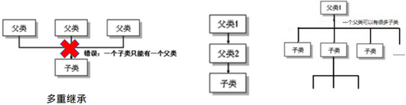

### Inheritance 

通过继承（`extends`关键字），我们可以让一个新类直接拥有其继承类的所有方法和属性 

	

#### 作用

- 继承的出现减少了代码冗余，提高了代码的复用性。 
- 继承的出现，更有利于功能的扩展。 
- 继承的出现让类与类之间产生了关系，提供了多态的前提 

#### 实现

```java
Class A extends class B{} 
```

- A是子类（`subclass`），B是父类（`Superclass`） 
- 子类继承父类所有的属性和方法，包括 `private` 方法
- 子类的功能往往比父类更加丰富，`extends` 

#### 注意 

- 子类不可以直接调用父类的`private`属性和方法 
- `Private`字段，子类不可以直接使用；但是可以使用父类提供的`getter`和`setter`来更改自身继承的`private`字段
- `Private`方法，子类不可以直接使用；但是可以使用父类提供的，包含`private`方法的`public`方法 
- `Java`中类的**单继承性**和多层继承，不允许多重继承 
- **一个子类只能有一个父类** 

- 一个父类可以派生出多个子类 



- 子父类是相对概念，我们可以多重继承。为便于区分，我们把父类区分为间接父类/直接父类。多层继承后，子类获取了直接父类以及所有间接父类中声明的属性和方法。 

#### Object 类 


- 我们发现我们创建的对象自带方法 -- 这来自于其父类 -- `java`定义的`object`类 
- 如果我们没有显式的声明一个类的父类，则此类继承与`java.lang.Object`类 
- 所有的`java`类，（除j`ava.lang.object`类之外），都直接或间接的继承于`java.lang.Object`类。 
- 意味着，所有的`java`类都具有`java.lang.Object`类中声明的功能 

#### UML图 

![Sum  Sup'S  J u" rus ](data:image/png;base64,iVBORw0KGgoAAAANSUhEUgAAAT4AAACiCAIAAABXiTbrAAAACXBIWXMAAA7EAAAOxAGVKw4bAAAgAElEQVR4nOydZ1gUVxeAz5TtlaVXCyCKhaoIAlY0auwtJpqmMaZqTGJMTDfVxCTmM4kxRo011tgLWAERRGmK0nuTZXdhe537/QB0ERCsiMyb+zzB3VvO7MyZuXPvKRhCCGhoaDobeEcLQENDcy/QqktD0ymhVZeGplNCqy4NTaeEVl0amk4Jrbo0NJ0S8s5fz1mf+WjkoLkfts7v2/7K9Dnt1Nw813dS3TnrM2f42T0SeWjund3pNXfbhD6tnRTrc01PmGloOiW06tLQdEraeNd9bI0kTUWrPl28VWoCwHGSJbb3mzln8XwfAdHRctE8WEyK9ANnL1xXEU7eQ2eF9BLigEyKcovIjd36Q8dUfTA6lhs2eZRNW1d3m109zrQlNXpMCzKramvkRMjcibNfHhrAKzq6YuXKixqq4wXrgHL3dLjI7Sy6rC+WL1l5RWHR5f3z62vPHCo36fNXfDD/6xL9nVoZK/7dvelgjbGNztvT1eNWrGnjvvR4wxSHzZkw0gEzjDKlRB3NS1Wa/OvO/Lj1v3gpuPeb9MGsp7zxkv/9vrbIqy+WElvd64O1s1zKzqz9Jia1SE869hj25ovPRQgJi+bajl2b912vMgl9np60cF5v3bY/12T0HOFZdPBoCfQInvPFlEES+mneEVD68nQl6T1u7Csjey8YcOwMjpXH/72/tBpt//3kq2MSdx3t9eySGdzsr9cf6fXskpm2VEHcHyticshufW6YwQ4ZCuL//iY6XSEMnv/iy2N5Bd+s3+/Si5eUlGP2nP7VM2GWxq5OLV4yUtQJH7xtiNzht5k73oHMmmtnEs8ePLl1ZdwNiuPel7j+2Rdfb1X0mTUqUHf2u9l/ZyhNqvT0szu2/Sez9/TykRDVR974+2ht8EufzRotKYpZd7JMb6rc/M3bH52t7T1o1EBI+OabN38qlGdfjd25fWOuw9Ao++IDu77/X5mh4w+2nXfiJwtcFPLZhF7X/lkYPHfiM9EFDFexXY9AFxa7W1C4NylPunwxW0shs6z+D1PN4df+imEOXfCyR6nUiKiaXS//Fd9jwuJX7E8v++VkhUGelHT0r3KfOSPdM46u2VxlETV21YuDdfSB3hOd+qmrK9+6aCVgGFPsFvLWCx/4K9cslpEewz0lXDysOyc+9UDhs1MBMIHXuz+9GmaDgVnOF+Lqiwf/WhsQEjnpvamhHnj1po155j4LvvxyhAOh8sx6c+mu6MoRgPF6Lvps6iBWUf7WpNMFWjMAq6OP9cHSOTQemQ32Qz44NxZlZybs3btu+U8eoV/0siWZHJ/+7sxLAAgBAmRBgACQQXH5BuH5ZZhfCGX02nbNVHOxUld39r81Fw11dYrYCtMEIGwihkcMsRc5k+dlRsRz8m7sCjrLD9KETq26fO8vz3453JHBZOAAAKospREobemVJCUJziOf695NiAEAwbW3YWIAAKRk9IZP0fqYkzEZh76L/fe3s58em6s2IUIiZhEAGCkUkMiktSAAJp9LYoARbBKA6tBj7MoYKrc98+GpyCXrvgwaoUrbvu+aykgBBshMIcAYBBhr9BYD5CrMAAAMXne+5dQFqa6fJeWGETnxnHg83jsfrAqXRR+p9vFh3QDAmTgAYDcfsvVdIYBO+djtrMtUgAAQhhFMJoOBN/yTYxfRnUUhuxGLnp0RoC2vxrqLSAQAOAPHAAEgXemW9/45ohi87ND/tqzy4WpuFOhtwgcKDdd27jhZlBcfsy5ezQ8ItycBsFuT0Y4/zC47Y2a7zfl6lN3hbyd2m/n0C4l2z7wwuRtXMthBf/zLBatrPZ7zxQ598ezT6/JIJoljwHKa/kkE+fv7EyLXXOOzmQzXeUsHVL3z9uTQTzecUrKZzbWT2dDVLxXGDji2+6ezbg4hwHECxzDMSkJSMvqX5y6+tHVxwEFgSALfWOwjwkrqK9cfCMdxVJTjyU++mbgRAc7vPWfhLE+RzYp35inW/PPiuxsR6RA+8Yuf/AQ/WussPIkK0lkOB7MZ8eL6jGcUUi0mEos5OADYLPz22HM64HGZ+NL9T+ssLA6j8fHDGvPKlmvPGzEWq2FVsde/03RqA4PPJzEA1wOb9gEAwMD/Nu0HAAC3m111mh/EGuwOAW7mrM+c2r/TWcwhs6pGjfgiYWurD2adQqrDRGIx9+aUA5mUdUoL18aG2QlXGvddqblbG+ZpAzrdaaUBANibUdMuG2YA6Dw36FuQAjsxQOuSExwbJ07TChhDILa9QxMamseOTviUoaGh6bzvujT3w96Mu3Y2onncaGvCTOvuk0gnXMKgAQDYd+XWPbcN1f3vquwhC0NDQ3MvtKG6k/vZPho5aO6Z/fTttUtCL1N1Te7V/oOqy9n72rcbc0130cqsubL+5/d+qzR1uPHKE1BuQasuzd2AC9174xqtGbVd9SYEr+cASqW23E0bmjbp+GUqS23a5fMZam7vXt4sgaOfiNGshrkqcfsR+6kvefLpG82DAQEAMsgyDieV9vEioi9KfcfNClNf2nMdjRsRqLhyLBGGTu9eeeJCno83Nyax1GPkFJ+CQ/sqHGdPfsoLMBJMlZf+/a+IiBw7ZYiYBEC6qkux+SUFeu8p/dH55AIPW/U53Yi3htnknzpQFjxjtBjDcAxDSH8j+VSeTKZkhw2P9GJhTQWYPVpC6m5ciq0yaWt0fDuHPn36ubVgvkjTSAc7/Vnkx//8NtEmclZwd9npb77P1yAEZk1xqZ6yqoZzHXp4CZn4Q5Khs5d7AQEggqDOnzqeBMEze1//ZX8x4Si5ei6+iuK4ibL3Xq6hSOri6RMpRMjzg+S//RGt6Td5knnPl1lKBIgyVFdIQkbbpS376WCZBVGqpO/O4X37h/S49M1715TnY44kCgNCXLk4RghtHR0YWL2USJv29RZ5UEjUZPfEt/+Il1G3CVCoM+St/P2cS++Bg6hdv+RSbOIRXH+drrRfdW+da7MZAbKYrGY9yGw0mFCTCoAaKyCrmshsVY1qMr6hcl+u0UHCZQl6PDV18XAhARZZzI7fE1QIAABZzAhZLCDsMSTMltGKGE37p2kvGMkVOXDt/dztJA6upMpgAbzeGhjDcACM4IjsOCIfF5FA0l3I7uYt5ju4svVqEwLAWa5BPboHRb4QbkiqNILuxulrmK5aqnSe/vknvo72fKfQHn0jeokZwHQLGO7Pa7jETNKDSQw3AYELe451KjlaaGguADIa5AozzhRyRLZOYjq8wZ1ph9MfpS46tuy3nbZDR+P5sSeNk3YtGe9MlW3esMPcv3dRdEKP1z+fZTj3yW/bhaMm8vPP7SvzXj7aPv1q/DFZ+JalE03JRy9SzMrLMdWDPv0qjJP2y/yVg9f8G2rbcF7Y7nP7VMxf/u71OW8vCvV+uSdSFRw/kFbEdjrt1MOw959d4uABKQllwfY1mWP/t8Em4cPbxCCMxef++hcf6CffvznPOTLy2XkDbZtPuGnaB0aAGSFAQEHrhu1Wt26Tme9rSwLBFKpz5HZTh3ggWXJFdWsNcaYtVV2otPjyAJh8Hxuy2ZSB1e2VMe4n0i9osRd+iXDo1O6oj4J2PHVxvnuAP5MUB8z8bOH7YdKYfD0gs0bnOHLyoPDh4uJj1Uaui18wAxf6Tnh33gcvWFLyvaZ+OP+9iZrYy2Vnvrxg5LJFXt7k+SPHS0284Lc3bB9se+t+igkjXl63dZJ97Pp5YV/+FqOwCLtHhNpIBoaMGOoT5E9i3MFvHf75+1muJCCsuRhgKPrf4ZzQwEGjh43WVRkiBtB6236QQZ6fXVueUS4vLi2RSXOLKckQm6yV2zb+m14tq8jIrMjLrqtOL5WXl+bLarOyFdLsIoW0oFABgl7Cgv0XEo6dS+wze2p3BrBdZ74i+nfysrde/vuI3lSaW1uWVFxnBgBKfnzV2z+VGyl92ZVqWZ5+1NvdY747HnvifFK/Z6Z2ZzQTQF158NTF03FHD1w6vu7U1TraT/rOtGUIiRAAIIzEGSIGhoAU4shEUcDxGOF06GBCnYAkkIVCgJEEg4sjBASfZJIEIMA5OKWpu1InmRwV3IsLERPHAQACYJNg5axE6cuMvOAxHx0Om7jpz4+XrukTsMwXASCEEAIcZzuwcIQsGIEBAtRMDESIB9trzlVqBnErMcd+EoLO890+EABgLMdRG38dBQDg+f35MACAvovXhRqYQqbh2YlcDg4Dfx0JAADLYgMBAOCFbWcAAOD1d79XK5XAD+MTAAgAt5/65pbxGg1wBSwMIv43umEITDL6re9HkUwc6/XS17teAoDwn0arag2ciDEkBgiIpgJYlJfix3755wCOTqcpu/5futI3sjOGjHpk3Ntvoy/f+PYp94nhg/vw7/RGQnA9DBm74motAIbStHSZBW6fJBnL95wu0QGQgn7PPzfV1aAwIABA7b3hEuKwYREulSlxlX1+fmu0E/12dJ/gHDGHwAku586XBUbwRTZNzzzO4glYzdaDcQaHbPIhzhZIRGTL68bGuoyEUxt/P3XySHJSDmN8gJDW2zvSjjcKZKjJTqmV4wVlUvtrWUopVigPceluW7n2o3/H9FVqy87Hp0kEyQqZKr9MZi5NqZObC8pkrvlXlXKBMmhZ8Lm3lj7/WzevoVPeXUyoE39+9ZfQX7fdmjNTsoy/v6eGhjoThWl5Q59514WBe9opv9m7WzLMPr1WqrxWOC0ETy9RVEF2maP2NjGG+FrORh/eZnBy4LAFFy9NnvH8OHrK3GnhuL+86SN1tUyFiRwdWLTetkUbrvYTfSWtfEmZ9WaCzQSjEZh33H5DRrVMxZDYsnAAoExKPSG08nE3qymCh1RVMh1L4iBhYPUfai04l2z75CFd7vY40+ghrpReq5Zn7sjt9d44D3abzZ4wDl6T362r/eS+tH1rp2R/pqy9rvatvzriBJsJAMBsK54exuTZ3XRjx0kht0l9ko8DgNDZQWg1HMkl7txnA/rqY9viDFrekF48s7RaN2iQM5t+16XpInS8NdV9wPF4Y8+bmefzKuso19ChQ1yZ+GMuMA3NA6OTv1LgXIf+UWGjJwb0de2MYaU6igbjHG3aho/+qLgbT4K2C6UtiXn/m+/StR1td/REFms6cfYDutSXe4fr/+JXC52bL+yZKpJ35xnutrf6VjjX0VOk1ZjuRy6a9vCobFaQUXHtaEK6feQzQwT04/GxgDKUn7+QaPCfGGG5dvhiWR9PIjpZ6jtuZqhsz6LNcUNmec4d3PvGuYNlQdOGUVmHE/MbXBFGTPYpOLyv0nH2pDFeTH1+alyWTlvFCJ5kc66hVZANCZQy78iqDIX/+GdGimmzqIfDI1MjDIercWdz9LSNzOMCRuCa80eTVBaCROdP33QDKCU9woIkLpFBgbYkKZQ4OTBwnEQXz0Sn4CHPD1T89meMpt/kSea9X2arzLXnvzpvFxHcv+zguiKHxlYEIHNdCTfsud7Xfz5YrOvow3xiafcyFWUyAUkiwIiGnSBkNgHJaHFbCFEIwxurWUxAMDBg8CVubBwBAmSisPqdH2Q2GhGD1dAJspgBxyhEEPRj+VGAkSI7PgMDjOQ0ugHUuJFqgwW4jVWYbgHD3ADAJLJji3xcRAJVNyHLzVvMN7iy9GoTbjP8p7Fxpy8VSQ0aaw9ejJT0c7ERM13wBL2lA46sa9CuzSFj6bbDaZJuWGpi3awFz3mS+rwLR5MRsyLlZJX3WEnyloS+n60fEPvZZa+lkyN7srTJv776w6Bfd4TwShL3naUc0NWD6b0/+jEcMMpQkLz3m6LYaP3Ef1/rG71lp6WfT9HJC90XfjZDe2r5n7tEQf1SkzQff/5pCPfOYtHcHw2b+aj+P4QAoXrjU9Ro+oooZLXj3/BZY7PGirqyf944G7z2+Z5Fxy9Yt2roFUFjpzQPgfY84MyqqweuyYSeo9+aGmyLg1lxdkWSicsSeXuSiQk1U+aOJS5s3pLq+sGUoT1ZGAAv+I2/toVIKFn0pxe9p4SNnDt9Yh/MTAEAkLb+Uz96edHA6pgCjVbnOHzSwCHDxMXHqg18twB/EuOGvHloJa23jwhKX5ohleeWVCtl+Tl1FfVuADXS3GITx4tTsPFkXJlBfvznxT+VG4zygmxldUaZvLwsX1aXlV0rzS5W1BQW1mIs3fUd/4tJKNdWHLuu6c4p2HgyNv9GXo6yKqNcVlRSUiPNLTXQr0gPh/ZkPyAkEUv9V77/4YvuUe/9MhkMdZl1NhNHBXtzIWLCOACk+bDngiV1k+czGqfXBIcEUNemVKJpOAak7chXIwEsVYARQhJDGMnDLQamxwinw4cSVXySAAohABxnObII+g79yMDZPi99tfMlAAD3Db+MBADw+q7BD+GDDVMAxzFwefO7USSLxIav+2U4AAB8cK7eFeH5racBAIJ3f6OnGGwiagowmHjIhhmA4xhs+GVUQ29DHv1hdRna89S16KpR5CfR373jc/m3DVVGBs/dcGV3g1NBelpp8ZmMIR+/JF3z1ZW6xhcbBABMfk8o/u+iigKkyU7OaurDhYyVmxaddp8wJKQPj7i/HQ6ahwCG169V4Ax2K84CDRBMNgMDnFGf/hLH6Yg0j4y29nURIIS011Zv2hVbjTl3D4sUEQzbMZ8Ely1d9sKkb7/dripYvUsb7uM9ebTrmT+//Se7zozUiavnzk6UEfYTPwkqfXf5q7NX/e+MnRtTlpVSK08tKJWWZeUpZZdldjaVfy7fuf+UUluWEJ9Sej29tub89QI11fDiRZf2FpquSRvuB+N8bAAAUWZKJ1PoeRLbxshuyKiWqZgS25ZsmKx8DCi9Sq5jS2wYLVVrrwMDzR05mq24W/eDCa16ldA81hyycjVp1345hpMEz9GOZ/0Rk2/XmvcJzhA2rjThbIFda648OGnlwEBDQ3NX0FuoXZJ6E0pN2qblf1QZH6xlpkWTseHXpb9XGVvq36Iti1n63Xfpug43H+2kxQo6018Xhuv/wpd+WPO7t6ni0n5t/xlerHvptD5g+hkLaql/nOvQU6iNNd+rxDS3oA1MuyyUoTwhMUnvNyGCun74YqlvT/LEJWnfsTMHy/Ys3hwXNstrbohP9blDZUHTosSE7kZKXH5JvsHrmch+3LorVvVnRdmQuuqUuBtGbY2eZ2fXx6cnRmDYrf4njhLqM1NTS421MlbYzH44iaG6/COrMmr9x82iLZzvnbYmzPf5fDfdSN6yoVBN3W8/dLlDuXsQAAIMx9XnjyWpLAROnT8dnQhBM32yfjlQQrqHBUpcIgMCbAlSIHG0J3FKmfx9LO7bd1CPS98vSq3FmtQv1ukLflh7ztl74EDL7tW5wMax2/o3VcesLnUeGhzqojdRCJC5roQT9pxP1i+HiumJ872f6ofs9Idz7bp7ChjNExeYNSVNUxzQ5V7LvYKRIns+iQFGcsQOXDs/NzuJvSupNlhZHTPd/If583Bd9ZlroKuuUTlP/XS5J59xe33KYFDUmnGmgCOycbwZ+ryxfyDFA/yzP3169T5NTxsmAEba9He2Eds743UG2sL53mn3MhUyGw1NkkQ1zzlQnwCh4e/6LAe4oHtYmKRZ4gKLPGb32gvq+7juaB4SCAADrOk9gWAK1blyO4/efu52Sm3T044AWN1eGeV+7UpiCnr+5/AWQp9TFGvS23//NUS75rf/im+95mL0pvR90a5XDVP5ls07zX19ik9d6L7gsxftUXHchp1EsJ/84JYCp4jwWS8H8IoTjyUjZmXqqeqgj74azEn9beEPA1dv7V+5Y+0PR0b+8rf4wvJ1eyTho/DCuFOGp9dP0B/MKGY7nu0ePmzQHcPB0jw8KH1ZhlSRW1qtJPNzaiucKuS8GyU1NbnFplAvdsHGU3GOUX2v/vHltZkrl7hMf0W8ZMrHJ/09gxfMnm2SN62v4Z8+ezFeUCrhCJKVxBtDmBlSWVZxlVaiz5AqckulWvLClyd5zwf0GtTPiV2Xl1NX5Vgu51WX1NTklRr69KGDP94bbZhkPNXLBgDpcv46qZk+tnv6n4vWDv9tp2fV0i/+mLD8pyHm2BnfX/7y83d81CfmbambGu6MSQ/+mBjwz8fPdsd0ZpzDwAxZ2974tO+qnf21G1Z8plqwZrFtybIVayd88H7+L18Rr//ynC2tt/fN8Zy7Nsl4uncbJhmIogDHMaBMeoqst4WkDI1B0m/Dory8/prjrH5cnU5TlrVf7/dGxG0hlJHFYtErtLiNkEOf7/vicFa7TTLqFZvlPtzxyKEkpYAkwEIhQhxir42t0gzkVoJDXwmODHVXlTYTRgV6cyF8whgAQI1ZDhBGYPX/b0xcQAhxykRRqL5zesrUIbT9q+M4ACDASTbeUB9ncQUttjXWXUk4fUJW7e3IwDk24ybw8WZ1CILg2Qnu682c5nbaM2HWV2xedNZ/63sDqgq3AAAQotCIIXVVqfHc3j+91t+JABPXQ391b1zd+2NE5tKMbG7fAbYEArizcWO7UxzQPN5w3F7ctFRTLVdhQgc69Pmjoz2/NMnxsK1a9/GeA6eV2rILCZka2dlTR7ed2rvh5L9fb/7nmNzEsBv9SVDZB8tfnrzy+92M7mJCk7TmxWcvyk2G8vTS2hvZOeU3slPq5BmFZdKKrCyl7EKpoZutcseBvSdr6fBjTwIYwXO0d6L19pHSxrvuaG8xADR1FWAY8nacN0WFuiC9VqW4vjPPe8kYdzYgo0amYjQ4JNye5aA57U5xQNMG0bm1d/uuO763zcOTh+bhcSRLcXfuB01dBXTSE9suGLS8MG+euUaqCx7oxAa4leWgvv4tD4RWwEgubUhDQ3PP3MNTj+P+2u5XR3cDVR0lGRw+drSEztDVSdGmbf54bRX9ztI5aXOFuaVPMa5d3yi7vnesQ/MY03DKOP5zvvDD8GZn0FRx+YC23/R7cz9oN49mlCcXetLaZaGM5QmJFw0Dng6nrh9OLvPtSURfqvF9asZg+d7FW+OHzPCcM8inOu5wWcDUKDGhk16OLZKVK23HDw0SKS6fypfLVezQyHAvFmZUZB5OKvDx4p68WOoxbFKvwiP/VTk883SUuzrzeLrCy1Z+JMs4aPTkYM3lvdfR2GH+iswTSRA5URDdMEqIP7cmJa6gpMDgNbkvOn+5yEOijtUPfTPSlVbqO9GG6sbk1T4aOWgeORhOqC8cS+k5dqgAJZyNVvX8eIbP6lcOlex5JjTIpiAyMMCWNOokjvYM3KJMXHGY8f6LEcVbv95QaNEdU73+xihuzk+z1xObXwsTESj5XIy219dzgzJmrj/5zduTJpYtXZEz+C8X9aETx0Lmzhtu+/fi/7F2vtc78/yhgMgwT2Hu0th+059tGMVGm/xlPDk/ahD117L3yYUOp49VvvRWiA2PNt5ogzZUd5SX+NHIQXPPnLzH2ytGCu15jSHUOfUh1F0ZaoPl1kXBdPMb6gagyjmRY/MyD+P6z/3aK++L6YyZHxA4r/sY55KdRYYhQRyRHVvUy1koVHcTsVy9RTyDC0uvsZA8iYTnFt7Lq4/X88GntlQafesj1GFYk+BzOumZaxAhrVE5T/nkYwH+H88xtLtvEOf+fpOuAL05Q9OEBlOaJq+/JFtceyWtygzIWHVJK7ZUFyktAAAMQa87+NsiAAAKAQCGcwSeIgYQYEEIEFCIQjdHIZhCTZ7ctt63QUc74bcbWnW7IggAAaUruyKV55ZKlbKCnLqKjDJFcUlJTU1esYnrxSnceDK+TK84vnrJz+VGjvPsVyW7n/nqw7d2xNn1nPtut5Pfx8RFX0juN3VydxI1BlhXlJcWyOpyshXS7OLamoJChRksmuyYzKyki7E2Y6b0ZNuFibN+/HfzzitSeeWVHEPDKDW20+YLd0395J35/xzTG8vy6sqTSpTmDnelfDyLNW2YZIxsbcKMjMrC1FKZDgFGsG3tPfvYcR/gywkySdPLib7dH8K+k6UuPT0hQ8P18fRi8x0GCFscwXzj8s6jtpNf6M7rBLe2U3l3bZIx1qcNk4yW3A90ah3J4zEwAKD06joDWyy6c4xmffbSH6KffW2WC9/WgU0AAFD6WiNDyDAYMC4HvzXKHXwbaJpwzCr6511EyaCUV6/WGBvVnyl0scn+bekphYCtOrt1wbQ9GUr0gO4txtI9xzMkrjaMB37XouTHN69MtBkyM6CbPG7lyiINAmTWFZcaqKY1Ma5dt54CEu/42+zd3oofEC2EUMc5fF5jdjiczbdpQ28BzLoaqU6hYto16C0A4Gwxm8AJLgdvMgoAzuLRenuX3MVThdLk5SisEiYTHDGbw+/m0yN03rSB1fEbU7UIAJo63FvMCFksCACZzRRCloZvkNlAWV1z9V74lMmCAMBUcObPzH6DPRjNv2qsfdPpv34sZLY0/tNifSU3d/03Vu7PNzmKuSx+tzET3hgmxIGSn9y77oKaaiotLujWNEKAtQDNYwx0Ph7BDcVigh6fLZrXjTLRwVAeXLHiLiJCotY+QXpFjYnd3Y4w5CUeT0bMyvTT0oBly5wvf7Zhjyigb9pF6cDAsOAekJqsnPnSdGbqjsN6N5vaC6fMY76fHMQsO/HRhr22YSPxovhTxqd3vNzjz0SYHM4FhNQlTb967SlnqnzL9l3mPj7FZxNdxofn7t0rHDqeVxS3v8Lzw2H26VkJJ+Rh/yya5kHo8y7elOTDFYM4qWtf/zHop+3B7nO8K1/5atm1ma+/Hez1kgeoi/cfvFLCtj/r2M3437/7RAF905I1y96ZkrN11dFhq9aLE5c3EWCEKWnjTjx4gOLQlkKniNAZLwfY0qZkrYBzbJy7d7QQTzLtMMlAqpKTe7OVZkqZUWAoj0lnYUy34LFPiQGA0svTjiekX89zf/+N57y1sQsumaaE2Xn1IA/ExMjfG+5H7q0Ofm1v+Jnn/q4eMfKZN12KTKq4JefEK5aMcAdf/bfLvg344zn9VukAACAASURBVAcPP3/GfmX/qYuHBmu/W5cjDbpi8ZhHAgDGd23yVYHhKSdMq7MfPj2we0bq7rXgPZmBV/mMXTxkoOC7Lwt6/roseCDz+59TNVNcqNivbkkSXRo4O3jBH1sxDoFB+Jw1W86u/XTL67vPTvrulflj3MMGi8+SwcOGiqQF5H/Vwa8dmMgCMNg4kkebC6DyPHAib8IHrw4xa9clpoT37bR6eyxH0dEi0Nwv7VBdTOAR9aIHgLlqv1Y9MspL0PC5GQBnS/yfCus1LQwAQFucqRQ/HRXgzYXwiaMBLDficJYjkyBtwpcOWPX+5/M9hr/zdd8LheZQFgaAiwNdYF+lxuKBkzhDzMABYwhxZDTJDRivMTl2k6/MCGEc9xGORw8nKwUkAYAxCJJHYIATfAbDQGCAERyMMlLIqGwqCQAAhwEAlL7MxAsesfTgoKf/2fT5sr/7BC7qffMwCZzlyGx4K8MbEoA3FYAQD7bTxt3QDuJWYQ6+tp3XEu2pXrTnUKfkuNU99/4iQjYkQq4vDI6H/tq+uFoLIEPplSsyS0MPFm01Cl0e/fmiXmlrt+u9eKrkEj0AokwWvr8rn0BWAwEQbA8eVWuwWM3trf7QV2xZdM5tQkhIby4BVEsSQiuS1MtprNgbW6pDQPJ8506f5GJQ6CmA+s1H1MrxWguAiUOHhDlXpcVX9f5p/ignrKNffJq9/tB0Idp6clhdGoRNeISQ23g5G2uz47NkMunFS1XuEU4cHIBhG/VJwLnXPp/3h7tn5Pi3X5WnZ9TV1OUUTvbJ/XXPxRejvJ27De7XbdyokK9W7D24oI/psuPzi9yYBll2Sp0CLy6T2mVlKWswuccozrkSA+XLBIO86VfFskHOHrY31n/83yhflbY0/nC0XM4oKpVZylOVCktxucxYkKmS80uqJ/azlmTRIlydtPbN1cGrtvS3yDL/WUmFD3Ykiq7mD52yyIWBeUrqvjm0TxJuXy/tdFsvrrE8vUxxA3LK7XVNBCgsKD1zbJvR0ZHD5qd4T5747Fjaa4qmo2hjX3d4z7s0hERGjVzFsGmSARBRZkovq9XxbOoTBSKjWipFYmdBS2kCgZJd+f1b6rnv/Wxa3Chud37AJpJQJpWeEHAxs5oieEhdpdCxbOwl9dsbyKy1ENy2tjoAAOnzdlwwRYW4IL1OVXt9Z77Xkij31pKhPTrOFNz1vm6rE2aqNvfYzmILF+nVFs64ERO63TmVG9JlXVjzdfbEtS/58O5Y0Qpj5fX0Kmd/fzGjpV+8PQJo07Z8lxj1yUKnB3XfpLTlZ77YkfLsm+/73dfpfOCCNcM6hOCDDqGOMbm2toymG6KAkzjXUWLLxxrr8Bxc+czmcdUBASDctu/LL2mSzitMLQ6BE1b5AdstCU4KuBgAkHwcwwiBs52DhMAaxSO5N/++Y9FLY7Ylnjhw9fr18vy0El1woBO7w2fL9zhhvtWeUl7+sVjdeITXv9qnGj1swtxRY/zUlWoKARgrUvbkGVoZG2N3d+cp9WbUhog3O7HUZu3YRvj4icmWf/F2CcDxn/PZq07kg/sFMa59D6FWY75fw4TWBLvjb3jPJ7u9Sy2vjHS7t4vk3vnhUQ/YPtLzDzX+uQr+OlXWkbLcK+jWVYAoykg1miwjAmTH1iQM/Dy8Z/BTI7Qkpczfu3hbfNi0nlNcDWdy0bhIP8W16ESIfNbPxiJLOZZTq6su01KAENJWp9Y77s0K78utu3rkUlmfnkT05Rrf0dMHK/Yt3hYfNs1zTqDtjgPSkW/zjbIrVhVmRIlN188dKQuYEsVqVYAZ3mTi5UJ3iSZW3TuQLKIGPB1uyWrSiQ0DAOmqU+OqjVqZnm9r17tXXzcmBpQmMy211FQnZw2e4cfJqx9IROikKbHFsgqlZFxksCPCCKDq8o+tulrr/9SMEUJzfnp8tl57gxE8O9AZU1w9klzoLtHE6Ye+EeHCQnqrb13YoK0XfiSnOiEpyXC7YFaHP8j/QQYvbq/qdtJrlKZVKFXJucN5KpOu+KqucEsBixT0nxDs/emr49//c9GwuFHvPjt/ZneccBscaFMQGRDggeVkbjoUEB7qKczdF9t3Wq/K1Tsq5ywcL8yO3VAGlOrSqnjGvKhB1N8fLhb88pcnlXAuRtnzoxm9fl1wpDR8Zn0n/sK6ndGmPtMYQBDWFUrC57gLJI4OJA7s1gTwdzBkXDh7ovKFNwcJCdXBE2k9xw7l39aJJ8dY8OPfcZOXvCGRvrMw/9WNfTAAMNXE/Fre/5exvZMumymMrB/Iokr66ijjvefDS7Z/s7Gq3zIHQBZlCXfwsz6/LDhSMmhc0beJdj+9LFz93frMvp/4EVTD0DZcAsBSl2D17adB7IY+MRxXJ55IuV2wW4f/gIOOP+ScQ3R5+OVez7zAY/jsERPnhIf2Cx43d8TE2QN78AGY3af/8fWGn/1rf1v1wSapdewbjGHlsqct35cg8LEjMbbIhY+DXnr2GqaX1qhcJi1f7slncET2jUmJGFZJjEzaYjUmZuIYeXsFptuASD8eDqg1ATCSI7LjOg7u1ifCx82RV58qqfkoyNgs+xEpGuCX+/nENfs1PcTMxoG0VdHZNg48jOv33FfL3NgAgBE2/ZxsxHbOhNIA4qE/jFaeuZwhNWrN1K2hw73EJADR5FuAxj4xUmjfqmAPgYec6e9moYy11/bH7ExQWx5cn/dQTDdStm8sbjXzoLEuK73W2Nab2+NWHhyG4vXZtRRpHzFu6ZoAfazMAFhjaiAMw8EC9S57CGE4rq2q0KD6SwThTKE6T2br7jPA3a6ueVKixk4Ipi2bUjdLVdU+Ae5MfQ2mx/wRbtevXkxBc34Os6+fUVKIOen1dX+GaX9be6Ck0aeQZInqrqRWmQEZbyTU6K36xwAhQ8XWt+IkI4KDvFqyq77zty0I1s5DuFsemWcMjsO1xLgcQ8cGTse5dt16ChjNj9qsKy01IKawG+fqtl03DC00fZKwUnyc6zXNgdV4g9VlHV3/29nYs5ejD5qHv+PBBYzvxS7cePp8GWU7RJz9w64tu65I5ZVXy22fe5a56e2tO7alFNVUpxcIp7wi3D3t8yXzNx+nBCyTvCC3tiKjXFFS2uhFyC7cePq8VBAehOfKTchwWwWt7Pj/3v25wti6APH5VQW5dWVJpUqjruyKVJFXKlXKmnaip8B041Bs8pkLxw+mRP91LrPOAoDAUpu0Yt+5Kn6vgb69RKCoH4jj/MwCyd5nvl3+1s44IZdpkBfkKqsyyuXFpSU1NXnlZqYua9ea00nl2spjmZV1NQ1D17siYjjL6tsqg7mhT6o1wRoPv8z4QO/SbWwORfZo3BxCZjMiCARYg50RILMZyJa3VBCFbkZCQBYTEAwMwHLjn1XfoHmrXpQAhdXHX0ZmkxFIVkMnyGIGHKOAINrjQtK0bf0HQDbZcLCW8JZIyISAgWH13xLIRGEMAsmP7/xFOeazmRIC9Nc/2ZD58oLpPTqLsVRs4V1vDjWG174dZNFQGMsor9CQjrZiVuNP1+Cad7vLnlmp0rO5mAHjCgisDce9hk7MlYl/HHB7ZaHb7ZswDd6FcEcB2sKiSvn7uuPMvhydTlOWfVDf/7UIId6Q8UiH2wg4BDR1Y9ToSC6vxU0qi1GPGGzcYgSyhS3M27616rMV2n0IbWAdc7t9mf7Ktp/IkLhD6iXlzOef8ST1eZdOJFPMyozTVV6jbVO2J/h8/FffuM/SPd8fF96TqUte/8aPAau2B/FKLh84R9mj60fSvZf+EAIY0hek7f+2JD7GMH77i74xu/eY+/QqPpfU/YXl0/VnPt60V+Tvm3ZZ89HSj0LuHN/EVL7l35ttP37Rjiq5sGknHjSg9vCWIqeIwTNeHsAtbpRQGrBsRTAndf0bPwas2uJbtWPjT0eH/rhelLR80z7b0BF40flTxnF/PaU/eLWYbR/bPTRyENdttGX1X5VPf/MYbNk+ajCCRwBw7Dysf38MbzRLZYvZAMBt+BIjhUI+ADTuvOIsngBao6ET0nnQS2EpqRniQQOaZnjEGWwcAOCOArSFUXnlwrlomdTLkYFzxE89LcDrD4ogeXaNojUOBAA4h9fqbjTBZAMAkC3va9/2rVWfrdDuQ7gL2tOjWZ15IEcm7DHqzacDbXEw18Z9ddnEZQm9epBJSbJJM8cQl7ZtueK6dHxETyYGwA2e9/vWIAlSnPosxWvywOFzJo7vA2YKAIC07Tfpw2ffCJaeLtRqdfZDJ/mHDhOWHK/R850H+JHADVx44LO29BYAWazb6sBQsuZk3uD+QVGhI3XVhvA+EsxKwoSTMaXmBpGYXM8QBxIQxnfx82cQor5TPpm7KFR+tto+dLBYEhwYOYhHAMa0dzSnZSvo8MQPBZw/IHhwX85DeVHjuL6wYclb8waFTxg6efYgT8GT7QDcHqc/UjRkab+f31+xwGPoop/HglF5TSkaH+XnxYUhE0cCIM0yjzffVU6YTzTUxzAOA0Bdm1ZFTSIAGOLhr4YCWG4ARgoJDDCSj1uMDPcRDscOX1IJSAIoAIQRONuRSbRn2QVjNm1LigdLdA1eAXa+tkQzCQEa3A8Q4Hi9kQbW6FdACnHKTDWstwACAIxk40aVkWqHJJ2Vm4f24rBHvl3ftdl09oFtsrZnwmzRSdHgD6ND0leuWbcxaPVbXDf99X1xynfHCM2lmdkgKrsS8sFLMT9/df2H73yFBED9shqT1wPKDl5U9xnJ0+eklTn2E1l1iYw3tiyK89/61oCq4m13u0qqr9y6KM7vVltcHBoWWledFs/x+WlePyccTE0kzOH26W+Lo3ZnHkRGDcXr9iDj9Tx+NP7im87Q2/WPlgf3QGjP5hDSZ/26c0+sDHP2CIkQkgxJ1Cf+5R+seGXy6h93qAtX79eFe3tNGu5ydvPKzflKM6iT/pr37GUZYTfuY7/y975589k/fj9t68KszU6tk6cVl0krc3LV8ku1dpLq9R8fOHharS1LTkipyM6oqzmfU6RuhzEayXG3tWqbqZGdPXd827l9G87t/HrH5mMKo7WEuxndxHiDSCZDeXq54kZuTrk0O6VOkVFSJq3MylLJLpQbu0mUO47uO1lnAqQtqRaM9RKTHb/r88g3h2g6EW2sMId3FwM0+A/U6XliCb9B11tyM2ikwdYfBwCkV8t1LIlNS6t47XYkaIGmmQfzdySZogY5N3gFFHotGVGfebCZ+0EbmQcJLolRqqQPjuMfThso6QQR5QAAIL7orleYo7zEgHQVZz/fkTT7jWX+TdfjLNrMzf9s10/9/DXHh2RGr03f9v2FUR8vvMf+H2pzZFRci7vhGNHb7s6eFx1DjFUIwXZdnxhOElxHyU29BQCMybNtUW8BAGfcVBKMzbdtUW+hPnsgBoDdtd7e1lYvi9l28cSBzKzrFflppfrggJuZB29JaCVSK2Akl8TALE+8Wvf808GdRm/vDQSAMI5dT4lOa6Ruf4oTnB79KZWmTZ+Cey9cv9mfverQPGqguSJlX56+Y5tjTHGfAMuBdTlqqsOnU3eeYLV38/K1qMd8PSO94HDDXzt+ut++Nv8AAPBHzJP+Hlhv22iqzDx51uI9qo9zTcLRMv8pUSLAcKx+D1wvTTldKJep2KHhQ9y1mUculfXpQUSn1vhGzYwSEzppaly1SSvT8W3te3v7ujGx+qfWkUsFvXpyT14q6xY5wbvo2P4b9rPGRnkxdddjj5T5TxnJqU64eNHQf3w4lWXV4YzB8r3v7DgfNrXnnIE3zX2Rrjo1rrC0wOA1a0iPqvi7by5NiS2RVSgl48J95Qntbt4ztPj3I8Vvz3qs9/bbG1bu9yf+Om5G13iLNCszz1TbDY/wsieNBhtHB6tk5ZQm/Zvdta8vHMXN+fnZjfiGZwQJcTHKHstneP+64Ghx+HTsxw1xkxe/IZEuWViwYGPvxrisJEqOO6nxXjE38Mqsjae+fn3ChPJlX+WFbuzLEtg0muknnUjp8dRQAbLqsCR8emigTWGk/y0zfUp9eWUCOW/kQGrjR4sFP3x1l80tqqSvjjHemxte8u+3G6t95rS/OWYXqI87qZj2iv1jrLtP9sSQpg1M5ZvWHxQHBTmTcNOM/uaX2huHkklXAY4Ju412KjtRiovsOfZ+brYSexeG2mABymisvc3WHwAj2UI7tqiXo1Ao9hCyPLxFPAdntl5jQs3N9Nm3dXg7OunZa6CXylQuE5cv7ym+2+baG40+BrNXLHMV3EVzjOVIaHO0j3cWlYfifmCpTU87viUh9mJleYayNcNN043UHXfwBLitIJM0rVimqctKr2vmHvAQhutU5e652ZThNH2MzdpNR4pNLXRJMmwtNUVKCwACJr8xvdCtth7zh7lez7yYQj33c4g9eVtzdPtYqHkF1LTDett/q2oEQ6DOl9u6+gxwta3TmtBdNieZ4rqraVUmQIYbCVLD3TS3aIDlzHj8QuhbcxdOfxb11Wsyo9UnZm1pqaHZYoZFcXz7T4miITMHeMgTVq0s0aKWa+JcW4+efEYrsTKaFmPZnpNXJM4SnqAb5+r2XTcMD3e4zlXuBQRA6WpyMutkZTbT3mH8+9K26Ksq6fHf3/u50kAZyq7UyLNKqsD5mSXup1aeiou+mNxv8gRnVX5uXUVGpbykrLRGllesqToUd+lM4vGDadF/xWXWNazqUMbagmxl9ZUKeXl5gVyZk1MnzS5VSIsKFWa5Vf+KvPJqpaJph2aOF7tw49n4MlPDsbGdpr4i3D1txbvztx2neNrou2zOcZ61QLL3mZXL39oTJ+SoT7S/uan2KtZnlITR0af2jie7jc2hsG637NTNN/YfU4+c4NlgDUrJj+9erYz6dKak3grDbEAEC8dAf33hj1ueenPFZDGBdHl/S53muRlP3KzZxMegJU+ABotza18CU8Gprzd7ffB5Nw4AgP76J/9ce3netB4EhTAceyDD3T5ipyKh+K43h0Z6tuh+0JIZPdKra1tML2RRpfyd5TjTl6PTactyDur7vRYhbOPnuyczfWTQqOu9Gu6p+S0fg/Y311fuWVEY+UWYw2P3pnsq/y7dD1oAqcpiD14rYdvHdQ8Z7Jy157DBzaY28ZQ56vvxveZ4Vr7yw/JrUxe+HeD5kjuoS08evFbCto919DD+t+c/0YC+aSmaZa9PzNn1y9GIletFF5dv3mcbMgIvSThlHLdj/jBT8j87iaABiiNbih0jQqa/7FPzZzJMDmu0bGa5j7b876/K4VOi3/8x4IftAW73N9xoZ8JYkth0xAFdNNBjS2b0GJtv06IfhlF59UJsjKzGy5Gst/Vv+7Z3T2b62E2vhntqfsvHoJ3NzZrcCxX9lg5+/PT2NtqxwoxUZaf35taZKVVGkbH8dDoLY7kFjHnKJXSwKJb0jwgyxc2LF614Y5g79NH/9NG3A9b8MHP1Fue/Pv33rd1xE7974aUxDTUjhwprCoj91f4LDoxlARhs7MmjFMZ3GuDPOKD0nbw4PEj70/oCVc8Dp/MnLHpliEW77lJquI8E6k5dodznETfnCwx7B3NajuHzF9dsxTgEQPj9DGcY7UyUrGk6IuMeZ6GdkJdH3OeeX0zmifo/3r9/YR5DNpx+fDdW2pX9wG3ki24Alhv7teqRwxsnzI1LcvraxEJzCAsDwEWBzrCvUl7i5BQ89N2DwWP/2fbVsi0+gQt9bvbVJMNAw8zG2hMAmQnRYIk2TqobxL2B2fnakmAxKQzAtfLhxUg2blQbEc5hQmNCg3seDiEgxbeN+ORz897092N8aT4OPM438fvcHKIAmLxePPWlEiMAIJOF7++g/u9CmQ6A5PnOnTLBxaioDx/S3ugYuDg0NNS5Oi3+hs9PL45wwoHkuPNQrVV0DWTUUDwHXoOTkaly7/0M19KINDSdgLYmzFa3HUwcHirg3vwE43raKL859p/TuFFfB19aceDwgl6my/ZzFjkRq09sWmkZMtiBKLpWMHT8my4kXl9TMtg+Q1lTl1s03caTaypPr6i9AbnldroUpQIvKZfaZmWparCiwtLY49uMjo5sNj/Na/K4Z8YK+o9hx5boKd/6RSSkLanmjx1OXv77ldUBK7f4WmTXN9/7cCXyMC/L2dtGtOmar7r3g7EyO72Uw1TqXCN9WrL+RbrspN+/yp2wdm6v1oOtU8qCQx8dVi1+bY5X4xmwaDM3b9mun/zwDKo7LW2sMA/2uFP2A2TWUgSXwKA+oQGInflMHJnVFMEDdZVCxxJbZRhoqNkGyJC/46IpKtgZ6XWquqydhV5LhrtoMtd+i2Z/38+GAKBUFz+Ixj+cEiy2WCU0uNfhWhmxWfyVx5nEkrteYR5xa4WZUqb+XNvrXY92Zy9oAVSbvfVvfPI73rzaa5u2M2e+7sVvPnfRl6195mjk1gW+/Dv0pL/+9i9xbyxZ4HNL+7WX/vjw7OQf3nN+HN0BHjWnH8AKMwAAYGSjVyvG5Du4Nn7IJwBA4GwnaKlmG+hrTm5LNmi5g7055hq5LtjfkQ042/fFl5Ljz9cOjxSoEq/VPj8uSoID4AIuAMB9DdfKiE861ndrimrwQAAApM+/cj5br71BBs0OcDaXx/97VeYdNDZcVBN/Md8xOLybKi2usLTA4DnZFyWkFrnbaOL0kW+EUFuPSEe+JsARSHoMLl57tPjNmT0I7fW4o2V+k6NEhEGeciyvTlddpkUACOlrUk4XymVqTmhYmFPNxb05aFy4nyIrJhEinu2FkWCqzNj7XwkROfLpMCEJABgOGEK66pRGY+a+NvRLDTx+hpAc1wW7XxjVDdR1yGZwyFOj6+euGLfvoJGBYNQbzP2CR/fnPMjt15ZHfPJBqtKzO84e2nrhwtWUY1vOHtpxubCuLuHbi7bh/n3LTvydacD4zj6cq6dzgSCQpQTr6WFOWZmA+/YZ2D191dJsVULsiYt8v0FOXEqREG3s41j/UGTaBRpiTyrMgJECGwcHBo5011ftqgoMHD62JwMhoLTp3+ypDQwaNcklefE/iQaJJDPxQiXFdRXk7cuQGQEoY02FOHi0bcZHa4+VNS6FIu3NoX9cnFHbsVFFHxfuIqv9IwLjSnyjJL7NBCD4Ih4Aj/3gpWptxCcYBAAC96Gz3YGqu1xe23tut/oJs/sPI8+fSSuSGrVmhICwGzfG7qXYwgnBGS59J6Gaf69hQ6QypcvTH37Mx/+LdRjs0TuIA9riYjU+hIkhAACM6YjrUrQmALZb/wg3AHXBvgT+rMUk4CInPo50VYeSyekCHHgeo5zK9xQZ5zAwAEAY1uCrhDOdg9w9fNxnD4ndUml82o2DAMCsiLuGRdQPvdyGi3WNk9QGj9tTl6YDMVRuf+u87YiAm8HBMZtes/yyN2xL7xUoIgiGQJ2vsHXzGeBmW6cz39SepoHRLRpgOrOsHLsxTHujMdg6AoJpa6kpVlIAAEy+t5gBOFgAoD4y+y1RkNnM7W3bOAHCSOuhb4/B3kVp46mbVFL7aOR4NBAKvaVl26CuhdW1j3M9pzFY9Z9gOFOXs3vNuf612qpj16r8A5xYzJ4vBWN/e/a0AQDHqa8IP5j29Wm/7oEvRDjk1VUIy5R+XkKWTVgQflpuinJiApjqrmK+48VMsCiOr/vm+uSv33Gd8yzzy7d3VI4SFddIhQWimUvcV648zR/LzO03cVp3lmWIKPuHvVtHiKXyqqu5+mBvftH+S0l+hpzek6d0J4DSV1ypkefpw14Qrq4f+pVps3Bad+HOK8xPGBYz9f30A+PeCPCP6t7RsnQkc9ZnDms1bbLFpEdkk9DhiNJZME6j6S8yaNXAuS1Ourny4p8HXOcvdGXpK/esKIr8ItSBtLZYRmalWs/m4AaMIyCw2+2ib4/MblGrVcATN1ukbnHoLsbZgge0wty5iN+ZJbTjXDlT0jfSncF6ogM+3jsE4/bQ4RjOsbpIMBa3eZx00jn4hbC01FSGTW1lv6UhDda/t2yGMVIosA623tQu+vbI7ARf0OKNpcWhuzBd5V1XJdOd2niFILG6au2pjVc6WpwnDZw/IDCkv9hrWGBvUVe5pDqarvI7H1p92aAzyys0DBZxauMVRZWmoyV64sBIZvuMYGgeCF1CdUuu1iQfygt8qoe0RGnvLqQsaP+q5I4WqiPpcI9xutxbsaZLqO7JjVe4QtboBX4AwBWzhj7nmx5TVFOq6mi5aGjunS6xTDXmVT9qXn+uoGGZZOzrAW59bG1d72RM+4SD2q5yd7TmfqBN//eHCyM+WujQRWzUHiFd4qnr2kvi7mt3858MFhH4VA/sAaQ7fQKgVKmrSu/zxR/V5uzaTvQO9ugfSB1al6e2MlTk+s365NWW9dZckfZf3pOehPwh0iWeujS3Yf3QveV+gIy1145cLuzVg3sytazbkKe9i4/vr7afNXqUF9OQfzUhW6+9QQbO9ndG0st7Uov4faOCauMTmaFTemq3HpWOfFWAI5B0H1y87mjx6zN7ENrr8cdKfQdxs1MM/caFW7KPpJb16U5Ep8l8R0yPEhOqon3v7EoIm9RzTpCfLb1Tdw90iacuTQsgVem5HbGHtl5IvJpyfEvsoR0pRTockhNOpxLBc/0Uv205o+n99ATzwa8K1GblhW+TbcP9+pZFb8g0YBz7fsGW85suZ12qFA3pKQFFQrTJ2v0g/mRto/sBk1Rfik5SWwiCSjh/KgkCZ3hlrz5RrANM4BoSaOMcOYDW23uFfup2VbAG9wPl5fLa3nPr/XVNpXYsYS9HoVDdTchy8RbyDE4svcaEiyJ/GJFwJr1YatSZEQDG7hO1KPK7L5Ln/jaVBK22RI0NaUgchTEdcW2K1gzAdusX4Qbay1wGBhjJEdlz7PxcbCVyF4bG2DzcOc1dQz91adpEX7n9rQTJCP/ARrcEpKrKdhwfVbJ3b6YBNXM/YDm3kkeugcbpOgZdxgj3YUCrPbaT0QAACD5JREFUblfEaqsQ53hNs2MBAkDIWFuYrZJeqVCUVxTIlbk5dTXZpbXS4uJajKXL3b0mNqlcV3XsemVt5clvT3FH9396vjD6zb3xFbywIDxPXp8/waS8ivUZVe9+8OfSn4qLrtQo8sqlSnlhbl1lRqWipLy0RpZXrEeA87xYhRtjE8pay1dBlzvv63Yh9wOD1vRB2LanFvo/tdC/o2XpSOasz4zocae4RS3R3C3BCnNl8p8HXOcvdGHpq/auKIr4YnBT94PWaCHiOc0diSvsku4HNPdBc7cEK0jnoBfC0uvdD/ouHdTM/aA1Woh4TtNuaNXtkjzomRbOGxAwyGykCHuCDmHxiOhaqstgEaWZNd9PP9DRgnQYfBs2hDycLOcYyaT3eR4hXUh1SQYRNt0HAOw8hB0tS4fBFbIuPAQ7SJpHTxdSXYKBT3l/UEdL0fFsWZ/Z0SLQPADodQKadqBN3/Xl2mpTS18ZK3Mup9YZDbWZp3JqjO1tRXPf0KrbxaFUaavK2nQ/4PrN+LglLwJUm7trO+7jJ2KyxH0CqEPr8pv6HrTcylyRTjse3De06nZFrHf5KUuD+wFCRkXmf6cPZxacXr13y/5KeWbSjq8PncwzIMpQEZ94+HSdyaC4uu/0iev5J1fv+zem1gym8q3Haka68nEEgHBJt8HFR48VG7XX4/fG1JlbaWVSFe57Z8+5I+npMnNHWzh0umINrbpdFaQqO7cj7vDWpKSrqce3xB3ekVqkIyA54XQqHjzXT/HbtjMan/ETLAe+ylcDTqgvRSdpLASOEhJOJkHADK+c1dElSsWFaFNvx5t7vfW+B3UgEDs4kDjWcqtS0jUkUOwc2Z92PLg/utAyFU0TMIHb0NluQCkvl9f1nuve6H7AFvZyFAo1Hg3uB45svdYEpMCeS2KAkRyhlReBwaCzcjwAAIzpSGhTdPgrfSPcAABabmUBbkcd8xMFrbpdEtTsn8jqc9T0j5umsk0/RwhnStiUyoQQNGivWQMsZwbWtP/bWwEgDBCid6juE3rC3BWxen3COZ7TbG+6HxRlq2quVCjKK4oa3A/KaqXFxTJt+RWZIq+8RikvylVWZlQqSirKamT5VdzQW44HqNH3QKg5/teyn6uMlL7lVsVmrheraGMc7Xhwf++6Xcj9gKaeOeszw7rdrftBK5grL6074DJvoQsLAPRV+1YUh38R4oDTjgcPiYTiW+4H9FOX5j4gnQOfD6tOy9BYzJq8C1V9lw50IAFwxh31FgAwWm/vG/pdl+a+wPkD/AdZLIBDz2H+tD4+QmjVpblvMIIAAFptHy206nZF6OWNJwBadWnaAVVbEL2zzMJFerWFMz5inEcLkZV16Xt+vDB02UL7NqOlGytzr1Q59PdFefFShwhv65DrD3agJxp6maqL09SG2VyRsT/P2KySPvvro6rRYePnRo7201apqBZrcvymLX+1bXVCtbm7G82eewdQh9cVWJk9P8iBnnSIzz//vKNloHmk7EuRuotvprdFhopYvV2EiAmAVMX73tgRrxc5ezs64orU6KxribmVPGd3CShiTm25yOkf5ubo4S7iMMWm0vqaTh6smpiLyeratH/zTIbK5AJhT1fd9YOJqYCKtp+7qHLu7cnGdDVpZ0pKr+Tml2k0TJ5h155Lw4ZGOpMAgHH4rN27E3r596xKPJQm9vYk6x7YQCI74ZOXeLCsTj810KH+b/qp2xVBCBClKq23YU68acOMOQ0KFDlF9htgo8/4Zn9toN/wSU6XFm+7ICO9Pp37lDrm3WGr1+ypceDjIHBuqOnAoC7ER1/k9R/kyNNdjk5SmwmcSrhwKgn5z/DMWR1drDMU/rjtvHOPgIGW/auLKKIuMdrY25GBACFACBi2gYb4k7WUQGzvQGDAfGADsTFoGOJJKtbQqttVwQRukbPDx88ZFNLPf8zc8PGz/bvzG59S2uojyaSLAMeE7iOdKmKKDIjpPuWPZX/+3K/2t7WfbJKZb3ZCskV2XIfBbr0jvFwd66Ols0X2bFs/F1uJbb3FMmU01taacSafLRI58owlakzUxOwZ1+XocDffcD8uDuiBDSR+4n0baNWlsabe/phk2lpkxUoKAIDJ8xZTJevz6yjSLmLkkjX99LEK/c2abcN0nx/uej3rUgqa/fNAOxbDlo00plstKQ0wb4VcNz6wgZ789dcn/whp7gjO9ZzGYDX8g+B6sYs2xl/4IHzGErcfVsbyxzLz+o2f0p0oyzq1/zfpwAF8Rawl8h03HhB6L3bRxvgEUW9jrrJCUKHs71p9RabIq6xREoW5yiqnKgWvprRGXlCsFZxJvHyeVy5h8y6riDeCQ4PwM3LzSKf6ZWVz3VWsz3ih5vjfn15/+st3RLoHNtCQPqIn+7lE2zB3OeaszwzxaNWG+ZZ1MdJrag1ssYjAAFk0CGcZ5RVa0tFG1Ji9pF12yBZ16t+5jjN9ODq9piz/iL73y1456w+4vLzQmQUA+hv7VhSHfzGo0ewZHuBACyIET9wyVVIJHUKdphVuhTXH2DybhoVo7P/t3b0KwjAUhuHTH6FSq0Np3VzcdBI6eQFO3oK34d05Fzfp4Cq4OEhRUBeh1kUQSumiVZK+zxgKJ8vXk0BILNcQcfyBU/pllftlG8erNB32bbPdm807LW+ymCabpBuNjF18GC+j0BaR133rXyykXW4L6LqNU911a5A/bsfT1fCC4P3mSZ5lYkou1jePPZcV0gtdF79kmG7ou4WxOo49lxXSl6Z/J0B3dN0mWu/P/54CPsVeF1ASC2ZASUQXUBLRBZREdAElEV1ASUQXUNITakwCflMlqTIAAAAASUVORK5CYII=)

我们使用箭头来表示继承关系，箭头从子类指向父类 

### Override/Overwrite方法的重写 

#### 定义 

- 在子类中可以根据需要对从父类中继承来的方法进行改造，也称为方法的重置、覆盖。在程序执行时，子类的方法将覆盖父类的方法 
- 就是把父类的**同名，同参**方法进行修改 

#### 作用 

- 重写以后，在创建子类对象后，通过子类对象调用父类对象中同名同参方法时，执行的是子类重写父类的方法 
- 注意：通过父类调用时，方法还是父类的，和子类不同 

#### 规定 

- 约定俗成 

  - 我们把子类的方法叫重写的方法；父类的方法叫做被重写的方法 

- 方法名（形参列表）：子类重写的方法名和形参列表与父类被重写的方法的方法名和形参列表相同 

- 权限修饰符：子类重写的方法的权限修饰符>=父类被重写的方法的权限修饰符。 

  - ```java
    Cannot reduce the visibility of the inherited method from 
    ```

  - 特殊情况：子类不能重写`private`权限的方法；但是可以新定义一个和父类同名 ，同参的方法。

- 返回值类型：子类重写的方法的返回值类型不能大于父类被重写的方法的返回值类型。 

  - 父类被重写的方法的返回值是`void`，子类重写的返回值类型也只能是`void` 

  - 父类被重写的方法的返回值类型是A类型，则子类重写的返回值类型可以是A类型/A类型的子类 

  - 父类被重写的方法的返回值类型是基本数据类型，则子类重写的方法的返回值类型必须是相同的基本数据类型 

    - 我们虽然可以`int`自动类型提升到`double`上；但是能自动类型提升的基本数据类型并不存在子父类关系 

    - ```java
      The return type is incompatible
      ```

- `throws`抛出异常 

  - 子类重写的方法，抛出的异常类型不大于父类被重写的方法抛出的异常类型 
  - **工作当中，我们基本无需记住上述规则，因为我们基本通过复制黏贴来是实现不报错重写代码。Eclipse也能帮助我们自动重写。** 

- **`@Override`写在上面表示重写** 

- 子类与父类中同名同参数的方法必须同时声明为非`static`的(即为重写)，或者同时声明为`static`(不是重写)。`Static`方法是无法被重写的 -- `static`方法随着类的加载，无法重写 

#### 区分方法的重载与重写 

- 重写：子类重写父类同参，同名方法 
- 重载：同一个类下多个不同参，同名方法 

### Super关键字

`super`可以理解为父类的

`super`可以用来调用：属性方法构造器

`super` 关键字的使用 - 属性和方法

 * 在子类的方法或构造器中使用 `super.属性` 或 `super.方法` 的方式，显式的调用父类中声明的属性和方法。但是通常情况下我们都习惯省略 `super`。 `super` 不能调用父类的 `private` 方法和属性
 * 如果子父类定义了同名的属性方法构造器
    * 子类调用时优先调用自己定义的，因为`java`会优先在对象内部寻找有无符合条件（同名）的属性方法构造器，然后再去父类寻找。
    * 如果想要调用父类中声明的属性，则必须显式的使用 `super.`进行调用
* 如果子类没有重写父类的方法，那么使用 `this` 或者 `super` 调用都是父类定义的方法
  * 唯一的区别是写 `this` 是先在子类中寻找； `super` 是直接去父类中寻找
  * 注意：这里的父类包括但不仅限于子类的直接父类，其间接父类同样纳入考量

`super` 调用构造器

```java
	public Person(String name,int age) {
		this.name = name;
		this.age = age;
	}
	public Student(String name,int age,String major) {
//		this.name = name;
//		this.age = age;
		super(name,age);
		this.major = major;
	}
```

- 我们可以在子类的构造器中显式的使用 `super(形参列表)` 的方式，调用父类中指定的构造器

- `super(形参列表)` 的使用，必须声明在子类构造器的首行

- `this(形参列表)`构造器必须声明在首行；所以这两个构造器只能二选一，不能同时使用；且子类中也只能声明一个 `super`(形参列表) 或者 `this(形参列表)`

- 在构造器首行，没有显式的声明 `super()/this()`，则默认调用的是父类中的空参构造器

  - 如果父类没有空参构造器，则必须显式调用 `super(形参列表)` 构造器，否则报错

  - 并且，`Java`系统提供的默认空参构造器也会自动调用父类的空参构造器；因此，如果父类没有提供空参构造器，且子类没有自己定义构造器，就会发生错误。

  - ```java
    Implicit super construcotr Circle() is undefined. Must explicitily invoke antoher constructor	
    ```

  - 在类的多个构造器中，至少有一个类的构造器使用了 `super(形参列表)` 调用父类的构造器

### 子类对象实例化过程

#### 结果

- 当子类继承父类以后，子类就获取了父类中声明的属性和方法
- 创建的子类对象就在堆空间中加载了所有父类的属性（包括直接和间接父类）

#### 过程

- 我们通过子类的构造器创建子类对象
- 在子类构造器中，直接或间接的（可能从这个this调用到另一个this，但最后这些this指向一个首行为super的构造器）调用父类的构造器；父类直接或间接的调用其父类的构造器
- 直到调用到`java.lang.Object`的空参构造器位置

因此，我们最后创建出的子类会加载出父类的 `属性`， 子类才会有父类中的结构

#### 注意

- 虽然调用了多次构造器，但是最后只是造出一个子类对象。调用父类构造器不等于创建新对象 – 对外暴露的只是创建的子类对象的地址值。

### Polymorphism

#### 理解

- 一个事物的多种形态 – 子类对象的多态性
- 为了实现通用性，例如 `public boolean equals(Object obj){}`，里面不管可以传入 `obj`参数，还可以传如所有的其他对象（`obj`的子类对象）。再比如数据库，我们把参数写成 `数据库`父类的对象；然后就可兼容所有的子类对象了
- 抽象类和接口也是多态的体现

#### 代码

- ```java
  Person p2 = new Man();//Man is subclass of Person
  ```
  
- 父类的引用指向子类的对象（或子类的对象赋给父类的引用）

- 子类可看做是特殊的父类， 所以父类类型的引用可以指向子类的对象：向上转型(`upcasting`)

  - 一个变量只能有一种确定的数据类型
  - 一个引用类型变量可能指向(引用)多种不同类型的对象

#### 应用

##### 虚拟方法调用 `Virtual Method Invocation`

- 子类中定义了与父类同名同参数的方法，在多态情况下，将此时父类的方法称为**虚拟方法**，父类根据赋给它的不同子类对象，动态调用属于子类的该方法
- 这样的方法调用在**编译期是无法确定的** – 也就是方法调用在运行时确定，称为**动态绑定** – 多态是运行时行为

- ```java
  p2.eat();//输出为, Man eat
  ```

- 调用子父类同名同参方法时，实际执行的是子类重写父类的方法 = 口诀：编译看左边，运行看右边

- 前提

  - 必须有子父类才能进行多态
  - 必须有方法的重写（也就是子父类同名，同参方法）
  - 虚拟方法调用时不能调用子类特有的方法；如果父类没有子类的某些方法，则**编译报错**

##### 辨析 —多态和属性无关

- 对象的多态性只适用于方法，不适用于属性。因为子类和父类的属性是同时存在，所以运行时只看引用类型变量的类型

#### 作用

- 提升代码可扩展性，减少代码的冗余

- ```java
  public class AnimalTest {
  	public static void main(String[] args) {
  		AnimalTest test = new AnimalTest();
  		test.show(new Cat());//Animal animal = new Cat();
  		test.show(new Dog());//Animal animal = new Dog();
  		//如果没有多态性，我们就需要为每种动物类型定义一种新的方法，大量的使用方法的重载
  	}
  	public void show(Animal animal) {
  		animal.eat();
  		animal.shout();
  	}
  }
  
  class Animal{
  	public void eat() {	}
  	public void shout() {	}
  }
  
  class Cat extends Animal{
  	public void eat() {	System.out.println("猫吃鱼");}
  	public void shout() {System.out.println("喵！");}
  }
  class Dog extends Animal{
  	public void eat() {	System.out.println("狗吃骨头");	}
  	public void shout() {System.out.println("汪！");}
  }
  ```

#### 概念辨析

- 多态是运行时行为

- ```java
  import java.util.Random;
  //证明如下：
  class Animal  {
   	protected void eat() {
  		System.out.println("animal eat food");
  	}
  }
  
  class Cat extends Animal  {
   	protected void eat() {
  		System.out.println("cat eat fish");
  	}
  }
  
  class Dog extends Animal  {
   	public void eat() {
  		System.out.println("Dog eat bone");
  	}
  }
  
  class Sheep  extends Animal  {
   	public void eat() {
  		System.out.println("Sheep eat grass");
  	}
  }
  
  public class InterviewTest {
  	public static Animal  getInstance(int key) {
  		switch (key) {
  		case 0:
  			return new Cat ();
  		case 1:
  			return new Dog ();
  		default:
  			return new Sheep ();
  		}
  
  	}
  
  	public static void main(String[] args) {
  		int key = new Random().nextInt(3);
  		System.out.println(key);
  		Animal  animal = getInstance(key);
  		animal.eat();//此处，直到运行之前我们都不知道结果是什么，所以是运行时行为
   	}
  }
  ```


### 向下转型–强制类型转换

- 原因

  - 将父类的引用指向子类对象，内存中加载了子类特有的属性和方法；因为变量声明为父类类型，导致编译时只能调用父类中声明的属性和方法；子类持有的属性和方法不能调用（不过，大多是时候我们为了利用多态，不会在子类定义特有方法)
  - 想要调用子类中特有的属性和方法，加载在内存中的属性的方法

- 代码实现

  - ```java
    Man m1 = (Man)new Person();//这个报错
    ```

  - 只需要一个 `(类型)` 就可以解决了

  - 风险：错误的强制类型转换，编译通过，运行报错

    - `java.lang.ClassCastException`

  - 避免异常，`instanceof`

    - `x instanceof A`：检验对象`x`是否为类`A`的实例，返回值为`boolean`型

      - 要求 `x` 所属的类与类 `A` 必须是子类和父类的关系，否则编译错误（如果是，那么返回值为true）(逻辑上很好理解，没有子父类关系肯定执行不了，写了也是废话)
      - 如果`x`属于类`A`的子类`B`， `x instanceof A`值也为`true`

    - ```java
      if(p instanceof Woman){
      	Woman w = (Woman)p;
      	System.out.println("Is Woman")
      }
      if(p instanceof Man){
          Man m = (Man)p;
          System.out.println("Is Man")
      }
      ```

  - 为了避免向下转型出现 `ClassCastException`的异常，我们在向下转型之前，先进行 `instanceof` 判断，一旦 `true` 就向下转型；反之，不进行

- 内存结构

  - 
  - 原本声明的变量中存在子类的方法和属性；因为类型不正确，编译器不允许调用 `子类`的方法；但是经过向下转型，类型正确以后，编译器自然可以调用了

- 例子

  - ```java
    Object obj = new Woman();//多态
    Person p = (Person)obj;	//编译通过，运行也通过；因为Person是Woman的父类，多态；Woman有P的所有结构
    ```

  - ```java
    Person p = new Person();
    Man m = (Man)p;//父类不能转子类，因为P没有Man特有的子类结构；编译过运行不过
    ```

  - ```java
    Man m = new Woman();//这个是运行不过，编译是直接 Type mismatch
    ```

  - 综上，有以下几点规则

    - 子类转父类是可以的
    - 子类转父类，父类转其他子类是不可以的；父类转子类，编译可以通过
    - 子类直接转子类，是编译都过不了的
    - **看有没有足够的方法，属性就好**

- ```java
  class Base {
  	int count = 10;
  
  	public void display() {
  		System.out.println(this.count);
  	}
  }
  
  public class FieldMethodTest {
  	public static void main(String[] args) {
  		Sub s = new Sub();
  		System.out.println(s.count);//20
  		s.display();//20
  		
  		Base b = s;//地址值相同
  		System.out.println(b == s);//true
  		System.out.println(b.count);//10，属性不多态
  		b.display();//20，方法多态
  	}
  }
  
  class Sub extends Base {
  	int count = 20;
  
  	public void display() {
  		System.out.println(this.count);
  	}
  }
  ```

  

  - 若子类重写了父类方法，就意味着子类里定义的方法彻底覆盖了父类里的同名方法，系统将**不可能把父类里的方法转移到子类**中 – 编译看左边，运行看右边
  - 对于实例变量则不存在这样的现象，即使子类里定义了与父类完全相同的实例变量，这个实例变量依然**不可能覆盖父类中定义的实例变量** – 编译运行都看左边

- 面试题

- ```java
  package com.atguigu.exer1;
  
  public class InterviewTest1 {
  
  	public static void main(String[] args) {
  		Base base = new Sub();
  		base.add(1, 2, 3);//sub_1，编译器认为 int[] arr和 int... arr作为同一个形参列表，所以他们不能在同一个类中出现
  
  		Sub s = (Sub)base;
  		s.add(1,2,3);//有固定参数的方法，编译器先调用固定参数的;sub_2
  	}
  }
  
  class Base {
  	public void add(int a, int... arr) {
  		System.out.println("base");
  	}
  }
  
  class Sub extends Base {
  	public void add(int a, int[] arr) {
  		System.out.println("sub_1");
  	}
  
  	public void add(int a, int b, int c) {
  		System.out.println("sub_2");
  	}
  
  }
  ```

### 常用类的使用

#### Object类

- `Object` 类是所有 `java` 类的根父类

- 如果在类的声明中未使用`extends`关键字指明其父类，则默认父类为`java.lang.Object`

- `Object` 类是所有类的根父类,所以其方法具有通用性

- 构造器

  - `Object()`只声明了一个空参构造器，且没有任何属性

- 方法

  - `clone()` 复制一个对象，`protected` – 子类对象都可调用。但是返回 `object`类型，需要自己强转一下

  - `equals(Object obj)`比较两个对象是否相等 - ***Important***

  - `finalize()`当垃圾回收器发现没有任何引用指向这个对象，垃圾回收器就会结束这个对象；永远不要主动调用这个方法，交给垃圾回收器

    - 这个方法是在对象被干掉之前对象调用的 – 自杀的
    - 垃圾回收机制在 `java` 中是不可见的，你只能通知系统回收而不能让他马上回收

  - `getClass()`，获取当前对象的所属类 - ***Important***

  - `hashCode()`，返回当前对象的哈希值

  - `toString`，返回当前对象的字符串表示（全类名+`@`+地址值）- ***Important***

    - ```java
      com.atguigu.java1.Order@123a439b
      ```

- `==` 和 `equals()`的区别

  - `==` 是一个运算符 – 可以使用在基本数据类型和引用数据类型变量中

    - 基本数据类型变量，比较数据值是否相同 – 化成整形时候的数据值，比较的基本数据类型类型不一定相同

      - 整形，字符，浮点型可以相互比较，自动类型提升 – 只要不是布尔型，都可以相互比较

      - ```java
        int i = 10;
        int j = 10;
        double d= 10.0;
        System.out.println(i == d);//true
        //boolean b = true;
        //System.out.println(1 == b);
        char c = 10;
        System.out.println(c == i);//true
        char c2 = 'A';
        char c1 = 65;
        System.out.println(c2 == c1);//true
        ```

        

    - 引用数据类型变量，比较地址值是否相同

      - 也就是比较两个引用（变量名）是否指向同一个对象实体；即和两个所有字段相同，同属一个类下 – 这些无关

      - ```java
        String str1 = new String("Atguigu");
        String str2 = new String("Atguigu");
        System.out.println(str1 == str2);//false
        String str3 = "Atguigu";
        String str4 = "Atguigu";
        System.out.println(str3 == str4);//true
        ```

      - 字符串和常量池

        - 因为字符串中的内容存在常量池中，所以如果没有使用 `new`的方式创建字符串，则默认方式创建的字符串不会创建两个不同的内容相同的字符串 – 只会把多个引用指向一个字符串
        - 但是用 `new String("")`造出来的在堆空间中 – 不能使用 `==`

    - 如果一个是基本数据类型变量，一个是引用数据类型变量，编译无法通过

  - `equals()`是一个方法

    - `equals`方法是不能在基本数据类型使用的 – 基本数据类型不是对象。只能在引用数据类型变量中使用

    - `Object`的 `equals`

      - ​	`object`默认继承给子类的 `equals`就是直接比较地址值 – 和`==`是相同的

        ```java
        public boolean equals(Object obj) {
            return (this == obj);
        }
        ```

    - `String` 的 `equals`

      - ```java
        public boolean equals(Object anObject) {
            if (this == anObject) {//优化一，地址值相同出去了
                return true;
            }
            if (anObject instanceof String) {//优化二，避免不是String的放进来
                String aString = (String)anObject;//避免报错
                if (!COMPACT_STRINGS || this.coder == aString.coder) {//优化三，字符串编码
                    return StringLatin1.equals(value, aString.value);
                }
            }
            return false;
        }
        ```

        ```java
        public static boolean equals(byte[] value, byte[] other) {//String = byte[]
            if (value.length == other.length) {//优化一，先比较长度出去了
                for (int i = 0; i < value.length; i++) {
                    if (value[i] != other[i]) {//优化二，有一个不对就出去了
                        return false;
                    }
                }
                return true;
            }
            return false;
        }
        ```

      - 类似的，`date`，`file`，`String`，`包装类`都重写了 `object`类中的 `equals()`方法；重写以后不在比较地址值是否相同，而是部分或全部 `属性` 是否相同

      - 于是，我们就能解释自定义类中的 `equals()`不能够按照我们想要的方式比较（比较内容），而系统自带的这些类 `equals()`就可以比较内容了

    - 自己重写 `equals`

      - ```java
        public boolean equals(Object anObject) {
            if(this == anObject) {
                return true;//比较地址值，地址一样对象一定一样
            }
            if(anObject instanceof Customer) {//比较是不是Customer
                Customer temp = (Customer)anObject;//强转
                return (temp.getAge() == this.getAge()
                        && temp.getName().equals(this.getName());//这里必须用字符串的equals()方法
            }
            return false;
        }
        ```

        

      - 就是比较对象我们所关心的属性是否相同；大多数时候我们都需要自己重写`equals`

      - 我们写的 `equals` 没有考虑到

        - `null`  – 如果 `anObject`是 `null`， 那么直接 `return null`
        - `getClass()`比较，帮助优化 – 类型不一样，直接 `false`；而且 `instancof`可能会出现子类向上转型后被错误的判断为相等

      - 注意

        - `java`中的类， `equals`一般都是重写好的，用 `equals`
        - 基本数据类型， `==`
        - 自定义类，则该自定义类中 `equals`也需要重写，然后才可以正确的 `equals`

- `toString`方法

  - 使用

    - 当我们输出一个对象的引用时，实际上就是调用对象的 `toString()`方法
      - `System.out.println(Object)`
    - 在进行`String`与其它类型数据的连接操作时， 自动调用`toString()`方法
      - `System.out.println("Test" + new Integer(12).toString)`  

  - `Object`类中的定义 

    - ```java
      public String toString() {
              return getClass().getName() + "@" + Integer.toHexString(hashCode());
      }
      ```

    - `com.atguigu.java1.Customer@379619aa`

      - 输出的的地址值
      - 全类名 + `@` + 16位数字形式下的哈希值（该地址是 `hashcode`算出来的，并不是在实机系统中的真实地址值）

  - 其他类

    - `String`，`Date`，`File`，包装类等都重写了 `object` 类中的 `toString()`方法；使得在调用对象的 `toString()`方法时，返回的是内部属性的信息

  - 自定义类如果重写 `toString` 的话

    - 当调用此方法时，返回对象的实体内容

    - ```java
      public String toString() {
          return "Customer[name = " + name + ",age = " + age + "]";
      }
      ```

    - 也可以让 `eclipse` 自动生成一个

#### 单元测试方法

- 测试的过程中，我们往往希望只有部分代码被测试（即运行测试类中的部分代码）

- 步骤

  - 选中当前工程，右键选择 `build path` – `add libraries` – `JUnit 4` - `Finish`

    - 

  - 创建 `Java`类，进行单元测试

    - 此类是 `public`的
    - 此类提供无参构造器

  - 此类中声明单元测试方法

    - 此方法必须是 `public`，没有返回值，没有形参，此方法上面声明注解 `@Test`，并在单元测试类中添加 `import org.junit.Test/org.junit.jupiter.api.test`
    - 方法名无要求，建议使用 `test + className`的形式

  - 声明好单元测试方法，在方法体内写测试相关的代码

  - 写完代码以后，左键双击单元测试方法名，右键 `run as - Junit Test`

  - 如果想要快速，先写 `@Test`，然后快速修复就好

  - 说明

    - 
    - 如果运行结束没有异常，那么就是绿条
    - 

    - 如果执行结果出现异常，那么就是红条
    - 并且，在使用 `JUnit`时，可以直接调用类中的属性而无需创建对象 – 因为这就是一个方法，而不是 `main`静态方法，所以就不用造对象；同样，也可以直接调用类中的方法
    - 如果想要测不同的代码，只需要造不同的方法就好 – 只会执行这部分 – 这样，我们就可以分段测试了

  - 

#### 包装类

- 针对八种基本数据类型定义相应的引用类型—包装类（封装类）

  - 因为基本数据类型没有方法可以使用，也不属于任何类 – 将其封装到类中，就可以把他们整合到面向对象的系统中 – 这样，他们就有了类的特征

- 有了类的特点，就可以调用类中的方法， Java才是真正的面向对象  

  | 基本数据类型 | 包装类    |
  | ------------ | --------- |
  | byte         | Byte      |
  | short        | Short     |
  | int          | Integer   |
  | long         | Long      |
  | float        | Float     |
  | double       | Double    |
  | boolean      | Boolean   |
  | char         | Character |
  
- 其中， `Byte`,`Short`,`Integer`,`Long`,`Float`,`Double`都有共同的父类 – `number`  
  - 除了 `Integer`和 `Character`，其他包装类的类名都比较规律

- 基本数据类型，包装类，和 `String` 类之间的相互转换

  - 基本数据类型 — 包装类

    - 装箱

      - `WrapperType InstanceName = new WrapperType(PrimitiveType)/new WrapperType(String)`

        - `String` 必须是符合要求的 – 你不能把整形里面赋 `ABC`；但是 `Boolean`是一个特例，他对所有不是 `true`（不分大小写）的字符串都赋值为 `false`
        - 这个方法从 `JDK 9.0`以后就不建议使用了，处于内存和空间考虑，建议使用 `valueOf`方法

      - `WrapperType.valueOf(PrimitiveType)/WrapperType.valueOf(String)`

        - 使用的所有要求同上
        - `Float`类的 `valueOf` 不再支持双精度浮点数

      - 在自定义类中使用包装类时，需要注意默认值不再是基本数据类型的默认值；没有显示初始化的情况下默认值为 `null`

      - 例子

        - ```java
          Float f1 = new Float(12.3);
          Boolean b1 = new Boolean("true");
          
          Float f2 = Float.valueOf(12.3f);
          Boolean b2 = Boolean.valueOf(false);
          ```

    - 拆箱

      - `PrimitiveTypeNameValue`

      - 我们有的时候需要转化回来，因为加减乘除运算的时候不能直接对包装类进行

      - 例子

        - ```java
          Integer in1 = new Integer(12);
          int = in1.intValue();
          ```

    - 自动拆箱和自动装箱

      - `JDK 5.0`时加入了新特性，自动拆箱和自动装箱

      - 自动装箱

        - `Integer in1 = num2;`我们不需要 `new Integer`，自动将基本数据类型转化为包装类

      - 自动拆箱

        - `int num3 = in1`; 我们现在不需要 `in1.intValue()`，就可以自动让 `Integer`自动拆箱了

      - 因此，对于要求基本数据类型/包装类形参的方法，也可通过自动拆箱和装箱，把封装类/基本数据类型形参传入

      - ```java
        	public void test3() {
        		int num1 = 10;
        		wrapper(num1);
        		Integer in1 = num1;
        		primitive(in1);
        	}
        	public void wrapper(Object obj) {
        		System.out.println(obj);
        	}
        	public void primitive(int i) {
        		System.out.println(i);
        	}
        ```

- 基本数据类型和包装类 — 字符串类型

  - 方式一

    - `String <Instancename> = <InstanceName> + ""`，通过连接运算

    - ```java
      int num = 10;
      String str1 = num1 + "";
      ```

  - 方式二

    - ​	`valueOf`，调用 `String`类型重载的该方法；因为自动拆箱，里面可以写基本数据类型和基本数据类型的包装类的变量

    - ```java
      float f1 = 12.3f;
      String str2 = String.valueOf(f1);//"12.3"
      Double d1 = 12.4;
      String str3 = String.valueOf(d1);//12.4
      ```

  - 方式三

    - (类型)字符串 – 这样的方式是错误的，不会成功 – 强转想要成功，必须要有子父类的关系;子类和子类直接强转一定会报错

    - 调用包装类中 `parsePrimitiveType`的方法；除布尔类型外，都要小心 `NumberFormat`的错误

    - ```java
      String str1 = "123";
      int num2 = Integer.parseInt(str1);
      System.out.println(num2 + 1);
      
      String str2 = "true";
      boolean b1 = Boolean.parseBoolean(str2);
      System.out.println(b1);
      ```

  - 方式四

    - 通过包装类 `ClassName(String)`的方法也可以把字符串转化为包装类对象

- 赋值方式的不同对结果造成的影响

  - `IntergerCache`是在 `Integer`中定义的结构，内部保存了从 `[-128,127]`之间范围的整数；如果我们使用自动装箱的方式，给 `Integer`赋值的范围在 `[-128,127]`的范围内时，就可以直接调用数组中的对象，不用再去 `new`;提升了运行时效率

  - 例子

    - ```java
      Integer m = 1;//m
      Integer n = 1;
      System.out.println(m == n);//true
      Integer x = 128;//new了一个 integer对象
      Integer y = 128;
      System.out.println(x == y);//false
      ```

  - 

