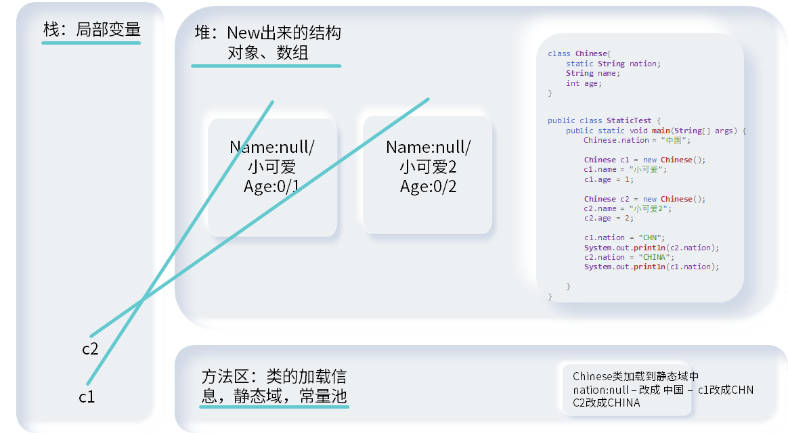

### 关键字 `Static`

#### 作用

- 没有 `Static`关键字的情况下，必须在 `new`对象以后，类中的方法/属性才可供外部调用
- 希望无论是否产生了对象或无论产生了多少对象的情况下， 某些特定的数据在内存空间里只有一份
  - 对象无论有无，都共享这一个属性 – 这就是 `static`
  - 所有的对象， E.g., 中国人，都有同一个 `String` 变量表示国籍
  - 没有创建对象，E.g., `Integer.valueOf`，但是方法同样存在

#### 代码和注意

- `Static` 修饰属性
  - 静态属性/类变量/静态变量 可以直接通过 `类.静态属性` 的方式进行调用
  - 静态属性可以被对象和类调用；但是类只能调用静态属性（不能调用非静态属性）
  - 数量
    - 创建多个类的对象，每个对象都有自己独立的实例变量（非静态变量）；修改其中一个对象的非静态属性，不导致其他对象中的属性修改
    - 创建多个类的对象，每个对象共享同一个静态变量；调用对象修改静态变量，其他变量调用静态变量时，是修改过的
  - 加载时间
    - 静态变量随着类的加载而加载
    - 静态变量的加载早于对象的记载
    - 类只加载一次，被 `JVM` 放在缓存区中；每次创建新对象都使用缓存中存在的类，故静态变量在内存中只存在一次，在方法区，静态域中

- `Static` 修饰方法
  - 静态方法随着类的加载而记载，可以直接通过 `类.静态方法` 的方式进行调用
  - 静态方法可以被对象和类调用；但是类只能调用静态方法（不能调用非静态方法）
  - `static`修饰的方法不能被重写
  - 静态方法中调用方法
    - 静态方法中只能调用静态的属性/方法—因为生命周期的问题
      - 静态方法中不能使用 `this.`，`super` 关键字，包括显式和非显式的使用
      - 静态属性可以省略 `类.`，直接调用 
    - 非静态方法中，可以调用静态和非静态的属性/方法
- 从生命周期的理解
  - 流程
    - `JVM`会先把类加载到缓存区中，而不会马上销毁
    - 在程序运行中，实例创建/销毁，里面的非静态结构也创建和销毁
    - 最后，程序运行结束，类从内存中消亡，静态结构消亡
  - 理解
    - 因为类加载时，实例还没有出现；所以无法调用实例中的结构
    - 实例出现时，类已经出现了，所以实例可以调用类中的静态结构
- 开发中是否需要声明  `static`
  - 属性是否声明 `static`
    - 如果该属性为所有对象共享，不会随着对象的不同而不同，就将其声明为静态的
    - 类中常量通常声明为 `static`；如`public static final double PI = 3.14159265358979323846`，因为每个对象获得的常量都是一致的，也算是共享了
  - 方法是否声明 `static`
    - 操作静态属性的方法，如 `getter/setter`，通常设置为 `static`
    - 工具类中的方法习惯上声明为静态方法，这样就不用造对象了；如 `Math`,`Arrays`,`Collections`

#### 内存结构

- 静态属性放在方法区中的静态域中
- 

#### 单例设计模式 Singleton 

- 设计模式是在大量的实践中总结和理论化之后优选的代码结构、编程风格、以及解决问题的思考方式。 设计模免去我们自己再思考和摸索。 **套路**

  - 设计模式是独立于编程语言的；只不过 `java`的设计模式比较火

-   所谓类的单例设计模式，就是采取一定的方法保证在整个的软件系统中，对某个类只能存在一个对象实例，并且该类只提供一个取得其对象实例的方法 **只创建一个对象**

  - 创建一个 `private` 权限的构造器，这样外面就不能通过 `new` 来创建对象
  - 类的外部只能通过静态方法来得到创建的单个对象
  - 该类对象的变量必须定义为静态，因为静态方法只能访问静态成员变量

- 实现方法

  - 懒汉式，延迟加载 – 写这个更好，但是必须写 多线程 学完后的

    - ```java
      class Order{
      	private Order() {
      		
      	}
      	private static Order instance = null;
      	public static Order getInstance() {
      		if(instance == null) {
      			instance = new Order();
      		}
      		return instance;
      	}
      }
      ```

  - 饿汉式，不延迟加载

    - ```java
      class Order{
      	private Order(){
          }   
          private static Order instance = new Order();
          public static Order getInstance{
              return instance;
          }
      }
      ```
      
    - ```java
      class Bank{
      	private Bank() {
      	}
      	public static final Bank instance = new Bank();//final和static，两个一起上就可以实现不造对象调用对象，且避免用户把 instance = null
      }
      
      ```

      

  - 区别

    - 延迟加载的更好，因为懒汉式避免的无用对象占用内存；只有需要的时候我们才把对象准备上。懒汉式现在的写法现在线程不安全 – 两个线程一起调用方法，于是创建了两个对象 `->` 见多线程
    - 饿汉式可能出现无用的对象加载时间过长，空耗内存；饿汉式是天然线程安全的
      - 反映了`Static` 的缺陷，快速反应；但是生命周期长，耗了内存

- 优点

  - 只生成一个实例，减少了系统资源开销
  - 见 `java.lang.Runtime`

- 场景

  - 计数器 – 单例模式帮助同步
  - 日志应用 – 长期打开，帮助同步，减少资源开销
  - 数据库连接池 – 避免消耗过多资源
  - 读取配置文件的类 – 没有必要使用多个对象读取配置文件
  - `Application`，`Windows Task Manager`, `Recycle Bin`

### `Main` 方法

- `main()`方法作为程序的入口
  - 一个公开的，普通的静态方法
  - 可以通过类去调用；一个源文件中可以存在多个 `main()`方法，只是只能有一个 `public`类
  - `main()`方法可以作为我们和控制台交互的方式
    - 我们可以在 `eclipse` 中， `run configurations`，`arguments`中加入参数；可不写双引号，用空格分开每个参数
    - 如果想要自己编译，则需要先在包内编译，然后退出包，以全类名的方式运行；并且，通过空格将参数分开
      - `java com.atguigu.java2.MainDemo 老可爱 小可爱 "可爱死了"`

### 代码块 – :do_not_litter:

- 作用
  - 用来初始化类，对象；为此，也被称为初始化块
  
- 代码
  - `<static>{//writing codes between brackets}`
  - 只能使用 `static` 进行修饰
  - 调用方式为创建新对象/调用静态类的静态属性 – 
  
- 分类
  - 按照代码块是否被 `static` 修饰，分为
    - 静态代码块
      - 内部可以有输出语句
      - 随着类的加载而执行，自动执行；只执行一次，也就是类加载的一次
      - 可以初始化类
      - 如果一个类中定义了多个静态代码块，按照声明的先后顺序执行；执行优先于非静态代码块
      - 静态代码块只能调用静态方法；不能调用非静态的结构
    - 非静态代码块
      - 内部可以有输出语句
      - 随着对象的创建而执行，自动执行；每创建一次，执行一次非静态代码块
      - **在创建对象时，用于初始化对象的属性等**
      - 一个类中定义了多个非静态代码块，按照声明的先后顺序执行；晚于静态代码块
      - 非静态代码块可以调用非静态方法
    - 一般情况下，我们都把多个代码块合成一个 – 反正都是顺序执行
  
- 对属性的赋值位置

  - 默认初始化，显式初始化，代码块初始化，构造器中初始化（代码块先于构造器，晚于显式初始化）

  - `对象.属性`或 `对象.get/set`

  - 
    
    ```java
    class Root{
    	static{
    		System.out.println("Root的静态初始化块");
    	}
    	{
    		System.out.println("Root的普通初始化块");
    	}
    	public Root(){
    		System.out.println("Root的无参数的构造器");
    	}
    }
    class Mid extends Root{
    	static{
    		System.out.println("Mid的静态初始化块");
    	}
    	{
    		System.out.println("Mid的普通初始化块");
    	}
    	public Mid(){
    		System.out.println("Mid的无参数的构造器");
    	}
    	public Mid(String msg){
    		//通过this调用同一类中重载的构造器
    		this();
    		System.out.println("Mid的带参数构造器，其参数值："
    			+ msg);
    	}
    }
    class Leaf extends Mid{
    	static{
    		System.out.println("Leaf的静态初始化块");
    	}
    	{
    		System.out.println("Leaf的普通初始化块");
    	}	
    	public Leaf(){
    		//通过super调用父类中有一个字符串参数的构造器
    		super("尚硅谷");
    		System.out.println("Leaf的构造器");
    	}
    }
    public class LeafTest{
    	public static void main(String[] args){
    		new Leaf(); 
    		//new Leaf();
    	}
    }
    
    /*
     * Root的静态初始化块
     * Mid的静态初始化块
     * Leaf的静态初始化块
     * Root的普通初始化块
     * Root的无参数的构造器
     * Mid的普通初始化块
     * Mid的无参数的构造器
     * Mid的带参数构造器，其参数值：尚硅谷
     * Leaf的普通初始化块
     * Leaf的构造器 
     */
    ```
    
  - 上述代码分析
  
    - **由父及子,静态先行**
    - 因为子类 `new` 之前，都会显示或隐式的调用其父类 `super()` 的构造器；直到 `java.lang.Object`
    - `Leaf->Mid->Root`依次调用，并且从父类到子类， `Root->Mid->Leaf`按照调用顺序将类加载到 `JVM`中
      -  三个类的静态代码块被执行
    - `super()`实际上创建了父类对象（但是我们最后只创建了一个对象），因此 `Root->Mid->Leaf`的构造器一次执行
      - 三个类的非静态代码块和构造器内的东西被执行
      - `Leaf`显式的调用了 `Mid`的含参构造器，而`Mid`的参构造器调用了无参构造器,所以有两行 `Mid`
    - 最后, `leaf`的初始化块和构造器被执行,代码运行结束
    - 如果我们运行第二个 `new leaf()`,则静态代码块不执行,三个静态初始化块不输出
  
  - ```java
    class Father {
    	static {
    		System.out.println("11111111111");
    	}
    	{
    		System.out.println("22222222222");
    	}
    
    	public Father() {
    		System.out.println("33333333333");
    
    	}
    
    }
    
    public class Son extends Father {
    	static {
    		System.out.println("44444444444");
    	}
    	{
    		System.out.println("55555555555");
    	}
    	public Son() {
    		System.out.println("66666666666");
    	}
    
    
    	public static void main(String[] args) { // 由父及子 静态先行
    		System.out.println("77777777777");
    		System.out.println("************************");
        }
    }
    ```

  - 输出结果为
  
    - 
      
      ```java
      11111111111
      44444444444
      77777777777
      ************************
      ```
      
    - 因为`main()`方法是静态方法，所以加载时必须类先加载；为此，静态代码块执行，然后 `main`方法执行
  
- 代码块赋值顺序

  - `默认初始化-->显式初始化/代码块中初始化-->`
    - 如果代码块写在显式初始化（声明变量语句）之上，则声明变量语句后执行
    - 如果代码块写在显式初始化（声明变量语句）之下，则代码块后执行（大多数时候我们都这么干）

  - `构造器中初始化-->对象.属性/对象.方法`

### 关键字 `final`

- 作用

  - 可以用来修饰类、方法、变量 – 可以理解成最终的

- `final class`

  - 最终的 `class` 就是太监了 – `The type FinalB cannot subclass the final class FinalA`
  - 被 `final` 修饰的类不能被其他类所继承，所以不能被扩充功能；这表示这个类中的功能完善，无需扩充
  - 例子：`String, System, StringBuffer`

- `final method`
  - 被`final`修饰的方法表示这个方法不能被重写（子类不能重写父类的方法）
  - 例子：`java.lang.Object.getClass()` – 这个方法里面还有 `native` 关键字，表示方法调用了底层的 `c`运行库
  
- `final variables`

  - 被`final`修饰的变量被称为常量，一般也用 `static` 修饰；其值不可以改变

  - 可以赋值的位置

    - 属性

      - 默认初始化不能用 `final` 修饰

        - **显式初始化** `final int KEAI = 1;`
    - 先用 `final` 修饰，然后在代码块中赋值，是可以的 `final int KEAI; {KEAI = 1;}`
        - 先用  `final` 修饰，然后在构造器中初始化；但是每一个构造器必须都要有赋值语句，保证常量被赋值，否则报错 `final int KEAI; public Final(){KEAI = 1;}`
        - **只要final修饰的变量在对象创建前（也就是被加载到内存中之前）被赋值，就可以**
        - 先用 `final` 修饰，不能在方法中赋值；因为通过对象调用方法对常量赋值时，对象已经有常量值了（默认初始化） – 所以不行 `final int KEAI; public void Final(int n){KEAI = n;}`

      - 如果多个对象的属性值都一样，直接 `static` 显式赋值；如果常量值必须要有不一样的值，可以用构造器（用户输入赋值）或代码块（用方法得到值）

    - 局部变量
      - 形参
        - 一旦用 `final` 修饰，方法内不能对变量进行修改；我们调用此方法时，给常量形参赋一个实参，赋值以后，就不能修改
      - 方法内
        - 一旦用 `final` 修饰，方法内不能对变量进行修改
    - `static final` 只能修饰属性和方法
      - 修饰属性时，称为全局常量
      - 自己定义的方法，往往都不会加上 `final`


### 抽象类与抽象方法 `Abstract` – :star2:

- 思想

  - 抽象性 – 随着继承层次中一个个新子类的定义，类变得愈发具体，父类变得愈发通用；父类不能实现任何具体功能（很抽象），也没有具体的实例 – 这样的类叫做抽象类

- 作用

  - `abstract`表示该类不再有任何实例，就是用来给子类继承的；翻译为中文表示 `抽象的`
  - `abtract`可以修饰类和方法

- 使用

  - `abstract`类
    - 抽象类不能实例化 – `Cannot instantiate the type Person`
      - 但是抽象类中的静态方法仍然可以使用；类还是被加载的
    - 抽象类中一定有构造器
      - 子类对象仍需父类的无参（有参）构造器来实例化 – 子类对象实例化的全过程
      - 我们在开发中***都会提供抽象类的子类***，让子类对象实例化，完成相关的操作；否则，抽象类就没用了
  - `abtract`方法
    - 代码
      - `	public abstract returnDataType identifier();`
    - 抽象方法只有方法声明，没有方法体；调用该方法不会执行任何代码
      - 为避免被调用，包含抽象方法的类，一定是一个抽象类
        - 子类必须重写父类所有的抽象方法，此子类方可实例化（也就是不是抽象类）（包括间接父类）
        - 不重写/没有全部重写 的话，子类必须是抽象类（包括间接父类）
      - 抽象类中可以没有抽象方法
  - 使用注意
    - `abstract`不能修饰属性，构造器，还有代码块 – 只能修饰方法和类
    - `abstract`不能用来修饰私有方法 – 因为私有方法不能被子类重写 – 只能修饰 `protected` ， `public`， 和 `default` 方法
    - `abstract` 不能修饰静态方法，因为静态方法也不能被子类重写（不认为是一种重写）
    - `abstract` 不能修饰 `final`方法，因为 `final`方法不允许重写；`abstract`也不能修饰 `final` 类，因为 `final` 类不能被继承

- 抽象类的匿名类

  - ```java
    method1(new Person() {
    	@Override
    	void eat() {
    		System.out.println("!@!吃东西");
    	}
    });
    ```

  - 通过 `<abstractClassName>(){@Override method}`的方法来创建匿名类；然后 `new`出一个匿名对象即可

- 模板方法设计模式 `Template Method`

  - 抽象类体现的就是一种模板模式的设计，抽象类作为多个子类的通用模板，子类在抽象类的基础上进行扩展、改造，但子类总体上会保留抽象类的行为方式。
  -  当功能内部一部分实现是确定的， 一部分实现是不确定的。这时可以把不确定的部分暴露出去，让子类去实现（重写抽象方法）。
  - 换句话说，在软件开发中实现一个算法时，整体步骤很固定、通用，这些步骤已经在父类中写好了。但是某些部分易变，易变部分可以抽象出来，供不同子类实现。这就是一种模板模式。

- 例子

  - ```java
    abstract class Template{
    	//计算某段代码执行所需要花费的时间
    	public void spendTime() {
    		long start = System.currentTimeMillis();
    		code();
    		long end = System.currentTimeMillis();
    		System.out.println();
    		System.out.println("花费时间为" + (end - start));
    	}
    	
    	public abstract void code();
    }
    
    
    class SubTemplate extends Template{
    	@Override
    	public void code() {
    		l:for(int i = 2;i<=1000;i++) {
    			int g = 2;
    			for(g = 2;g<=Math.sqrt(i);g++) {
    				if(i % g == 0) {
    					continue l;
    				}
    			}
    			System.out.print(i + ",");
    		}
    	}
    }
    ```

### 接口 `Interface` – :star:

- 介绍
  - 一方面， 有时必须从几个类中派生出一个子类， 继承它们所有的属性和方法。 但是， `Java`不支持多重继承。 有了接口， 就可以得到多重继承的效果。  
  - 接口就是规范，定义的是一组规则，体现了现实世界中“如果你是/要...则必须能...”的思想。 继承是一个"是不是"的关系，而接口实现则是 "能不能"的关系（没有子父类关系）
  - 接口的本质是**契约，标准，规范**，就像我们的法律一样。制定好后大家都要遵守。  

- 使用

  - 代码格式

    - `<Permission modifier> class <SubClass> extends <SuperClass> implements <InterfaceIdentifierA,B...>{}`
      - 一个类可以实现一个或多个接口，该类称为实现类
      - 一个类必须重写所有接口中的方法，才可实例化；否则，就是抽象类
    - `<InterfaceIdentifier> extends <InterfaceIdentifier>{}`
      - 一个接口可以继承一个或多个接口，该接口则继承父接口的所有结构
    - `method(<interfaceIdentifier> <formalParameter>)`
      - 接口同样具有多态性，编译时编译接口中存在的抽象方法；运行时运行传入对象重写接口中的方法

  - 和类的问题

    - 如果同时继承了父类和接口的重名变量（一个是属性，一个是全局变量），则报错 `Ambiguous`
      - 我们需要使用 `super.x` 调用类中的变量， `<InterfaceName>.x`调用接口中的变量
    - 两个接口定义了重名+同参方法，则继承时算一个方法，只需要重写一个

  - 匿名实现类

    - ```JAVA
      interface USB{
          void start();
          void stop();
      }
      class Flash implements USB{
          @Override
          public void start(){System.out.println("Flash Start");}
          @Override
          public void stop(){System.out.println("Flash Stop");}
      }
      class Computer{
          public void show(USB usb){
              usb.start();
              usb.stop();
         	}
          public static void main(String[] args){
              Computer c = new Computer();
              //非匿名类和对象
              Flash f = new Flash();
              c.show(f);
              //非匿名类和匿名对象
              c.show(new Flash());
              //匿名类和匿名对象
              c.show(new USB(){
                  public void start(){System.out.println("Start");}
                  public void stop(){System.out.println("Stop");}
              });
             //匿名类和非匿名对象
             USB phone = new USB(){
                  public void start(){System.out.println("Start");}
                  public void stop(){System.out.println("Stop");}
              };
              c.show(phone);
          }
      }
      ```
      
      

  - 接口的内部结构

    - 全部版本
      - 接口中没有构造器，接口不能实例化；因此，接口必须被对象继承才能发挥作用
      - 让对象继承并重写接口定义的抽象方法，是`模板方法`设计模式的体现；同时，程序员在写程序时也无需关心代码的具体实现细节，转而调用接口 – 这叫做 `面向接口的设计模式`
    - `JDK 7.0<=`
      - 全局变量 `public static final`
      - 抽象方法 `public abstract method`
        - 实现类可以继承多个同名同参抽象方法的接口，不会报错
      - 在代码中可以将前面的修饰符省略不写，因为默认编译器会把前面的部分补上
    - `JDK >=8.0`
      - `Java8`中，可以给接口添加静态方法，默认方法
        - `public static <returnType> <methodName>() {}` - 静态方法
          - 接口中定义的静态方法，只能通过接口来调用
          - 接口的实现类和实现类的对象都不能调用
          - 相当于接口可以实现一部分工具类的角色
        - `public default <returnType> <methodName>() {}` - 默认方法
          - 接口中定义的默认方法，实现类不需要重写就可以直接使用
          - 默认方法只能在接口中声明
            - 实现类想要重写方法，必须去掉 `defualt` 关键字；重写以后，调用重写后的方法
          - 如果实现类的父类中定义了和实现类的接口中声明了同名同参方法，则子类默认调用父类的方法 – **类优先原则**，该原则只针对方法
          - 如果实现类实现了多个接口，而多个接口中定义了同名同参的`默认`方法，那实现类没有重写此方法的情况下报错 – `接口冲突`
            - 实现类必须覆盖接口中同名同参数的方法，来解决冲突/有一个父类重写了这个方法，类优先原则
          - `<interfaceName>.super.<methodName>();`就可以调用接口中的默认方法
      - 代码中前面的权限修饰符可以省略不写，编译器会把前面的部分补上

  - 代理模式
    - 代理模式是`Java`开发中使用较多的一种设计模式。代理设计就是为其他对象提供一种代理以控制对这个对象的访问。
      - 包括代理类和被代理类，需要解决问题的类就是被代理类；代理类是帮助被代理类解决问题的
      - 常见的使用有：延迟加载（节省内存开销），安全代理（VPN），等
    
  - 工厂设计模式
    - **实现了创建者与调用者的分离， 即将创建对象的具体过程屏蔽隔离起来，达到提高灵活性的目的**

    - 其实设计模式和面向对象设计原则都是为了使得开发项目更加容易扩展和维护，解决方式就是一个“分工”

    -   设计原则
      - `OCP Open-Closed Principle`
        - 新增代码而不修改代码
      - `DIP` `Dependence Inversion Principle`
        - A关联B，就让B实现接口；A调用接口，而不直接调用实现
      - `LOD Law of Demeter`
        - 尽量封装，尽可能多的使用中介

    - 代码

      - ```java
        public class FactoryTest {
            public static void main(String[] args) {
                Car a = new AudiFactory().getCar();
                Car b = new BydFactory().getCar();
                a.run();
                b.run();
            }
        }
        
        interface Car{
            void run();
        }
        
        class Adui implements Car{
            public void run(){
                System.out.println("AUDI Run");
            }
        }
        
        class BYD implements Car{
            public void run() {
               System.out.println("BYD run");
            }
        }
        
        //Factory
        
        interface Factory{
            Car getCar();
        }
        
        //Factory Implements
        
        class AudiFactory implements Factory{
            public Adui getCar(){
                return new Adui();
            }
        }
        
        class BydFactory implements Factory{
            public BYD getCar(){
                return new BYD();
            }
        }
        ```
        
        

  

### 内部类 - :do_not_litter::do_not_litter: `InnerClass`

- 定义
  - 当一个事物的内部，还有一个部分需要一个完整的结构进行描述，而这个内部的完整的结构又只为外部事物提供服务，那么整个内部的完整结构最好使用内部类。  

- 代码

  - `Java`允许将类A声明在另一个类 `B`中，则 `A` 就是内部类，`B`就是外部类

  - 成员内部类（静态和非静态）

    - 作为外部类的成员
      - 可以调用外部类的结构（有足够权限的属性，方法都可以被调用）
      - 可以被 `static` 修饰 – 正常的外部类不能被静态修饰
        - 非`static`的成员内部类中的成员不能声明为`static`的， 只有在外部类或`static`的成员内部类中才可声明`static`成员  
      - 可以被全部四种权限修饰符修饰，正常的类不能被 `protected,private`修饰
      - 内部类可以调用外部类中的 `private`属性和方法
    - 作为类
      - 类内可以声明属性、方法、构造器、内部类、代码块
      - 类可以被 `final`（阻止继承），`abstract`（抽象类）修饰

  - 局部内部类（方法内，代码块内，构造器内）

    - 只能在声明它的方法或代码块中使用，而且是先声明后使用。除此之外的任何地方都不能使用该类  
    - 但是它的对象可以通过外部方法的返回值返回使用，返回值类型只能是局部内部类的父类或父接口类型
      - 因为如果返回值类型就是内部类，则没有声明，无法使用  
    - 局部内部类可以使用外部方法的局部变量，但是必须是`final`的  
    - 局部内部类不能使用`static`修饰，因此也不能包含静态成员  

  - 实例化

    - 创建静态成员内部类

      - 

        ```java
        Person.Dog dog = new Person.Dog();
        dog.sing();
        ```

    - 创建非静态成员内部类

      - 

        ```java
        Person p = new Person();
        Person.Bird bird = p.new Bird("可爱");
        bird.sing();
        ```

  - 成员内部类调用外部方法

    - `<ClassName>.this.` 必须使用这个方法才能调用外部类的属性和方法

- 开发

  - 有时，我们需要得到一个实现了某个接口的对象；可以使用内部类

  - ```java
    return new Comparable(){
        @Override
        public int compareTo(Object o) {
            return 0;
        }
    };
    ```

  - ```java
    class MyComparable implements Comparable{
    
        @Override
        public int compareTo(Object o) {
            return 0;
        }
    
    }
    return new MyComparable();
    ```


### 匿名对象

- 父类

  - ```java
    public class AnonymityTest {
    	public static void main(String args[]) {
    		Class test = new Class() {
    			@Override
    			public void method() {
    				System.out.println("Anonymity Subclass");
    			};
    		};
    		test.method();
    	}
    }
    
    class Class{
    	String name;
    	public void method() {
    		System.out.println("Class");
    	}
    }
    
    ```

- 抽象类

  - ```java
    public class AnonymityAbstract {
    	public static void main(String[] args) {
    		Abstract test = new Abstract() {
    			@Override
    			public void method() {
    				System.out.println("Anonymity Subclass");
    			}
    		};
    		test.method();
    	}
    }
    
    abstract class Abstract {
    	String name;
    
    	abstract public void method();
    }
    ```

- 接口

  - ```java
    public class AnonymityInterface {
    	public static void main(String[] args) {
    		new Interface() {
    			@Override
    			public void method() {
    				System.out.println("Anonymity Subclass");
    			};
    		}.method();
    	}
    }
    
    interface Interface{
    	public static final String name = "可爱";
    	public default void method() {
    		System.out.println("Interface");
    	}
    }
    ```

### 抽象类和接口的异同

 

| 抽象类                                   | 接口                                                   |
| ---------------------------------------- | ------------------------------------------------------ |
| 不能实例化                               | 不能实例化                                             |
| 有构造器，抽象方法，普通方法，常量和变量 | 没有构造器，**默认方法，静态方法**，全局常量，抽象方法 |
| 可以被继承，单继承                       | 可以被实现，多实现                                     |
| 并列                                     | 并列                                                   |
| 模板方法                                 | 代理模式，工厂                                         |
| 抽象类和接口都能用，优先接口             |                                                        |

